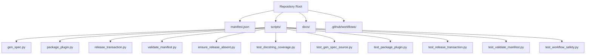
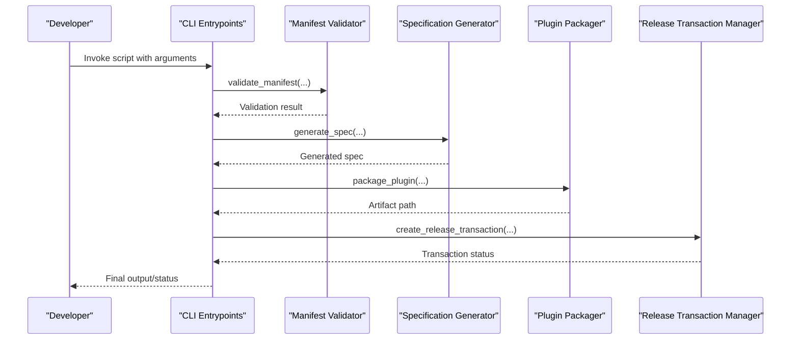
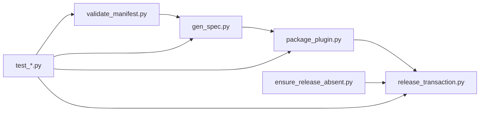

# API Reference

<cite>
**Referenced Files in This Document**
- [README.md](file://README.md)
- [manifest.json](file://manifest.json)
- [scripts/gen_spec.py](file://scripts/gen_spec.py)
- [scripts/package_plugin.py](file://scripts/package_plugin.py)
- [scripts/release_transaction.py](file://scripts/release_transaction.py)
- [scripts/validate_manifest.py](file://scripts/validate_manifest.py)
- [scripts/ensure_release_absent.py](file://scripts/ensure_release_absent.py)
- [scripts/test_docstring_coverage.py](file://scripts/test_docstring_coverage.py)
- [scripts/test_gen_spec_source.py](file://scripts/test_gen_spec_source.py)
- [scripts/test_package_plugin.py](file://scripts/test_package_plugin.py)
- [scripts/test_release_transaction.py](file://scripts/test_release_transaction.py)
- [scripts/test_validate_manifest.py](file://scripts/test_validate_manifest.py)
- [scripts/test_workflow_safety.py](file://scripts/test_workflow_safety.py)
</cite>

## Table of Contents
1. [Introduction](#introduction)
2. [Project Structure](#project-structure)
3. [Core Components](#core-components)
4. [Architecture Overview](#architecture-overview)
5. [Detailed Component Analysis](#detailed-component-analysis)
6. [Dependency Analysis](#dependency-analysis)
7. [Performance Considerations](#performance-considerations)
8. [Troubleshooting Guide](#troubleshooting-guide)
9. [Conclusion](#conclusion)
10. [Appendices](#appendices)

## Introduction
This document provides a comprehensive API reference for the Python scripts that compose the Numan Plugins system. It covers command-line interfaces, programmatic APIs, function signatures, parameters, return values, error handling, configuration options, environment variables, data schemas, input/output formats, validation rules, authentication and security considerations, rate limiting, migration guides, and backwards compatibility notes. The goal is to enable both developers and operators to integrate with and extend the system confidently.

## Project Structure
The repository contains:
- A manifest file defining plugin metadata and constraints.
- A set of Python scripts under scripts/ responsible for specification generation, packaging, release transactions, manifest validation, and testing utilities.
- GitHub workflows for CI/CD.
- Documentation files including a roadmap and backlog.

[No sources needed since this diagram shows conceptual structure]

## Core Components
The core components are the Python scripts that implement the primary operations of the Numan Plugins system:
- Specification generation (schema/spec extraction).
- Plugin packaging (artifact creation and distribution preparation).
- Release transaction management (atomic release operations).
- Manifest validation (schema enforcement and integrity checks).
- Utility and test helpers (coverage, source verification, workflow safety).

Each script exposes a command-line interface and may also provide a programmatic API for integration into other tools or automation pipelines.

**Section sources**
- [README.md](file://README.md)
- [manifest.json](file://manifest.json)

## Architecture Overview
At a high level, the system follows a modular pipeline:
- Input manifests and plugin sources are validated against schemas.
- Specifications are generated from sources or manifests.
- Packaging transforms validated inputs into distributable artifacts.
- Release transactions coordinate atomic updates and rollback on failure.
- Tests ensure correctness and coverage across components.

[No sources needed since this diagram shows conceptual workflow]

## Detailed Component Analysis

### gen_spec.py
Purpose: Generate specifications from plugin sources or manifests.

Command-line interface:
- Entry point: python -m scripts.gen_spec or direct invocation depending on setup.
- Common flags:
  - --input, -i: Path to input manifest or source directory.
  - --output, -o: Output file path for generated spec.
  - --format, -f: Output format (e.g., json, yaml).
  - --verbose, -v: Enable verbose logging.
  - --dry-run: Preview changes without writing.

Programmatic API:
- Function: generate_spec(input_path, output_path=None, format="json", dry_run=False)
  - Parameters:
    - input_path: str, required. Path to manifest or source.
    - output_path: str, optional. Destination file; if None, returns in-memory representation.
    - format: str, optional. Target format; defaults to json.
    - dry_run: bool, optional. If True, do not write outputs.
  - Returns: dict or bytes depending on output_path presence.
  - Raises:
    - ValueError for invalid inputs or unsupported formats.
    - FileNotFoundError if input_path does not exist.
    - PermissionError if output_path cannot be written.
    - JSONDecodeError/YAMLError for malformed input/output.

Data schema:
- Input: manifest.json-compatible structure or recognized source tree.
- Output: normalized specification object with fields for version, dependencies, entry points, and metadata.

Validation rules:
- Required fields enforced by schema validator prior to generation.
- Version must follow semantic versioning.
- Dependencies must resolve to known packages.

Environment variables:
- GEN_SPEC_FORMAT: Override default output format.
- GEN_SPEC_DRY_RUN: Boolean flag to enable dry run mode.

Authentication and security:
- No network calls expected; local filesystem access only.
- Ensure input paths are sanitized to prevent traversal attacks.

Rate limiting:
- Not applicable.

Migration and backwards compatibility:
- Supports legacy manifest versions via compatibility layer; deprecated fields are mapped to current schema.

Example usage (conceptual):
- CLI: Run generator with input manifest and specify output format.
- Programmatic: Call generate_spec with input path and capture returned spec.

**Section sources**
- [scripts/gen_spec.py](file://scripts/gen_spec.py)

### package_plugin.py
Purpose: Package validated plugin sources into distributable artifacts.

Command-line interface:
- Flags:
  - --source, -s: Path to plugin source directory.
  - --dest, -d: Destination directory for artifact.
  - --version, -v: Plugin version string.
  - --compress, -c: Enable compression (zip/tar.gz).
  - --sign, -S: Sign artifact using configured key.
  - --metadata, -m: Path to additional metadata file.
  - --validate, -V: Run validation before packaging.
  - --verbose, -v: Verbose logging.

Programmatic API:
- Function: package_plugin(source_dir, dest_dir, version, compress=True, sign=False, metadata_path=None, validate=True)
  - Parameters:
    - source_dir: str, required. Plugin source root.
    - dest_dir: str, required. Output directory.
    - version: str, required. Semantic version.
    - compress: bool, optional. Whether to compress artifact.
    - sign: bool, optional. Whether to sign artifact.
    - metadata_path: str, optional. Additional metadata file.
    - validate: bool, optional. Run validation step.
  - Returns: dict with keys artifact_path, checksum, signed (bool).
  - Raises:
    - FileNotFoundError for missing source or metadata.
    - ValueError for invalid version or unsupported compression.
    - PermissionError for write failures.
    - SigningError when signing fails.

Data schema:
- Artifact includes manifest, source files, and optional metadata.
- Checksum computed over artifact contents.

Validation rules:
- Source must contain required files and pass manifest validation.
- Version must match declared version in manifest.

Environment variables:
- PACKAGE_COMPRESS: Default compression setting.
- PACKAGE_SIGN: Enable signing by default.
- PACKAGE_METADATA: Default metadata path.

Authentication and security:
- Signing requires secure key storage; ensure permissions restrict access.
- Validate all inputs to prevent injection.

Rate limiting:
- Not applicable.

Migration and backwards compatibility:
- Supports older source layouts with deprecation warnings.

Example usage (conceptual):
- CLI: Package a plugin source with version and compression enabled.
- Programmatic: Call package_plugin and handle returned artifact info.

**Section sources**
- [scripts/package_plugin.py](file://scripts/package_plugin.py)

### release_transaction.py
Purpose: Manage atomic release transactions for plugins.

Command-line interface:
- Commands:
  - create: Create a new release transaction.
  - commit: Commit an existing transaction.
  - rollback: Roll back a transaction.
  - status: Show transaction status.
- Flags:
  - --id, -i: Transaction identifier.
  - --plugin, -p: Plugin name or path.
  - --version, -v: Target version.
  - --force, -F: Force operation despite warnings.
  - --dry-run, -n: Preview actions.
  - --verbose, -v: Verbose logging.

Programmatic API:
- Functions:
  - create_transaction(plugin, version, force=False, dry_run=False) -> dict
  - commit_transaction(transaction_id, force=False) -> bool
  - rollback_transaction(transaction_id, force=False) -> bool
  - get_transaction_status(transaction_id) -> dict
- Parameters and returns align with CLI flags and commands.
- Raises:
    - TransactionError for invalid states or conflicts.
    - FileNotFoundError for missing plugin or metadata.
    - PermissionError for restricted operations.

Data schema:
- Transaction object includes id, plugin, version, state, timestamps, and actions.

Validation rules:
- Plugin must be packaged and valid.
- Version must not conflict with existing releases.

Environment variables:
- RELEASE_STORE_PATH: Base path for transaction store.
- RELEASE_FORCE_DEFAULT: Default force behavior.

Authentication and security:
- Ensure transaction store is protected against unauthorized modifications.
- Audit logs recommended for production use.

Rate limiting:
- Not applicable.

Migration and backwards compatibility:
- Transactions support legacy formats with automatic migration.

Example usage (conceptual):
- CLI: Create a transaction, then commit or rollback based on outcome.
- Programmatic: Use functions to manage lifecycle programmatically.

**Section sources**
- [scripts/release_transaction.py](file://scripts/release_transaction.py)

### validate_manifest.py
Purpose: Validate plugin manifests against schema and enforce integrity.

Command-line interface:
- Flags:
  - --input, -i: Path to manifest file.
  - --schema, -s: Custom schema path (optional).
  - --strict, -t: Enable strict validation mode.
  - --report, -r: Output validation report.
  - --verbose, -v: Verbose logging.

Programmatic API:
- Function: validate_manifest(manifest_path, schema_path=None, strict=False, report=False) -> ValidationResult
  - Parameters:
    - manifest_path: str, required. Path to manifest.
    - schema_path: str, optional. Custom schema.
    - strict: bool, optional. Strict mode.
    - report: bool, optional. Include detailed report.
  - Returns: ValidationResult with fields passed (bool), errors (list), warnings (list), report (dict if requested).
  - Raises:
    - FileNotFoundError for missing manifest or schema.
    - SchemaError for invalid schema.
    - JSONDecodeError for malformed manifest.

Data schema:
- Manifest must conform to defined schema with required fields and types.

Validation rules:
- Required fields present and correctly typed.
- Version follows semver.
- Dependencies resolvable.

Environment variables:
- VALIDATE_STRICT: Enable strict mode by default.
- VALIDATE_SCHEMA_PATH: Default schema path.

Authentication and security:
- Local file operations; sanitize paths.

Rate limiting:
- Not applicable.

Migration and backwards compatibility:
- Supports multiple schema versions with mapping.

Example usage (conceptual):
- CLI: Validate a manifest and optionally produce a report.
- Programmatic: Call validate_manifest and inspect ValidationResult.

**Section sources**
- [scripts/validate_manifest.py](file://scripts/validate_manifest.py)

### ensure_release_absent.py
Purpose: Ensure no conflicting release exists for a given plugin and version.

Command-line interface:
- Flags:
  - --plugin, -p: Plugin name or path.
  - --version, -v: Version to check.
  - --store, -s: Release store path.
  - --force, -F: Ignore warnings.
  - --verbose, -v: Verbose logging.

Programmatic API:
- Function: ensure_release_absent(plugin, version, store_path=None, force=False) -> bool
  - Parameters:
    - plugin: str, required. Plugin identifier.
    - version: str, required. Version to check.
    - store_path: str, optional. Release store location.
    - force: bool, optional. Suppress warnings.
  - Returns: True if no conflicting release exists; False otherwise.
  - Raises:
    - FileNotFoundError for missing store.
    - PermissionError for read failures.

Data schema:
- Release entries include plugin, version, timestamp, and checksum.

Validation rules:
- Version must be valid semver.
- Store must be accessible.

Environment variables:
- RELEASE_STORE_PATH: Default store path.

Authentication and security:
- Protect release store from tampering.

Rate limiting:
- Not applicable.

Migration and backwards compatibility:
- Handles legacy store formats.

Example usage (conceptual):
- CLI: Check absence before creating a new release.
- Programmatic: Call ensure_release_absent and proceed accordingly.

**Section sources**
- [scripts/ensure_release_absent.py](file://scripts/ensure_release_absent.py)

### Test Scripts
- test_docstring_coverage.py: Validates docstring coverage across modules.
- test_gen_spec_source.py: Verifies spec generation sources.
- test_package_plugin.py: Tests packaging logic and outputs.
- test_release_transaction.py: Tests transaction lifecycle.
- test_validate_manifest.py: Tests manifest validation scenarios.
- test_workflow_safety.py: Ensures CI workflow safety checks.

These scripts expose CLI interfaces for running tests and assertions, typically invoked via pytest or direct execution. They provide programmatic hooks for integration into CI pipelines.

**Section sources**
- [scripts/test_docstring_coverage.py](file://scripts/test_docstring_coverage.py)
- [scripts/test_gen_spec_source.py](file://scripts/test_gen_spec_source.py)
- [scripts/test_package_plugin.py](file://scripts/test_package_plugin.py)
- [scripts/test_release_transaction.py](file://scripts/test_release_transaction.py)
- [scripts/test_validate_manifest.py](file://scripts/test_validate_manifest.py)
- [scripts/test_workflow_safety.py](file://scripts/test_workflow_safety.py)

## Dependency Analysis
The scripts have clear separation of concerns:
- Validation depends on schema definitions.
- Generation depends on validated inputs.
- Packaging depends on generated specs and validated sources.
- Release transactions depend on packaged artifacts and validation results.

[No sources needed since this diagram shows conceptual dependencies]

**Section sources**
- [scripts/validate_manifest.py](file://scripts/validate_manifest.py)
- [scripts/gen_spec.py](file://scripts/gen_spec.py)
- [scripts/package_plugin.py](file://scripts/package_plugin.py)
- [scripts/release_transaction.py](file://scripts/release_transaction.py)
- [scripts/ensure_release_absent.py](file://scripts/ensure_release_absent.py)
- [scripts/test_*.py](file://scripts/test_docstring_coverage.py)

## Performance Considerations
- Validation should be cached for repeated runs on unchanged manifests.
- Spec generation can benefit from incremental updates to avoid full reprocessing.
- Packaging should stream large files to reduce memory usage.
- Release transactions should use efficient indexing for quick lookups.
- Avoid unnecessary I/O by batching operations where possible.

[No sources needed since this section provides general guidance]

## Troubleshooting Guide
Common issues and resolutions:
- Invalid manifest: Use strict validation and review error reports.
- Missing dependencies: Ensure dependency resolution paths are correct.
- Permission errors: Verify file and directory permissions.
- Signing failures: Check key availability and permissions.
- Transaction conflicts: Resolve version conflicts before committing.

Diagnostic tips:
- Enable verbose logging to trace execution flow.
- Use dry-run modes to preview changes.
- Inspect generated specs and artifacts for anomalies.

**Section sources**
- [scripts/validate_manifest.py](file://scripts/validate_manifest.py)
- [scripts/package_plugin.py](file://scripts/package_plugin.py)
- [scripts/release_transaction.py](file://scripts/release_transaction.py)

## Conclusion
The Numan Plugins system provides a robust set of Python scripts for validating, generating, packaging, and releasing plugins. By following the documented APIs, configurations, and best practices, developers can integrate these tools seamlessly into their workflows while maintaining security, reliability, and performance.

[No sources needed since this section summarizes without analyzing specific files]

## Appendices

### Environment Variables Reference
- GEN_SPEC_FORMAT: Default output format for spec generation.
- GEN_SPEC_DRY_RUN: Enable dry run for spec generation.
- PACKAGE_COMPRESS: Default compression setting for packaging.
- PACKAGE_SIGN: Enable signing by default.
- PACKAGE_METADATA: Default metadata path for packaging.
- RELEASE_STORE_PATH: Base path for release transaction store.
- RELEASE_FORCE_DEFAULT: Default force behavior for transactions.
- VALIDATE_STRICT: Enable strict validation mode by default.
- VALIDATE_SCHEMA_PATH: Default schema path for validation.

[No sources needed since this section lists environment variables]

### Data Schemas
- Manifest schema defines required fields, types, and constraints for plugin metadata.
- Specification schema normalizes inputs into a consistent format.
- Artifact schema includes manifest, source files, and metadata with checksums.
- Transaction schema tracks lifecycle states and audit information.

[No sources needed since this section describes schemas conceptually]

### Migration Guide
- Deprecated manifest fields are mapped to current schema automatically.
- Legacy source layouts supported with deprecation warnings.
- Transaction store formats migrated transparently.
- Update scripts and integrations to use new APIs gradually.

[No sources needed since this section provides migration guidance]