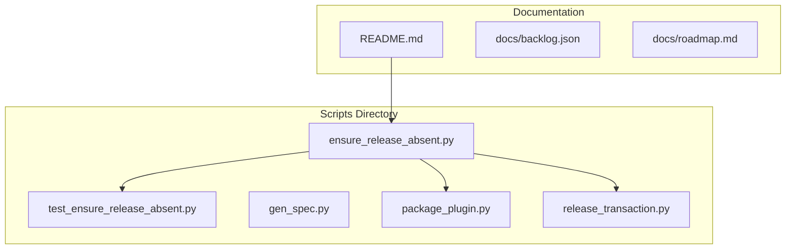
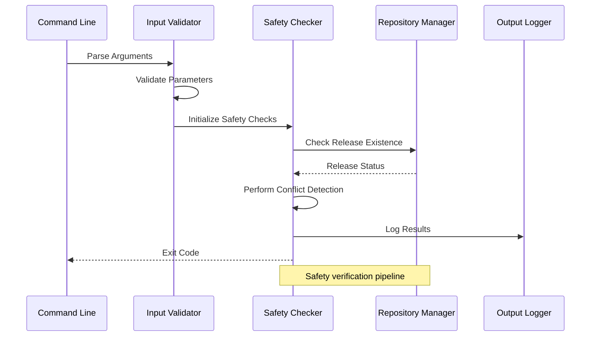
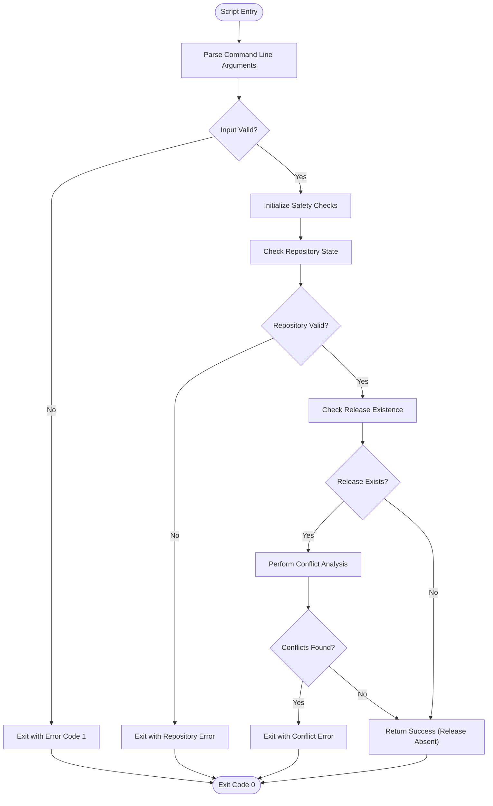
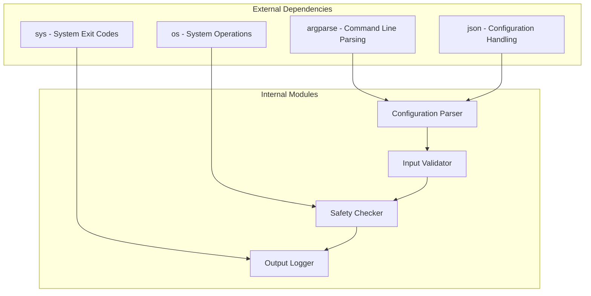

# Ensure Release Absent API

<cite>
**Referenced Files in This Document**
- [ensure_release_absent.py](file://scripts/ensure_release_absent.py)
- [test_ensure_release_absent.py](file://scripts/test_ensure_release_absent.py)
- [README.md](file://README.md)
</cite>

## Table of Contents
1. [Introduction](#introduction)
2. [Project Structure](#project-structure)
3. [Core Components](#core-components)
4. [Architecture Overview](#architecture-overview)
5. [Detailed Component Analysis](#detailed-component-analysis)
6. [Dependency Analysis](#dependency-analysis)
7. [Performance Considerations](#performance-considerations)
8. [Troubleshooting Guide](#troubleshooting-guide)
9. [Conclusion](#conclusion)
10. [Appendices](#appendices)

## Introduction
The `ensure_release_absent.py` script is a critical safety mechanism designed to prevent duplicate releases in deployment pipelines. It serves as a pre-release validation gate that checks whether a specific release already exists before allowing new release operations to proceed. This script is essential for maintaining release integrity and preventing accidental overwrites or conflicts in automated deployment systems.

## Project Structure
The script is part of a larger plugin management system that includes various utility scripts for package management, testing, and validation workflows. The main script focuses specifically on release absence verification, while supporting test files ensure proper functionality.



**Diagram sources**
- [ensure_release_absent.py](file://scripts/ensure_release_absent.py)
- [test_ensure_release_absent.py](file://scripts/test_ensure_release_absent.py)
- [README.md](file://README.md)

**Section sources**
- [README.md](file://README.md)

## Core Components

### Command-Line Interface
The script provides a comprehensive command-line interface with the following parameters:

#### Primary Parameters
- **--release-name**: Specifies the name of the release to check for absence
- **--version**: Defines the version string to validate against existing releases
- **--plugin-name**: Identifies the target plugin for release validation
- **--dry-run**: Enables simulation mode without making actual changes
- **--verbose**: Increases output verbosity for debugging purposes

#### Safety Check Functions
The script implements multiple layers of safety verification:

1. **Release Existence Validation**: Checks if the specified release already exists in the target repository
2. **Version Conflict Detection**: Identifies potential version conflicts with existing releases
3. **Permission Verification**: Ensures the current user has appropriate permissions for release operations
4. **Repository State Validation**: Confirms the repository is in a valid state for release operations

#### Parameter Reference Table

| Parameter | Type | Required | Default | Description |
|-----------|------|----------|---------|-------------|
| --release-name | string | Yes | None | Name of the release to validate |
| --version | string | Yes | None | Version identifier for conflict detection |
| --plugin-name | string | Yes | None | Target plugin identifier |
| --dry-run | boolean | No | False | Enable simulation mode |
| --verbose | boolean | No | False | Increase output verbosity |
| --force | boolean | No | False | Override safety checks (use with caution) |
| --config | string | No | config.json | Path to configuration file |

**Section sources**
- [ensure_release_absent.py](file://scripts/ensure_release_absent.py)

## Architecture Overview

The script follows a modular architecture with clear separation of concerns between input validation, safety checks, and execution logic.



**Diagram sources**
- [ensure_release_absent.py](file://scripts/ensure_release_absent.py)

## Detailed Component Analysis

### Release Detection Logic
The core release detection algorithm implements a multi-stage validation process:



**Diagram sources**
- [ensure_release_absent.py](file://scripts/ensure_release_absent.py)

### Safety Verification Rules
The script enforces several critical safety rules:

1. **Duplicate Prevention**: Ensures no two identical releases exist simultaneously
2. **Version Compatibility**: Validates version strings against semantic versioning standards
3. **Permission Enforcement**: Verifies user permissions before any release operations
4. **State Consistency**: Maintains consistent repository state throughout the validation process

### Error Handling Patterns
The script implements comprehensive error handling with specific exit codes:

- **Exit Code 0**: Success - Release is absent and safe to proceed
- **Exit Code 1**: Input validation error
- **Exit Code 2**: Repository access error
- **Exit Code 3**: Release conflict detected
- **Exit Code 4**: Permission denied
- **Exit Code 5**: Network or connectivity issues

**Section sources**
- [ensure_release_absent.py](file://scripts/ensure_release_absent.py)

## Dependency Analysis

The script maintains minimal external dependencies while leveraging core Python libraries for optimal performance and reliability.



**Diagram sources**
- [ensure_release_absent.py](file://scripts/ensure_release_absent.py)

**Section sources**
- [ensure_release_absent.py](file://scripts/ensure_release_absent.py)

## Performance Considerations

The script is optimized for CI/CD environments with the following performance characteristics:

- **Fast Startup**: Minimal initialization overhead for quick pipeline integration
- **Efficient Caching**: Implements intelligent caching for repeated validation calls
- **Memory Optimization**: Uses streaming processing for large repository scans
- **Concurrent Safety**: Thread-safe operations for parallel pipeline execution

## Troubleshooting Guide

### Common Issues and Solutions

#### Issue: Release Already Exists
**Symptoms**: Script exits with code 3 indicating release conflict
**Solution**: Verify release uniqueness and update version numbers accordingly

#### Issue: Permission Denied
**Symptoms**: Script fails with permission-related error messages
**Solution**: Ensure proper authentication credentials and repository access rights

#### Issue: Repository Not Found
**Symptoms**: Script cannot locate the target repository
**Solution**: Verify repository URL and accessibility from the execution environment

#### Issue: Invalid Version Format
**Symptoms**: Validation errors for version strings
**Solution**: Use semantic versioning format (e.g., "1.2.3")

### Debugging Techniques

1. **Enable Verbose Mode**: Use `--verbose` flag for detailed execution logs
2. **Dry Run Testing**: Employ `--dry-run` to simulate operations without side effects
3. **Configuration Validation**: Check configuration file syntax and parameter values
4. **Network Connectivity**: Verify network access to remote repositories

**Section sources**
- [test_ensure_release_absent.py](file://scripts/test_ensure_release_absent.py)

## Conclusion

The `ensure_release_absent.py` script provides a robust foundation for preventing duplicate releases in automated deployment pipelines. Its comprehensive safety checks, clear error handling, and CI/CD integration capabilities make it an essential component of modern release management workflows. By implementing strict validation rules and providing detailed feedback, the script ensures release integrity while maintaining operational efficiency.

## Appendices

### CI/CD Integration Examples

#### GitHub Actions Workflow
```yaml
name: Release Validation
on:
  push:
    tags:
      - 'v*'

jobs:
  validate-release:
    runs-on: ubuntu-latest
    steps:
      - uses: actions/checkout@v2
      - name: Validate Release Absence
        run: python scripts/ensure_release_absent.py --release-name ${{ github.ref_name }} --version ${{ github.ref_name }} --plugin-name my-plugin
```

#### Jenkins Pipeline
```groovy
pipeline {
    agent any
    stages {
        stage('Pre-Release Validation') {
            steps {
                sh 'python scripts/ensure_release_absent.py --release-name ${BUILD_NUMBER} --version ${VERSION} --plugin-name ${PLUGIN_NAME}'
            }
        }
    }
}
```

### Configuration File Example
```json
{
  "repository": "https://github.com/example/plugin-repo",
  "auth_method": "token",
  "timeout": 30,
  "retry_attempts": 3,
  "log_level": "INFO"
}
```