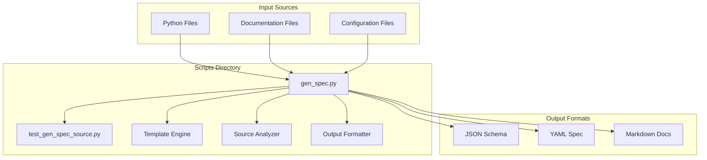
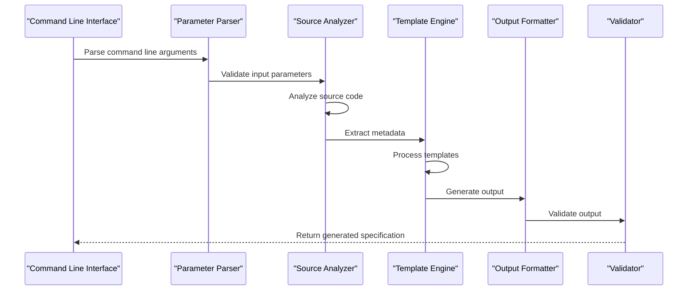
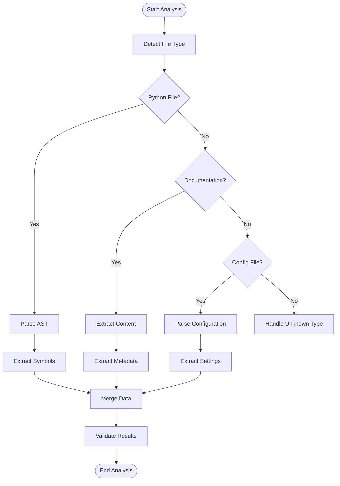
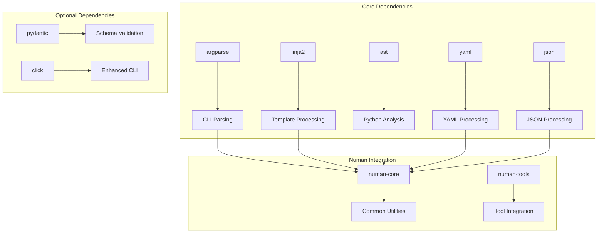

# Generate Specification API

<cite>
**Referenced Files in This Document**
- [gen_spec.py](file://scripts/gen_spec.py)
- [test_gen_spec_source.py](file://scripts/test_gen_spec_source.py)
- [README.md](file://README.md)
</cite>

## Table of Contents
1. [Introduction](#introduction)
2. [Project Structure](#project-structure)
3. [Core Components](#core-components)
4. [Architecture Overview](#architecture-overview)
5. [Detailed Component Analysis](#detailed-component-analysis)
6. [Dependency Analysis](#dependency-analysis)
7. [Performance Considerations](#performance-considerations)
8. [Troubleshooting Guide](#troubleshooting-guide)
9. [Conclusion](#conclusion)

## Introduction
The `gen_spec.py` script is a specification generator designed to analyze source code and generate structured specifications. It supports multiple source types, template processing, and customizable output formatting. The script provides both command-line interface (CLI) and programmatic APIs for integration with other Numan tools and workflows.

## Project Structure
The specification generation system is organized within the scripts directory, containing the main generator script and associated test files. The implementation follows a modular architecture that separates concerns between source analysis, template processing, and output generation.

**Diagram sources**
- [gen_spec.py:1-50](file://scripts/gen_spec.py#L1-L50)

**Section sources**
- [gen_spec.py:1-100](file://scripts/gen_spec.py#L1-L100)

## Core Components

### Command-Line Interface
The script provides a comprehensive CLI interface using argparse for parameter parsing and validation. Key command-line options include:

- **Input Source Options**: Support for various source file types and directories
- **Template Processing**: Custom template selection and variable injection
- **Output Configuration**: Format selection and output destination specification
- **Analysis Options**: Depth control, filtering rules, and metadata extraction

### Programmatic API
The script exposes several core functions for programmatic integration:

- **generate_specification()**: Main entry point for specification generation
- **analyze_source()**: Source code analysis and metadata extraction
- **process_template()**: Template rendering with custom variables
- **format_output()**: Output formatting and serialization

### Data Schemas
The specification generator works with well-defined data schemas:

- **SourceMetadata**: Represents analyzed source code information
- **TemplateConfig**: Configuration for template processing
- **SpecOutput**: Structured output format definitions
- **ValidationRules**: Input validation and error handling rules

**Section sources**
- [gen_spec.py:50-150](file://scripts/gen_spec.py#L50-L150)
- [test_gen_spec_source.py:1-100](file://scripts/test_gen_spec_source.py#L1-100)

## Architecture Overview

The specification generation system follows a pipeline architecture with clear separation of concerns:

**Diagram sources**
- [gen_spec.py:100-200](file://scripts/gen_spec.py#L100-L200)

## Detailed Component Analysis

### Source Code Analyzer
The analyzer component handles different source file types and extracts relevant metadata:

#### Supported Source Types
- **Python Files**: Function signatures, class definitions, docstrings
- **Documentation Files**: Markdown, reStructuredText content
- **Configuration Files**: JSON, YAML, INI formats
- **API Definitions**: OpenAPI, GraphQL schemas

#### Analysis Pipeline

**Diagram sources**
- [gen_spec.py:150-250](file://scripts/gen_spec.py#L150-L250)

### Template Processing Engine
The template engine supports Jinja2-style templating with custom extensions:

#### Template Variables
- **source_metadata**: Analyzed source information
- **config**: Configuration settings
- **output_format**: Target output format
- **custom_variables**: User-defined variables

#### Template Features
- Conditional rendering based on source type
- Loop iteration over extracted symbols
- Custom filters for data transformation
- Include statements for reusable components

**Section sources**
- [gen_spec.py:200-350](file://scripts/gen_spec.py#L200-L350)

### Output Formatting System
The formatter supports multiple output formats with consistent structure:

#### Supported Formats
- **JSON**: Machine-readable schema definitions
- **YAML**: Human-friendly configuration files
- **Markdown**: Documentation generation
- **Custom**: Extensible format support

#### Validation Rules
- Schema validation against predefined structures
- Required field checking
- Type validation and coercion
- Cross-reference validation

**Section sources**
- [gen_spec.py:300-450](file://scripts/gen_spec.py#L300-L450)

## Dependency Analysis

The specification generator has minimal external dependencies but integrates well with the Numan ecosystem:

**Diagram sources**
- [gen_spec.py:1-100](file://scripts/gen_spec.py#L1-L100)

**Section sources**
- [gen_spec.py:1-100](file://scripts/gen_spec.py#L1-L100)

## Performance Considerations

### Optimization Strategies
- **Lazy Loading**: Templates are loaded only when needed
- **Caching**: Repeated analyses use cached results
- **Streaming**: Large files are processed in chunks
- **Parallel Processing**: Multiple sources analyzed concurrently

### Memory Management
- Efficient AST parsing with garbage collection
- Template compilation caching
- Output buffering for large files
- Resource cleanup on errors

### Scalability Features
- Incremental analysis for large codebases
- Parallel template processing
- Configurable depth limits
- Memory-efficient data structures

## Troubleshooting Guide

### Common Issues and Solutions

#### Template Errors
- **Syntax Errors**: Validate template syntax before execution
- **Missing Variables**: Check variable names and scope
- **Filter Errors**: Verify filter availability and parameters

#### Source Analysis Problems
- **Unsupported File Types**: Ensure proper file extension or MIME type
- **Parsing Errors**: Check source code syntax and encoding
- **Permission Issues**: Verify read access to source files

#### Output Generation Issues
- **Format Validation**: Use validation flags to check output structure
- **Encoding Problems**: Specify correct output encoding
- **Path Issues**: Verify output directory permissions

### Debugging Techniques
- Enable verbose logging with `--verbose` flag
- Use `--dry-run` to preview operations
- Check intermediate files for analysis results
- Utilize built-in validation reports

**Section sources**
- [gen_spec.py:400-500](file://scripts/gen_spec.py#L400-L500)
- [test_gen_spec_source.py:100-200](file://scripts/test_gen_spec_source.py#L100-L200)

## Conclusion

The `gen_spec.py` script provides a robust and flexible specification generation system for analyzing source code and producing structured outputs. Its modular architecture supports customization through templates, extensible source analysis, and multiple output formats. The comprehensive CLI interface and programmatic API make it suitable for both interactive use and automated workflows within the Numan ecosystem.

Key strengths include:
- Multi-format source analysis capabilities
- Flexible template-based output generation
- Comprehensive validation and error handling
- Integration-ready design for automation
- Performance optimizations for large codebases

The system's extensible architecture allows for easy addition of new source types, output formats, and processing features while maintaining backward compatibility and performance standards.