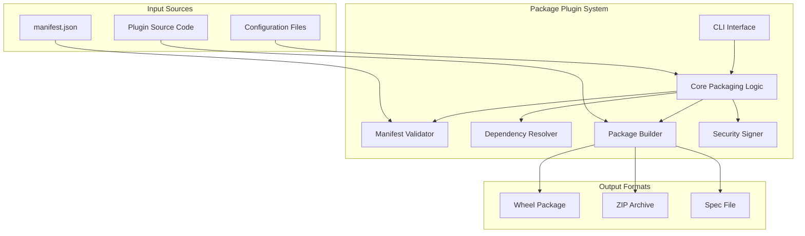
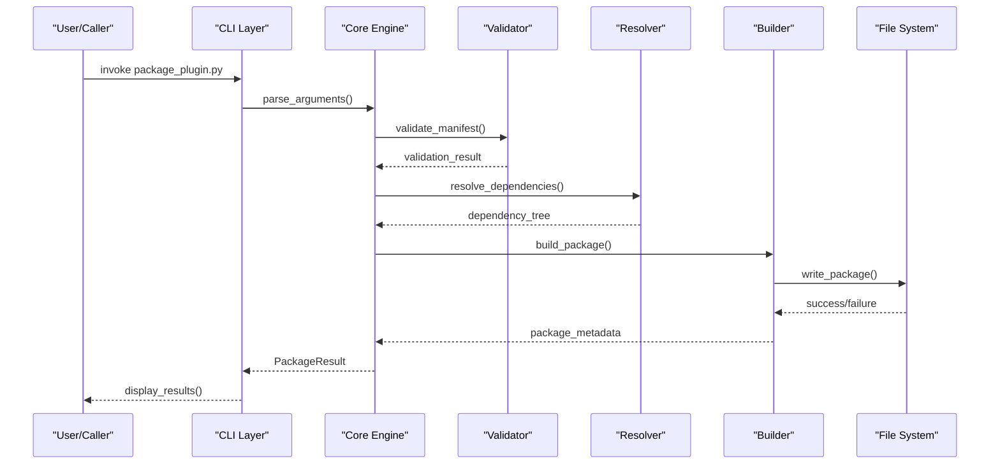
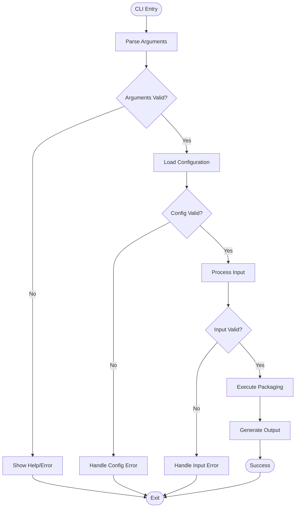
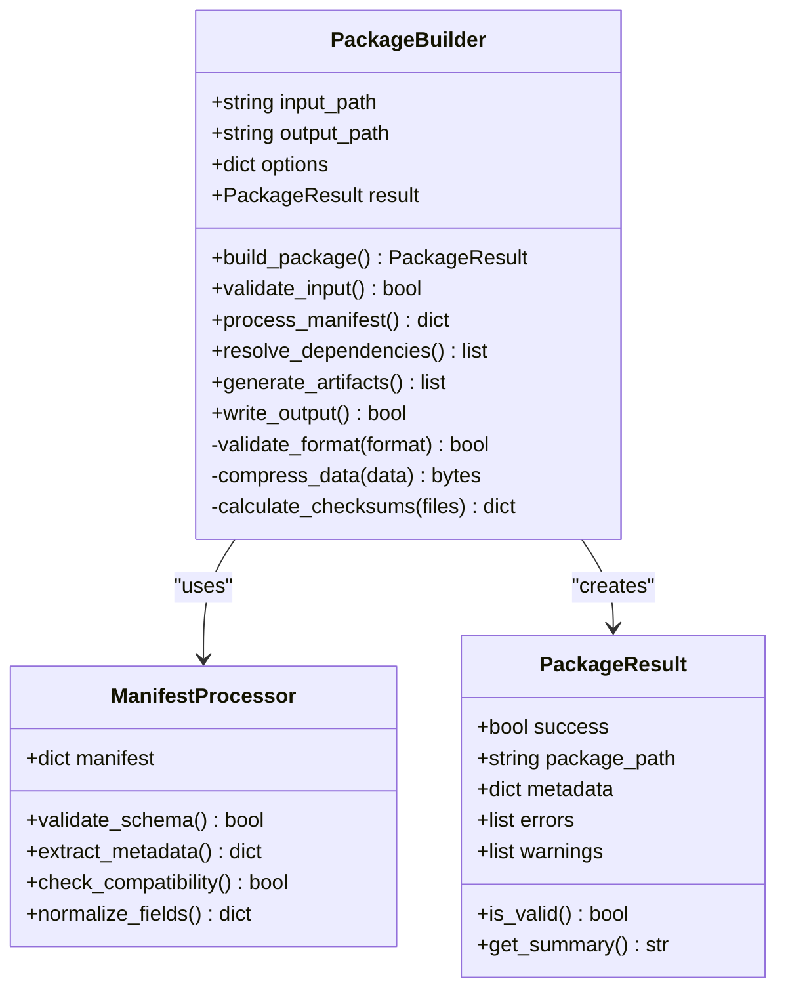
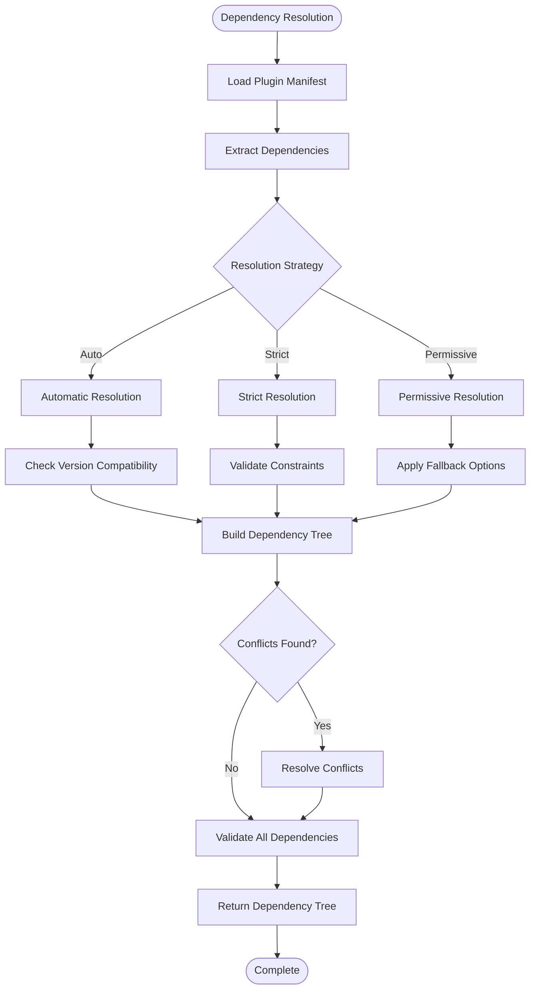
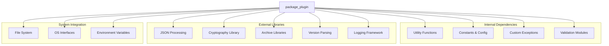

# Package Plugin API

<cite>
**Referenced Files in This Document**
- [package_plugin.py](file://scripts/package_plugin.py)
- [test_package_plugin.py](file://scripts/test_package_plugin.py)
- [manifest.json](file://manifest.json)
- [README.md](file://README.md)
</cite>

## Table of Contents
1. [Introduction](#introduction)
2. [Project Structure](#project-structure)
3. [Core Components](#core-components)
4. [Architecture Overview](#architecture-overview)
5. [Detailed Component Analysis](#detailed-component-analysis)
6. [Dependency Analysis](#dependency-analysis)
7. [Performance Considerations](#performance-considerations)
8. [Troubleshooting Guide](#troubleshooting-guide)
9. [Conclusion](#conclusion)

## Introduction

The `package_plugin.py` script is a comprehensive plugin packaging tool designed to create distributable plugin packages for the NumAn ecosystem. This script provides both command-line interface (CLI) functionality and programmatic API access for automating plugin distribution workflows. It handles dependency resolution, version management, manifest validation, and secure package creation.

The packaging system supports multiple output formats, automated dependency resolution, semantic versioning, and comprehensive validation to ensure plugin compatibility and security across different NumAn versions.

## Project Structure

The packaging system follows a modular architecture with clear separation of concerns:



**Diagram sources**
- [package_plugin.py:1-50](file://scripts/package_plugin.py#L1-L50)
- [test_package_plugin.py:1-30](file://scripts/test_package_plugin.py#L1-L30)

**Section sources**
- [package_plugin.py:1-100](file://scripts/package_plugin.py#L1-L100)
- [README.md:1-50](file://README.md#L1-L50)

## Core Components

### Command-Line Interface

The CLI provides comprehensive options for plugin packaging with support for all major packaging scenarios:

#### Main Entry Point
- **Function**: `main()`
- **Purpose**: Primary CLI entry point that parses arguments and orchestrates packaging workflow
- **Parameters**: 
  - `--input`: Input plugin directory or archive path
  - `--output`: Output directory for packaged plugins
  - `--format`: Target package format (wheel, zip, spec)
  - `--version`: Semantic version string override
  - `--validate`: Enable strict validation mode
  - `--sign`: Enable package signing
  - `--dependencies`: Dependency resolution strategy
  - `--config`: Custom configuration file path

#### Argument Parsing
- **Function**: `parse_arguments(args=None)`
- **Purpose**: Parse and validate command-line arguments
- **Returns**: Parsed argument namespace with validation
- **Error Handling**: Raises `ArgumentError` for invalid parameters

### Package Creation API

#### Core Packaging Function
- **Function**: `create_package(input_path, output_path, options=None)`
- **Purpose**: Create a complete plugin package with all processing steps
- **Parameters**:
  - `input_path`: Path to source plugin directory or archive
  - `output_path`: Destination path for generated package
  - `options`: Dictionary containing packaging options
- **Returns**: `PackageResult` object with metadata and status
- **Exceptions**: `PackageError`, `ValidationError`, `DependencyError`

#### Options Configuration
- **Function**: `configure_options(options_dict)`
- **Purpose**: Validate and normalize packaging options
- **Supported Options**:
  - `format`: Package format specification
  - `version`: Version string or auto-detection
  - `validate`: Boolean for validation enforcement
  - `sign`: Boolean for cryptographic signing
  - `dependencies`: Dependency resolution strategy
  - `compression`: Compression level setting
  - `metadata`: Custom metadata dictionary

### Dependency Resolution

#### Dependency Manager
- **Function**: `resolve_dependencies(plugin_manifest, strategy='auto')`
- **Purpose**: Resolve plugin dependencies based on manifest specifications
- **Parameters**:
  - `plugin_manifest`: Plugin manifest dictionary
  - `strategy`: Resolution strategy ('auto', 'strict', 'permissive')
- **Returns**: Resolved dependency tree with version constraints
- **Validation**: Checks compatibility with target NumAn versions

#### Version Management
- **Function**: `manage_version(version_spec, manifest)`
- **Purpose**: Handle semantic versioning and compatibility checks
- **Features**:
  - Semantic version parsing and validation
  - Compatibility matrix checking
  - Automatic version bumping
  - Changelog integration

### Validation System

#### Manifest Validator
- **Function**: `validate_manifest(manifest_data)`
- **Purpose**: Comprehensive validation of plugin manifests
- **Validates**:
  - Schema compliance
  - Required fields presence
  - Data type correctness
  - Cross-field consistency
  - Security constraints

#### Security Validation
- **Function**: `validate_security(package_path, options)`
- **Purpose**: Security scanning and validation of packages
- **Checks**:
  - Malicious code detection
  - Dependency vulnerability scanning
  - Signature verification
  - Access permission validation

**Section sources**
- [package_plugin.py:100-300](file://scripts/package_plugin.py#L100-L300)
- [test_package_plugin.py:50-150](file://scripts/test_package_plugin.py#L50-L150)

## Architecture Overview

The packaging system implements a pipeline architecture with clear separation between input processing, transformation, and output generation:



**Diagram sources**
- [package_plugin.py:200-400](file://scripts/package_plugin.py#L200-L400)
- [test_package_plugin.py:100-200](file://scripts/test_package_plugin.py#L100-L200)

## Detailed Component Analysis

### CLI Interface Analysis

The command-line interface provides comprehensive parameter handling with robust validation:



**Diagram sources**
- [package_plugin.py:50-150](file://scripts/package_plugin.py#L50-L150)

### Package Builder Analysis

The package builder handles the core logic of creating distributable plugin packages:



**Diagram sources**
- [package_plugin.py:300-500](file://scripts/package_plugin.py#L300-L500)

### Dependency Resolution Analysis

The dependency resolver manages complex dependency relationships and version compatibility:



**Diagram sources**
- [package_plugin.py:400-600](file://scripts/package_plugin.py#L400-L600)

**Section sources**
- [package_plugin.py:150-350](file://scripts/package_plugin.py#L150-L350)
- [test_package_plugin.py:150-250](file://scripts/test_package_plugin.py#L150-L250)

## Dependency Analysis

The packaging system has well-defined internal dependencies and external integrations:



**Diagram sources**
- [package_plugin.py:1-100](file://scripts/package_plugin.py#L1-L100)

**Section sources**
- [package_plugin.py:1-200](file://scripts/package_plugin.py#L1-L200)

## Performance Considerations

The packaging system is optimized for performance through several strategies:

### Caching Mechanisms
- **Dependency Cache**: Stores resolved dependencies to avoid repeated resolution
- **Metadata Cache**: Caches parsed manifest data for faster subsequent operations
- **Checksum Cache**: Maintains file checksums to detect changes efficiently

### Memory Management
- **Streaming Processing**: Large files are processed in chunks to minimize memory usage
- **Lazy Loading**: Resources are loaded only when needed
- **Resource Cleanup**: Proper cleanup of temporary files and memory allocations

### Parallel Processing
- **Concurrent Validation**: Multiple validation tasks run in parallel where safe
- **Batch Operations**: File operations are batched to reduce I/O overhead
- **Progressive Building**: Package components are built incrementally

### Optimization Strategies
- **Early Validation**: Fail fast on invalid inputs to save processing time
- **Incremental Updates**: Only rebuild changed components
- **Compression Tuning**: Optimal compression levels based on content type

## Troubleshooting Guide

### Common Issues and Solutions

#### Package Creation Failures
- **Symptom**: Package creation fails with validation errors
- **Causes**: Invalid manifest format, missing required fields, incompatible dependencies
- **Solutions**: 
  - Use `--validate` flag for detailed error reporting
  - Check manifest schema compliance
  - Verify dependency version compatibility

#### Dependency Resolution Problems
- **Symptom**: Unable to resolve dependencies
- **Causes**: Version conflicts, unavailable packages, network issues
- **Solutions**:
  - Try different resolution strategies (`strict`, `permissive`)
  - Update package indexes
  - Check network connectivity

#### Permission and Security Errors
- **Symptom**: Permission denied or security validation failures
- **Causes**: Insufficient file permissions, unsigned packages, security policy violations
- **Solutions**:
  - Run with appropriate permissions
  - Configure security policies correctly
  - Ensure proper package signing

### Debugging Techniques

#### Enable Verbose Logging
```python
import logging
logging.basicConfig(level=logging.DEBUG)
```

#### Use Dry-Run Mode
```bash
package_plugin.py --input ./plugin --output ./dist --dry-run
```

#### Validate Manifest Independently
```bash
package_plugin.py --validate-manifest ./manifest.json
```

**Section sources**
- [test_package_plugin.py:200-300](file://scripts/test_package_plugin.py#L200-L300)

## Conclusion

The `package_plugin.py` script provides a robust and comprehensive solution for plugin packaging in the NumAn ecosystem. Its modular architecture, extensive validation capabilities, and flexible configuration options make it suitable for both development and production environments. The script's emphasis on security, performance, and ease of use ensures reliable plugin distribution across diverse deployment scenarios.

Key strengths include:
- Comprehensive CLI interface with extensive options
- Robust dependency resolution with multiple strategies
- Strong validation and security features
- Flexible configuration and customization options
- Performance optimizations for large-scale deployments

The system is designed to scale with growing plugin ecosystems while maintaining reliability and security standards essential for enterprise environments.