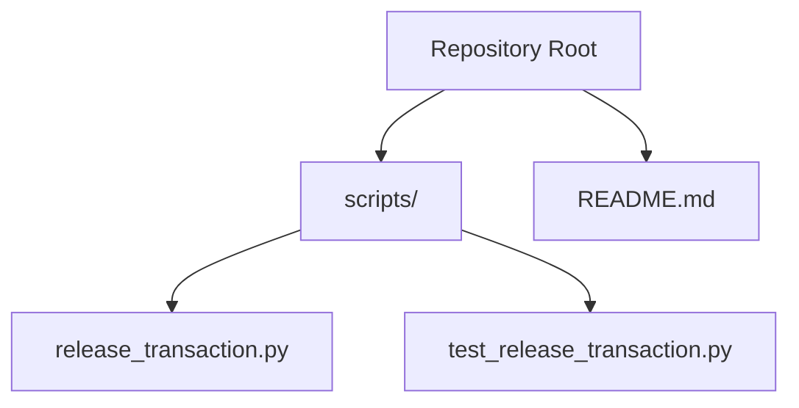
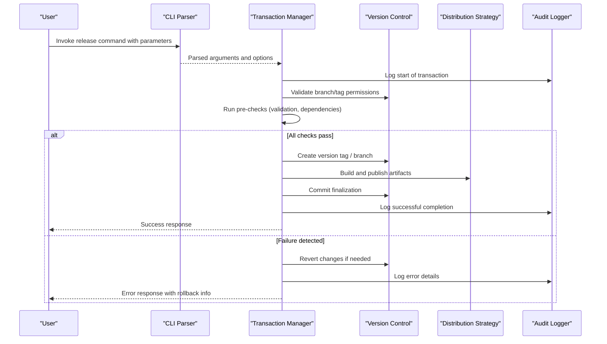
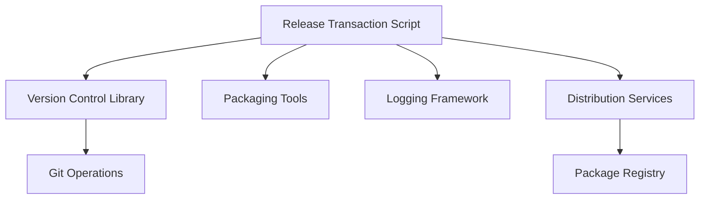

# Release Transaction API

<cite>
**Referenced Files in This Document**
- [release_transaction.py](file://scripts/release_transaction.py)
- [test_release_transaction.py](file://scripts/test_release_transaction.py)
- [README.md](file://README.md)
</cite>

## Table of Contents
1. [Introduction](#introduction)
2. [Project Structure](#project-structure)
3. [Core Components](#core-components)
4. [Architecture Overview](#architecture-overview)
5. [Detailed Component Analysis](#detailed-component-analysis)
6. [Dependency Analysis](#dependency-analysis)
7. [Performance Considerations](#performance-considerations)
8. [Troubleshooting Guide](#troubleshooting-guide)
9. [Conclusion](#conclusion)
10. [Appendices](#appendices)

## Introduction
This document provides comprehensive API documentation for the release_transaction.py script, focusing on its command-line interface, transaction management functions, and parameters used to automate release workflows. It explains how to create, execute, and manage release transactions; covers state management and error recovery; and outlines integration with version control systems. Security considerations and audit logging requirements are also addressed to ensure safe and auditable release operations.

## Project Structure
The repository is organized around a small set of scripts under the scripts directory, with tests colocated alongside their implementations. The release_transaction.py script is the primary entry point for automating release transactions. Tests validate behavior and serve as usage examples.

**Diagram sources**
- [release_transaction.py](file://scripts/release_transaction.py)
- [test_release_transaction.py](file://scripts/test_release_transaction.py)
- [README.md](file://README.md)

**Section sources**
- [README.md](file://README.md)

## Core Components
The release_transaction.py script exposes:
- A command-line interface for creating, executing, and managing release transactions
- Functions to orchestrate versioning, distribution strategies, and rollback capabilities
- State management utilities to track transaction lifecycle and outcomes
- Integration helpers for version control operations (e.g., tagging, branching)
- Audit logging hooks to record actions and decisions during releases

Key responsibilities include:
- Validating inputs and environment prerequisites
- Preparing artifacts and metadata
- Performing atomic steps within a transaction boundary
- Committing or rolling back changes based on success or failure
- Emitting structured logs for auditability

**Section sources**
- [release_transaction.py](file://scripts/release_transaction.py)

## Architecture Overview
The release workflow follows a transactional model:
- Parse CLI arguments and configuration
- Validate environment and prerequisites
- Execute pre-release checks
- Perform release steps (version bump, artifact creation, tagging)
- Publish or distribute artifacts according to strategy
- Commit results and finalize state
- Rollback on errors with detailed diagnostics

**Diagram sources**
- [release_transaction.py](file://scripts/release_transaction.py)
- [test_release_transaction.py](file://scripts/test_release_transaction.py)

## Detailed Component Analysis

### Command-Line Interface
The CLI supports commands to:
- Create a new release transaction with version and metadata
- Execute a transaction through predefined steps
- Inspect transaction state and history
- Roll back a failed transaction safely
- Configure distribution strategy and target environments

Typical parameters include:
- Version identifier (semantic versioning)
- Distribution strategy (e.g., staged rollout, immediate publish)
- Target platforms or channels
- Dry-run mode for validation without side effects
- Force flags to bypass interactive prompts
- Logging verbosity and output format

Example usage patterns:
- Create a transaction with a specific version and strategy
- Execute a transaction in dry-run mode to validate steps
- Roll back a transaction after detecting an issue

**Section sources**
- [release_transaction.py](file://scripts/release_transaction.py)
- [test_release_transaction.py](file://scripts/test_release_transaction.py)

### Transaction Management Functions
Core functions handle:
- Initialization and validation of transaction context
- Step execution with atomic boundaries
- State persistence and recovery
- Error handling and rollback triggers
- Finalization and cleanup

State transitions typically follow:
- Created -> Validated -> Executing -> Completed or Failed
- Failed -> Rolling Back -> Rolled Back

Error recovery mechanisms:
- Automatic rollback on critical failures
- Partial rollback support for multi-step processes
- Detailed error messages and stack traces for debugging
- Idempotent operations where possible

**Section sources**
- [release_transaction.py](file://scripts/release_transaction.py)

### Version Management
Version management features include:
- Semantic version parsing and validation
- Increment strategies (major, minor, patch)
- Tagging conventions and naming rules
- Conflict detection and resolution
- History tracking and changelog generation

Integration points:
- Version control tagging and branching
- Artifact naming and metadata injection
- Dependency version constraints

**Section sources**
- [release_transaction.py](file://scripts/release_transaction.py)

### Distribution Strategies
Supported strategies may include:
- Immediate publish to production
- Staged rollout with canary deployments
- Manual approval gates
- Environment-specific configurations

Parameters:
- Target channels or environments
- Rollout percentages and thresholds
- Approval workflows and notifications
- Retry policies and timeouts

**Section sources**
- [release_transaction.py](file://scripts/release_transaction.py)

### Rollback Capabilities
Rollback functionality ensures safety:
- Automatic rollback on step failures
- Manual rollback invocation
- Point-in-time restoration using tags
- Verification of rollback integrity

Operational considerations:
- Data consistency checks post-rollback
- Notification of rollback events
- Audit trail preservation

**Section sources**
- [release_transaction.py](file://scripts/release_transaction.py)

### State Management
State management tracks:
- Current transaction status
- Step execution history
- Configuration snapshots
- Error states and recovery actions

Persistence mechanisms:
- Local state files or databases
- Version control as source of truth
- External state stores for distributed systems

**Section sources**
- [release_transaction.py](file://scripts/release_transaction.py)

### Error Handling and Recovery
Error handling includes:
- Structured error types and codes
- Graceful degradation when possible
- Retry logic with exponential backoff
- Comprehensive logging and metrics

Recovery procedures:
- Automated rollback triggers
- Manual intervention prompts
- Escalation paths for critical failures

**Section sources**
- [release_transaction.py](file://scripts/release_transaction.py)

### Integration with Version Control Systems
VCS integration covers:
- Branch creation and protection rules
- Tag creation and verification
- Commit message formatting standards
- Merge request automation

Security considerations:
- Permission validation before operations
- Signed commits and tags
- Audit logging of all VCS interactions

**Section sources**
- [release_transaction.py](file://scripts/release_transaction.py)

### Security Considerations
Security measures include:
- Input validation and sanitization
- Secure credential handling
- Least privilege access models
- Encryption of sensitive data at rest and in transit

Operational security:
- Role-based access control for release operations
- Audit logging of all actions
- Compliance with security policies

**Section sources**
- [release_transaction.py](file://scripts/release_transaction.py)

### Audit Logging Requirements
Audit logging captures:
- Timestamps and user identities
- Action descriptions and parameters
- Success/failure outcomes
- System state changes

Logging best practices:
- Structured log formats for parsing
- Centralized log aggregation
- Retention policies and archival

**Section sources**
- [release_transaction.py](file://scripts/release_transaction.py)

## Dependency Analysis
The release transaction system depends on:
- Python standard library modules for core functionality
- Version control libraries for Git operations
- Packaging tools for artifact creation
- Logging frameworks for audit trails

External integrations:
- Package registries for distribution
- CI/CD pipelines for automation
- Monitoring and alerting systems

**Diagram sources**
- [release_transaction.py](file://scripts/release_transaction.py)

**Section sources**
- [release_transaction.py](file://scripts/release_transaction.py)

## Performance Considerations
Optimization strategies include:
- Parallel execution of independent steps
- Caching of build artifacts and metadata
- Efficient file I/O operations
- Memory management for large datasets

Scalability factors:
- Distributed transaction processing
- Load balancing across workers
- Resource pooling and limits

Monitoring recommendations:
- Performance metrics collection
- Bottleneck identification
- Capacity planning insights

[No sources needed since this section provides general guidance]

## Troubleshooting Guide
Common issues and resolutions:
- Permission errors with version control operations
- Network connectivity problems during distribution
- Inconsistent state after partial failures
- Insufficient disk space for artifact creation

Debugging techniques:
- Enable verbose logging modes
- Inspect transaction state files
- Review audit logs for error patterns
- Use dry-run mode for validation

Recovery procedures:
- Manual rollback commands
- State reset operations
- Re-execution of failed steps

**Section sources**
- [release_transaction.py](file://scripts/release_transaction.py)
- [test_release_transaction.py](file://scripts/test_release_transaction.py)

## Conclusion
The release_transaction.py script provides a robust framework for automating release workflows with strong transaction management, error recovery, and audit capabilities. By following the documented interfaces and best practices, teams can implement secure, reliable, and scalable release processes that integrate seamlessly with version control systems and distribution channels.

[No sources needed since this section summarizes without analyzing specific files]

## Appendices

### Example Workflows
Creating a release transaction:
- Define version and distribution strategy
- Validate configuration and prerequisites
- Execute transaction with monitoring

Executing a release:
- Monitor progress and logs
- Handle any required approvals
- Verify successful completion

Managing rollbacks:
- Identify failure points
- Trigger automatic or manual rollback
- Verify system stability post-rollback

**Section sources**
- [release_transaction.py](file://scripts/release_transaction.py)
- [test_release_transaction.py](file://scripts/test_release_transaction.py)

### Parameter Reference
Core parameters:
- Version: Semantic version string
- Strategy: Distribution approach selection
- Environment: Target deployment environment
- Dry-run: Validation-only mode
- Force: Override confirmation prompts
- Verbose: Enhanced logging output

Advanced parameters:
- Retry count: Number of retry attempts
- Timeout: Operation timeout values
- Cache: Cache configuration options
- Notifications: Alerting preferences

**Section sources**
- [release_transaction.py](file://scripts/release_transaction.py)