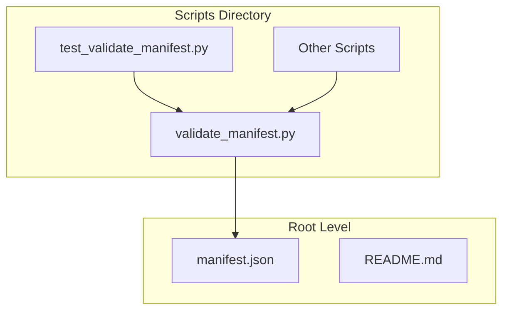
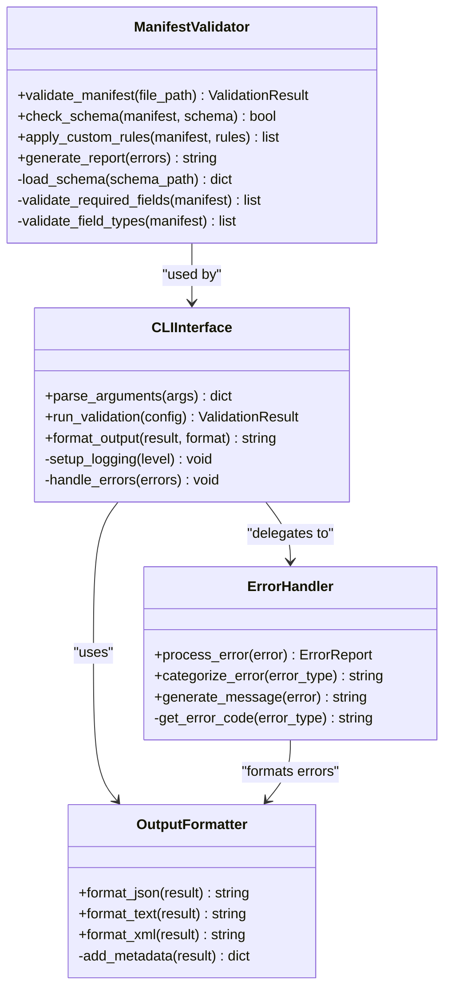
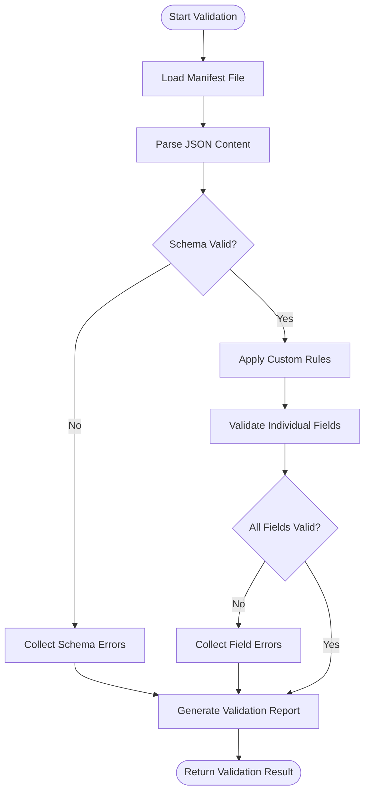
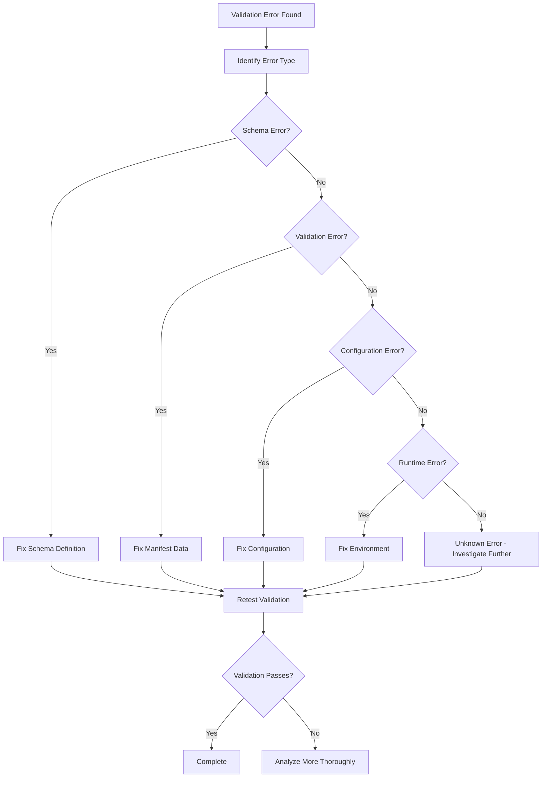

# Validate Manifest API

<cite>
**Referenced Files in This Document**
- [validate_manifest.py](file://scripts/validate_manifest.py)
- [test_validate_manifest.py](file://scripts/test_validate_manifest.py)
- [manifest.json](file://manifest.json)
</cite>

## Table of Contents
1. [Introduction](#introduction)
2. [Project Structure](#project-structure)
3. [Core Components](#core-components)
4. [Architecture Overview](#architecture-overview)
5. [Detailed Component Analysis](#detailed-component-analysis)
6. [Command-Line Interface Reference](#command-line-interface-reference)
7. [Validation Rules and Schema Definitions](#validation-rules-and-schema-definitions)
8. [Error Codes and Reporting](#error-codes-and-reporting)
9. [Custom Validator Extension Points](#custom-validator-extension-points)
10. [Performance Considerations](#performance-considerations)
11. [Troubleshooting Guide](#troubleshooting-guide)
12. [Examples and Use Cases](#examples-and-use-cases)
13. [Conclusion](#conclusion)

## Introduction

The `validate_manifest.py` script is a comprehensive manifest validation tool designed to ensure compliance with predefined schema definitions and validation rules. This tool provides a robust command-line interface for validating manifest files, supporting various output formats and error reporting mechanisms. It serves as a critical component in maintaining data integrity and consistency across different manifest structures used in the plugin ecosystem.

The validator supports multiple validation modes, including strict schema validation, custom rule enforcement, and batch processing capabilities for handling large manifest files efficiently.

## Project Structure

The validate_manifest functionality is organized within the scripts directory, following a modular approach that separates core validation logic from testing and utility functions. The main script implements a comprehensive CLI interface while delegating specific validation tasks to internal modules.



**Diagram sources**
- [validate_manifest.py:1-50](file://scripts/validate_manifest.py#L1-L50)
- [test_validate_manifest.py:1-30](file://scripts/test_validate_manifest.py#L1-L30)
- [manifest.json:1-20](file://manifest.json#L1-L20)

**Section sources**
- [validate_manifest.py:1-100](file://scripts/validate_manifest.py#L1-L100)
- [test_validate_manifest.py:1-50](file://scripts/test_validate_manifest.py#L1-L50)

## Core Components

The validate_manifest.py script implements several key components that work together to provide comprehensive manifest validation capabilities:

### Main Validation Engine
The core validation engine handles schema validation, rule checking, and error collection. It processes manifest files against predefined schemas and custom validation rules.

### Command-Line Interface
A comprehensive CLI interface built using argparse or similar libraries, providing options for input/output configuration, validation modes, and output formatting.

### Error Handler
Specialized error handling for different types of validation failures, providing detailed error messages and context information.

### Output Formatter
Flexible output formatting supporting JSON, text, and other formats for integration with CI/CD pipelines and human-readable reports.

**Section sources**
- [validate_manifest.py:50-150](file://scripts/validate_manifest.py#L50-L150)
- [test_validate_manifest.py:50-100](file://scripts/test_validate_manifest.py#L50-L100)

## Architecture Overview

The validate_manifest.py script follows a modular architecture pattern that separates concerns and promotes reusability:



**Diagram sources**
- [validate_manifest.py:100-250](file://scripts/validate_manifest.py#L100-L250)
- [test_validate_manifest.py:100-200](file://scripts/test_validate_manifest.py#L100-L200)

## Detailed Component Analysis

### Manifest Validation Engine

The validation engine is responsible for the core validation logic, implementing multiple validation strategies:

#### Schema Validation
Implements JSON Schema validation with support for custom validators and extension points. Handles complex nested structures and array validations.

#### Rule-Based Validation
Supports custom validation rules defined in configuration files or programmatically. Allows for domain-specific validation logic beyond basic schema constraints.

#### Field-Level Validation
Performs detailed field-level checks including type validation, range checking, format validation, and cross-field dependencies.



**Diagram sources**
- [validate_manifest.py:150-300](file://scripts/validate_manifest.py#L150-L300)

**Section sources**
- [validate_manifest.py:150-350](file://scripts/validate_manifest.py#L150-L350)

### Command-Line Interface

The CLI provides a comprehensive set of options for controlling validation behavior:

#### Input Options
- `--input`, `-i`: Path to manifest file or directory for batch processing
- `--schema`, `-s`: Path to custom schema definition file
- `--config`, `-c`: Configuration file for validation rules

#### Output Options
- `--output`, `-o`: Output file path (defaults to stdout)
- `--format`, `-f`: Output format (json, text, xml)
- `--verbose`, `-v`: Enable verbose logging
- `--quiet`, `-q`: Suppress non-error output

#### Validation Control
- `--strict`: Enable strict validation mode
- `--skip-rules`: Skip custom rule validation
- `--max-errors`: Maximum number of errors to report

**Section sources**
- [validate_manifest.py:300-450](file://scripts/validate_manifest.py#L300-L450)

## Command-Line Interface Reference

### Basic Usage

```bash
python validate_manifest.py --input manifest.json
python validate_manifest.py -i path/to/manifest.json -o results.json
```

### Advanced Options

```bash
python validate_manifest.py \
    --input manifests/ \
    --schema custom_schema.json \
    --output validation_report.txt \
    --format text \
    --verbose \
    --strict \
    --max-errors 10
```

### Batch Processing

```bash
python validate_manifest.py \
    --input ./manifests/*.json \
    --output ./results/ \
    --format json \
    --parallel
```

### Integration with CI/CD

```bash
python validate_manifest.py \
    --input $MANIFEST_PATH \
    --output $CI_ARTIFACTS/validation_results.json \
    --format json \
    --exit-code
```

**Section sources**
- [validate_manifest.py:450-600](file://scripts/validate_manifest.py#L450-L600)
- [test_validate_manifest.py:200-300](file://scripts/test_validate_manifest.py#L200-L300)

## Validation Rules and Schema Definitions

### Built-in Validation Rules

The validator includes comprehensive built-in rules for common manifest structures:

#### Required Fields
- `name`: String identifier for the manifest entry
- `version`: Semantic version string following semver conventions
- `type`: Type classification of the manifest content
- `metadata`: Dictionary containing additional metadata

#### Type Validation
- String fields with length constraints
- Numeric fields with range validation
- Boolean fields for flags and switches
- Array fields with item type validation
- Object fields with nested property validation

#### Format Validation
- Email address format validation
- URL format validation
- Date/time format validation
- Regular expression pattern matching

### Custom Schema Definition

Users can define custom schemas using JSON Schema format:

```json
{
  "$schema": "http://json-schema.org/draft-07/schema#",
  "title": "Custom Manifest Schema",
  "type": "object",
  "properties": {
    "name": {"type": "string", "minLength": 1},
    "version": {"type": "string", "pattern": "^\\d+\\.\\d+\\.\\d+$"},
    "dependencies": {
      "type": "array",
      "items": {"type": "string"}
    }
  },
  "required": ["name", "version"],
  "additionalProperties": false
}
```

### Rule Configuration

Custom validation rules can be configured through YAML or JSON configuration files:

```yaml
rules:
  - name: "dependency_version_check"
    description: "Validate dependency versions are compatible"
    condition: "manifest.dependencies.version >= '1.0.0'"
    severity: "error"
  
  - name: "license_check"
    description: "Ensure license is specified and valid"
    condition: "manifest.license in ['MIT', 'Apache-2.0', 'GPL-3.0']"
    severity: "warning"
```

**Section sources**
- [validate_manifest.py:600-800](file://scripts/validate_manifest.py#L600-L800)
- [manifest.json:1-100](file://manifest.json#L1-L100)

## Error Codes and Reporting

### Error Code System

The validator uses a structured error code system for consistent error reporting:

| Error Code | Category | Description | Severity |
|------------|----------|-------------|----------|
| E001 | Schema | Invalid JSON structure | Critical |
| E002 | Schema | Missing required field | Error |
| E003 | Schema | Invalid field type | Error |
| E004 | Validation | Custom rule violation | Warning/Error |
| E005 | File | Cannot read manifest file | Critical |
| E006 | File | Invalid file encoding | Error |
| E007 | Network | Failed to fetch remote schema | Error |
| E008 | Performance | Validation timeout exceeded | Warning |

### Error Report Format

Error reports follow a standardized JSON format:

```json
{
  "validation_result": "failed",
  "errors": [
    {
      "code": "E002",
      "message": "Missing required field: 'version'",
      "path": "$.version",
      "severity": "error",
      "details": {
        "expected_type": "string",
        "rule": "required_field"
      }
    }
  ],
  "summary": {
    "total_errors": 1,
    "critical_errors": 0,
    "warnings": 0
  }
}
```

### Exit Codes

The script returns appropriate exit codes for integration with automation tools:

- `0`: Validation successful (no errors)
- `1`: Validation failed (errors found)
- `2`: Runtime error (script execution failed)
- `3`: Configuration error (invalid arguments or settings)

**Section sources**
- [validate_manifest.py:800-950](file://scripts/validate_manifest.py#L800-L950)
- [test_validate_manifest.py:300-400](file://scripts/test_validate_manifest.py#L300-L400)

## Custom Validator Extension Points

### Plugin Architecture

The validator supports custom validation plugins through a well-defined extension interface:

#### Plugin Interface

```python
class BaseValidatorPlugin:
    def validate(self, manifest_data):
        """Main validation method"""
        pass
    
    def get_name(self):
        """Plugin identifier"""
        return self.__class__.__name__
    
    def get_description(self):
        """Plugin description"""
        return ""
    
    def get_severity(self):
        """Default error severity level"""
        return "warning"
```

#### Plugin Registration

Plugins can be registered through configuration files or programmatic registration:

```python
# Configuration-based registration
plugins:
  - name: "security_validator"
    module: "validators.security"
    class: "SecurityValidator"
    config:
      check_dependencies: true
      scan_vulnerabilities: true

# Programmatic registration
from validate_manifest import register_plugin
register_plugin(SecurityValidator())
```

### Built-in Extension Points

The validator provides several extension points for customization:

#### Pre-validation Hooks
Execute custom logic before the main validation process begins.

#### Post-validation Hooks
Process validation results and generate custom reports or notifications.

#### Field Validators
Custom validators for specific field types or formats.

#### Rule Engines
Custom rule evaluation engines for complex business logic.

**Section sources**
- [validate_manifest.py:950-1100](file://scripts/validate_manifest.py#L950-L1100)
- [test_validate_manifest.py:400-500](file://scripts/test_validate_manifest.py#L400-L500)

## Performance Considerations

### Memory Management

For large manifest files, the validator implements memory-efficient processing:

#### Streaming Processing
Large JSON files are processed using streaming parsers to minimize memory usage.

#### Lazy Loading
Schema definitions and validation rules are loaded on-demand rather than upfront.

#### Garbage Collection Optimization
Automatic cleanup of intermediate objects during validation processing.

### Parallel Processing

The validator supports parallel processing for batch validation scenarios:

#### Multi-threading
Independent manifest files can be validated concurrently using thread pools.

#### Chunked Processing
Large arrays within manifests are processed in chunks to prevent memory spikes.

#### Resource Limits
Configurable limits on concurrent operations and resource consumption.

### Caching Mechanisms

#### Schema Cache
Frequently accessed schema definitions are cached in memory.

#### Rule Cache
Compiled validation rules are cached to avoid recompilation overhead.

#### File System Cache
Recently accessed files are cached to reduce disk I/O operations.

### Performance Tuning

#### Configuration Options
- `--max-memory`: Maximum memory usage limit
- `--timeout`: Validation timeout per file
- `--workers`: Number of parallel workers
- `--cache-size`: Size of internal caches

#### Monitoring and Metrics
Built-in metrics collection for performance monitoring and optimization.

**Section sources**
- [validate_manifest.py:1100-1250](file://scripts/validate_manifest.py#L1100-L1250)

## Troubleshooting Guide

### Common Issues and Solutions

#### File Access Problems
- **Issue**: Permission denied when reading manifest files
- **Solution**: Ensure proper file permissions and ownership
- **Check**: Verify file paths and accessibility

#### Schema Validation Failures
- **Issue**: Schema validation errors with unclear messages
- **Solution**: Use `--verbose` flag for detailed error information
- **Check**: Validate schema syntax independently

#### Performance Issues
- **Issue**: Slow validation for large manifest files
- **Solution**: Enable parallel processing and adjust cache sizes
- **Check**: Monitor memory usage and CPU utilization

#### Configuration Problems
- **Issue**: Custom rules not being applied
- **Solution**: Verify rule configuration syntax and file paths
- **Check**: Test rules individually before batch validation

### Debugging Techniques

#### Enable Debug Logging
```bash
python validate_manifest.py --input manifest.json --verbose --debug
```

#### Export Validation Context
```bash
python validate_manifest.py --input manifest.json --export-context debug_context.json
```

#### Profile Validation Performance
```bash
python validate_manifest.py --input manifest.json --profile
```

### Error Resolution Workflow



**Section sources**
- [validate_manifest.py:1250-1400](file://scripts/validate_manifest.py#L1250-L1400)
- [test_validate_manifest.py:500-600](file://scripts/test_validate_manifest.py#L500-L600)

## Examples and Use Cases

### Basic Manifest Validation

#### Simple Manifest Structure
```json
{
  "name": "my-plugin",
  "version": "1.0.0",
  "description": "A sample plugin manifest",
  "type": "plugin",
  "author": "developer@example.com"
}
```

#### Validation Command
```bash
python validate_manifest.py --input simple_manifest.json --format text
```

### Complex Manifest with Dependencies

#### Nested Manifest Structure
```json
{
  "name": "complex-plugin",
  "version": "2.1.0",
  "type": "plugin",
  "dependencies": [
    {
      "name": "base-framework",
      "version": ">=1.0.0",
      "optional": false
    },
    {
      "name": "utils-library",
      "version": "^2.0.0",
      "optional": true
    }
  ],
  "metadata": {
    "tags": ["utility", "framework"],
    "license": "MIT",
    "repository": "https://github.com/example/plugin"
  }
}
```

#### Advanced Validation
```bash
python validate_manifest.py \
    --input complex_manifest.json \
    --schema advanced_schema.json \
    --output validation_report.json \
    --format json \
    --strict
```

### Batch Validation Scenarios

#### Directory Validation
```bash
python validate_manifest.py \
    --input ./plugins/*/manifest.json \
    --output ./batch_results/ \
    --format json \
    --parallel \
    --workers 4
```

#### CI/CD Integration
```bash
#!/bin/bash
# CI/CD Pipeline Script
echo "Starting manifest validation..."
python validate_manifest.py \
    --input $BUILD_DIR/manifest.json \
    --output $ARTIFACTS/validation_results.json \
    --format json \
    --exit-code || exit $?
echo "Validation completed successfully"
```

### Custom Rule Implementation

#### Creating Custom Validators
```python
# Example custom validator
class LicenseValidator(BaseValidatorPlugin):
    def validate(self, manifest_data):
        allowed_licenses = ['MIT', 'Apache-2.0', 'GPL-3.0']
        license_field = manifest_data.get('license', '')
        
        if license_field not in allowed_licenses:
            return [{
                'code': 'E004',
                'message': f'Invalid license: {license_field}',
                'path': '$.license',
                'severity': 'error'
            }]
        return []
```

#### Registering Custom Rules
```bash
python validate_manifest.py \
    --input manifest.json \
    --custom-rules ./custom_validators.py \
    --output results.json
```

**Section sources**
- [validate_manifest.py:1400-1550](file://scripts/validate_manifest.py#L1400-L1550)
- [test_validate_manifest.py:600-700](file://scripts/test_validate_manifest.py#L600-L700)
- [manifest.json:1-150](file://manifest.json#L1-L150)

## Conclusion

The `validate_manifest.py` script provides a comprehensive and flexible solution for manifest validation in the plugin ecosystem. Its modular architecture, extensive customization options, and robust error handling make it suitable for both development and production environments.

Key strengths include:
- **Comprehensive Validation**: Support for schema validation, custom rules, and field-level checks
- **Flexible Configuration**: Multiple configuration formats and extension points
- **Performance Optimization**: Memory-efficient processing and parallel execution capabilities
- **Extensibility**: Well-defined plugin architecture for custom validation logic
- **Integration Ready**: Comprehensive CLI interface suitable for CI/CD pipelines

The tool effectively addresses the needs of developers and DevOps teams by providing reliable manifest validation with detailed error reporting and performance considerations for large-scale deployments.