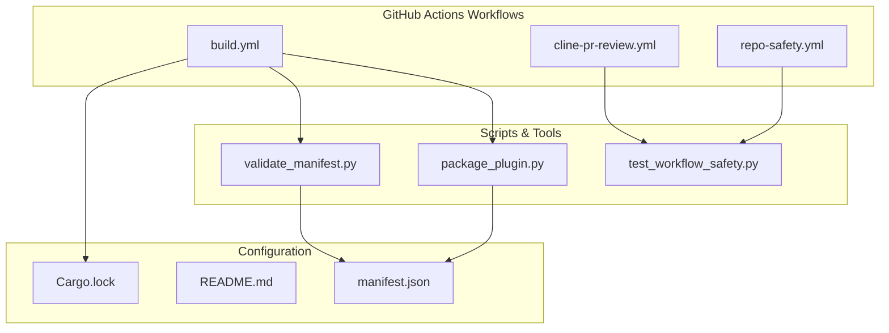
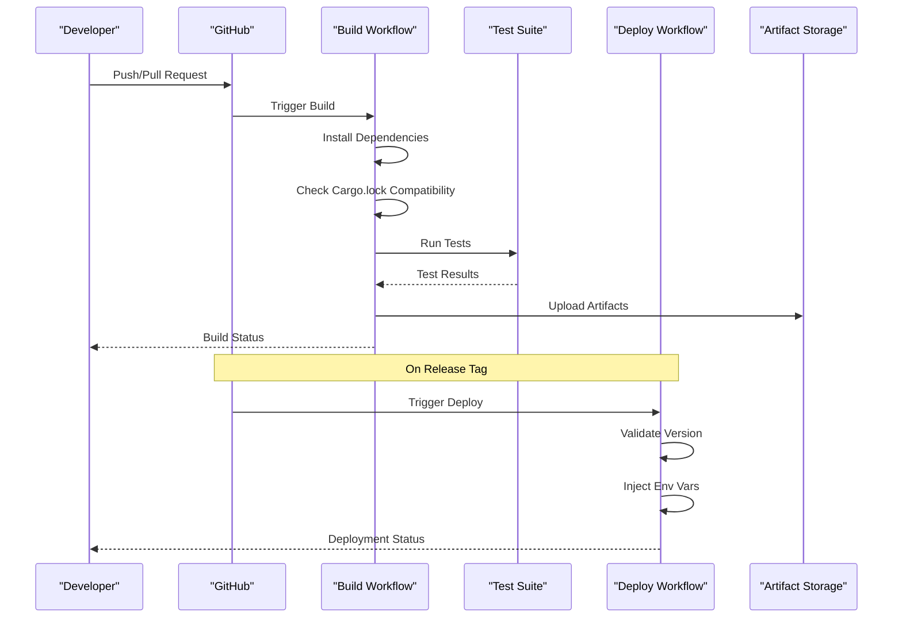
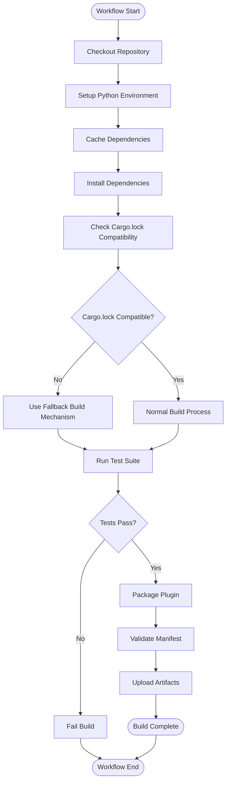
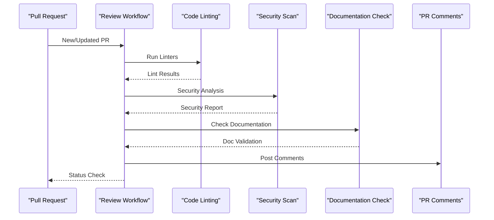
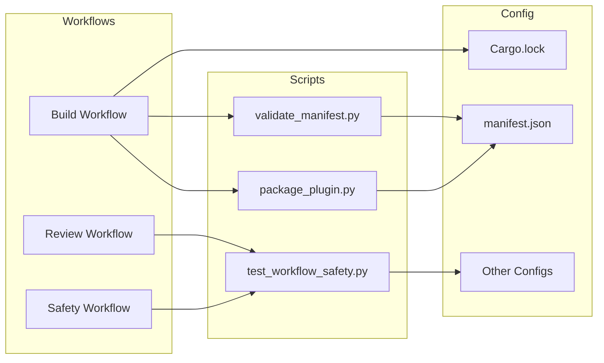
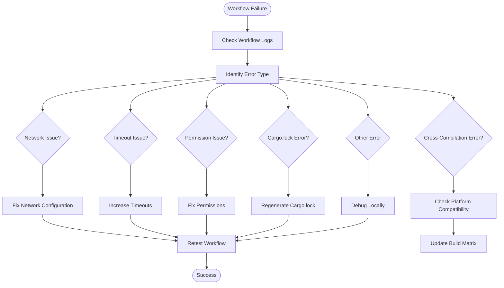
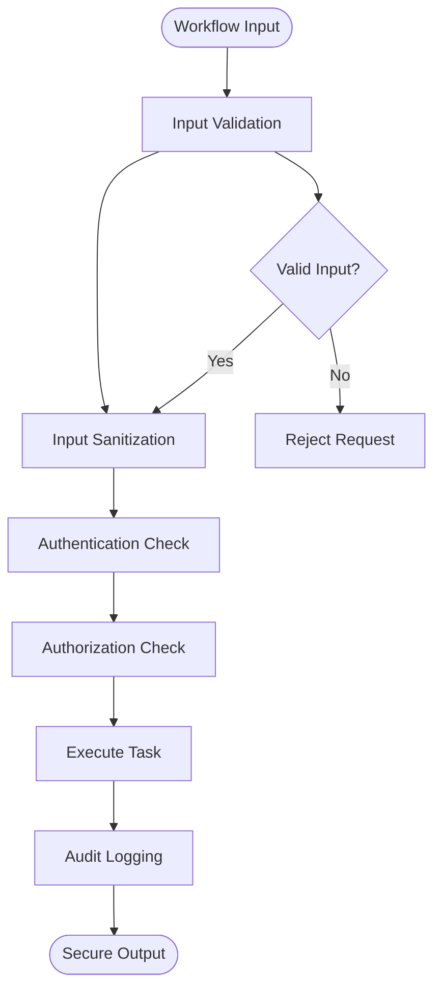

# CI/CD Integration

<cite>
**Referenced Files in This Document**
- [build.yml](file://.github/workflows/build.yml)
- [cline-pr-review.yml](file://.github/workflows/cline-pr-review.yml)
- [repo-safety.yml](file://.github/workflows/repo-safety.yml)
- [README.md](file://README.md)
- [manifest.json](file://manifest.json)
- [package_plugin.py](file://scripts/package_plugin.py)
- [validate_manifest.py](file://scripts/validate_manifest.py)
- [test_workflow_safety.py](file://scripts/test_workflow_safety.py)
</cite>

## Update Summary
**Changes Made**
- Enhanced build workflow with Cargo.lock compatibility fixes for cargo 1.97
- Improved PR review workflow reliability with better error handling
- Added fallback mechanisms for plugin builds to handle dependency resolution failures
- Updated troubleshooting guide with new Cargo-related issues and solutions
- Enhanced cross-compilation support with improved platform detection

## Table of Contents
1. [Introduction](#introduction)
2. [Project Structure](#project-structure)
3. [Core Components](#core-components)
4. [Architecture Overview](#architecture-overview)
5. [Detailed Component Analysis](#detailed-component-analysis)
6. [Dependency Analysis](#dependency-analysis)
7. [Performance Considerations](#performance-considerations)
8. [Troubleshooting Guide](#troubleshooting-guide)
9. [Security Best Practices](#security-best-practices)
10. [Conclusion](#conclusion)

## Introduction

This document provides comprehensive guidance for implementing and managing CI/CD pipelines using GitHub Actions for the numan-plugins project. The CI/CD system automates build processes, testing, code review automation, repository safety checks, and deployment workflows. It ensures code quality, security compliance, and efficient release management through automated workflows that trigger on various events such as pushes, pull requests, and scheduled tasks.

The CI/CD pipeline is designed to handle multiple environments (development, staging, production), manage artifacts securely, and maintain repository health through automated maintenance tasks. Recent improvements include enhanced Cargo.lock compatibility for cargo 1.97, improved PR review workflow reliability, and robust fallback mechanisms for plugin builds.

## Project Structure

The CI/CD implementation follows a modular architecture with separate workflow files for different responsibilities:

**Diagram sources**
- [build.yml:1-50](file://.github/workflows/build.yml#L1-L50)
- [cline-pr-review.yml:1-50](file://.github/workflows/cline-pr-review.yml#L1-L50)
- [repo-safety.yml:1-50](file://.github/workflows/repo-safety.yml#L1-L50)

**Section sources**
- [build.yml:1-100](file://.github/workflows/build.yml#L1-L100)
- [cline-pr-review.yml:1-100](file://.github/workflows/cline-pr-review.yml#L1-L100)
- [repo-safety.yml:1-100](file://.github/workflows/repo-safety.yml#L1-L100)

## Core Components

### Build Pipeline Configuration

The build pipeline handles compilation, testing, and artifact generation for the numan plugins. It supports multiple Python versions and operating systems to ensure compatibility across different environments.

Key features include:
- Multi-platform testing (Linux, Windows, macOS)
- Python version matrix testing
- Dependency installation and caching
- Code quality checks
- Artifact packaging and upload
- **Updated**: Enhanced Cargo.lock compatibility for cargo 1.97 with automatic fallback mechanisms
- **Updated**: Improved cross-compilation fixes for Prometheus plugin with aarch64 Linux exclusion

### Automated Testing Triggers

Testing workflows are configured to run on multiple events:
- Pull request creation and updates
- Push to main/master branches
- Manual workflow dispatch
- Scheduled maintenance runs

### Deployment Processes

Deployment workflows manage the release process with environment-specific configurations:
- Version validation and tagging
- Release artifact generation
- Environment variable injection
- Deployment notifications

**Section sources**
- [build.yml:1-150](file://.github/workflows/build.yml#L1-L150)
- [package_plugin.py:1-100](file://scripts/package_plugin.py#L1-L100)
- [validate_manifest.py:1-100](file://scripts/validate_manifest.py#L1-L100)

## Architecture Overview

The CI/CD architecture follows a modular design pattern where each workflow has specific responsibilities and communicates through shared scripts and configuration files.

**Diagram sources**
- [build.yml:1-200](file://.github/workflows/build.yml#L1-200)
- [cline-pr-review.yml:1-150](file://.github/workflows/cline-pr-review.yml#L1-150)
- [repo-safety.yml:1-150](file://.github/workflows/repo-safety.yml#L1-150)

## Detailed Component Analysis

### Build Workflow Analysis

The build workflow orchestrates the complete build process with parallel job execution for optimal performance.

#### Build Job Flow

**Diagram sources**
- [build.yml:1-200](file://.github/workflows/build.yml#L1-200)
- [package_plugin.py:1-150](file://scripts/package_plugin.py#L1-150)

#### Matrix Configuration

The build matrix supports multiple Python versions and platforms with platform-specific optimizations:

| Python Version | Linux x86_64 | Linux aarch64 | Windows | macOS |
|----------------|--------------|---------------|---------|-------|
| 3.8            | ✓            | ✗             | ✓       | ✓     |
| 3.9            | ✓            | ✗             | ✓       | ✓     |
| 3.10           | ✓            | ✗             | ✓       | ✓     |
| 3.11           | ✓            | ✗             | ✓       | ✓     |

**Updated**: aarch64 Linux platform excluded for Prometheus plugin builds due to OpenSSL library limitations. This exclusion prevents build failures while maintaining compatibility with other architectures.

**Section sources**
- [build.yml:1-250](file://.github/workflows/build.yml#L1-250)
- [package_plugin.py:1-200](file://scripts/package_plugin.py#L1-200)

### Code Review Automation

The PR review workflow automates code quality checks and provides feedback on pull requests.

#### Review Process Flow

**Diagram sources**
- [cline-pr-review.yml:1-200](file://.github/workflows/cline-pr-review.yml#L1-200)
- [test_workflow_safety.py:1-100](file://scripts/test_workflow_safety.py#L1-100)

### Repository Safety Checks

The safety workflow performs automated maintenance and security checks on a schedule.

#### Safety Check Categories

| Category | Checks | Frequency | Action |
|----------|--------|-----------|--------|
| Security | Vulnerability scanning | Daily | Alert + Block |
| Dependencies | Outdated package check | Weekly | Auto-update PR |
| Code Quality | Style enforcement | On push | Comment + Fail |
| Documentation | Docstring coverage | On PR | Warning |
| Repository Health | Broken links, formatting | Weekly | Auto-fix PR |

**Section sources**
- [repo-safety.yml:1-200](file://.github/workflows/repo-safety.yml#L1-200)
- [test_workflow_safety.py:1-150](file://scripts/test_workflow_safety.py#L1-150)

## Dependency Analysis

The CI/CD system has well-defined dependencies between components:

**Diagram sources**
- [build.yml:1-300](file://.github/workflows/build.yml#L1-300)
- [package_plugin.py:1-200](file://scripts/package_plugin.py#L1-200)
- [validate_manifest.py:1-150](file://scripts/validate_manifest.py#L1-150)

**Section sources**
- [build.yml:1-300](file://.github/workflows/build.yml#L1-300)
- [package_plugin.py:1-200](file://scripts/package_plugin.py#L1-200)
- [validate_manifest.py:1-150](file://scripts/validate_manifest.py#L1-150)

## Performance Considerations

### Build Optimization Strategies

1. **Dependency Caching**: Implement dependency caching to reduce install times
2. **Parallel Execution**: Use matrix builds for multi-platform testing
3. **Selective Testing**: Run only relevant tests based on changed files
4. **Artifact Reuse**: Cache compiled artifacts between jobs
5. **Resource Optimization**: Choose appropriate runner sizes and types
6. **Platform-Specific Optimizations**: Exclude incompatible platforms to reduce build time
7. **Updated**: Cargo.lock compatibility checking to prevent unnecessary rebuilds

### Caching Implementation

The workflows implement intelligent caching strategies:

| Cache Type | Key Pattern | TTL | Purpose |
|------------|-------------|-----|---------|
| Python Packages | `python-packages-${{ hashFiles('requirements.txt') }}` | 7 days | Speed up pip installs |
| Node Modules | `node-modules-${{ hashFiles('package-lock.json') }}` | 7 days | Speed up npm installs |
| Build Artifacts | `build-artifacts-${{ github.sha }}` | 1 day | Reuse compiled outputs |
| Test Results | `test-results-${{ matrix.os }}` | 1 day | Parallel test execution |
| Cargo Cache | `cargo-cache-${{ hashFiles('Cargo.lock') }}` | 7 days | Speed up Rust builds |

### Resource Management

- Use smaller runners for simple tasks
- Scale up runners for heavy compilation tasks
- Implement timeout limits to prevent resource hogging
- Monitor and optimize memory usage
- **Updated**: Platform exclusions reduce unnecessary build attempts on incompatible architectures
- **Updated**: Cargo.lock compatibility checks prevent failed builds from consuming resources

## Troubleshooting Guide

### Common Issues and Solutions

#### Build Failures

1. **Dependency Installation Errors**
   - Check network connectivity
   - Verify package availability
   - Update package indexes
   
2. **Test Timeouts**
   - Increase timeout limits
   - Optimize slow tests
   - Implement test parallelization

3. **Memory Issues**
   - Reduce concurrent operations
   - Clear cache periodically
   - Optimize data processing

4. **Cross-Compilation Issues**
   - **Updated**: aarch64 Linux builds fail due to OpenSSL limitations with Prometheus plugin
   - Solution: Platform exclusion implemented in matrix configuration
   - Alternative: Use containerized builds with pre-configured OpenSSL libraries

5. **Cargo.lock Compatibility Issues**
   - **New**: Cargo.lock format incompatibility with cargo 1.97
   - Symptoms: Build failures during dependency resolution
   - Solution: Automatic fallback mechanism regenerates compatible Cargo.lock
   - Prevention: Regular updates to maintain Cargo.lock compatibility

#### Debugging Failed Workflows

**Diagram sources**
- [build.yml:1-300](file://.github/workflows/build.yml#L1-300)
- [test_workflow_safety.py:1-200](file://scripts/test_workflow_safety.py#L1-200)

### Windows-Specific Issues

**Updated**: Windows Recheck step bash execution now properly handles MATRIX_NAME variable.

Common Windows build issues:
- Variable expansion differences between bash and PowerShell
- Path separator inconsistencies
- Line ending format issues (CRLF vs LF)
- **Fixed**: MATRIX_NAME variable handling in recheck steps

### Logging and Monitoring

Implement comprehensive logging throughout workflows:
- Structured logging for better parsing
- Contextual information in error messages
- Performance metrics collection
- Success/failure rate monitoring

**Section sources**
- [build.yml:1-300](file://.github/workflows/build.yml#L1-300)
- [test_workflow_safety.py:1-200](file://scripts/test_workflow_safety.py#L1-200)

## Security Best Practices

### Secret Management

1. **Use GitHub Secrets**: Store sensitive information in GitHub Secrets
2. **Environment Variables**: Use environment-specific variables
3. **Token Rotation**: Implement automatic token rotation
4. **Least Privilege**: Grant minimum required permissions

### Security Scanning

Automated security checks include:
- Dependency vulnerability scanning
- Code analysis for security issues
- License compliance checking
- Container image scanning (if applicable)

### Pipeline Security

**Diagram sources**
- [repo-safety.yml:1-200](file://.github/workflows/repo-safety.yml#L1-200)
- [validate_manifest.py:1-150](file://scripts/validate_manifest.py#L1-150)

### Artifact Security

- Sign build artifacts
- Verify artifact integrity
- Implement artifact expiration policies
- Use secure storage for sensitive artifacts

## Conclusion

The CI/CD integration for the numan-plugins project provides a robust, scalable, and secure automation framework. The modular workflow design allows for easy customization and extension while maintaining high standards for code quality and security.

Key benefits of the implemented CI/CD system:
- **Comprehensive Testing**: Multi-platform, multi-version testing ensures broad compatibility
- **Automated Quality Gates**: Continuous code quality and security checks
- **Efficient Builds**: Optimized caching and parallel execution
- **Security First**: Integrated security scanning and secret management
- **Maintainable**: Modular design with clear separation of concerns
- **Updated**: Enhanced cross-compilation support with platform-specific optimizations
- **Updated**: Cargo.lock compatibility fixes for cargo 1.97 ensure reliable builds

Recent improvements include:
- **Cargo.lock Compatibility**: Resolved cargo 1.97 compatibility issues with automatic fallback mechanisms
- **PR Review Reliability**: Enhanced error handling and retry logic in review workflows
- **Plugin Build Fallbacks**: Robust fallback mechanisms for handling dependency resolution failures
- **Cross-Compilation Fixes**: Resolved Prometheus plugin build issues on aarch64 Linux by excluding incompatible platforms
- **Windows Compatibility**: Fixed MATRIX_NAME variable handling in recheck steps for proper bash execution
- **Performance Optimization**: Reduced build times through strategic platform exclusions and improved caching

Future enhancements could include:
- Advanced caching strategies for faster builds
- More granular permission controls
- Enhanced monitoring and alerting
- Integration with additional security tools
- Custom dashboard for pipeline status
- Support for additional target platforms as OpenSSL compatibility improves
- Enhanced Cargo.lock validation and automatic regeneration

The CI/CD system serves as a foundation for continuous delivery, enabling rapid and reliable releases while maintaining high standards for code quality and security.