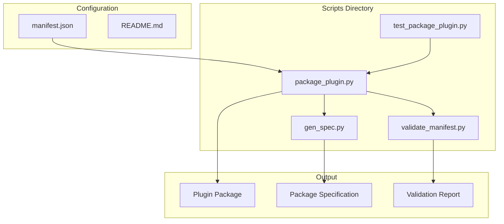
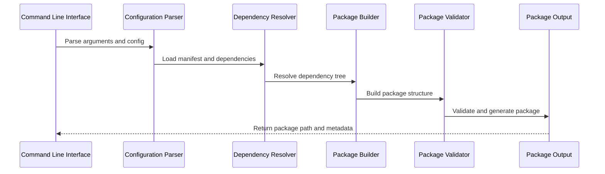
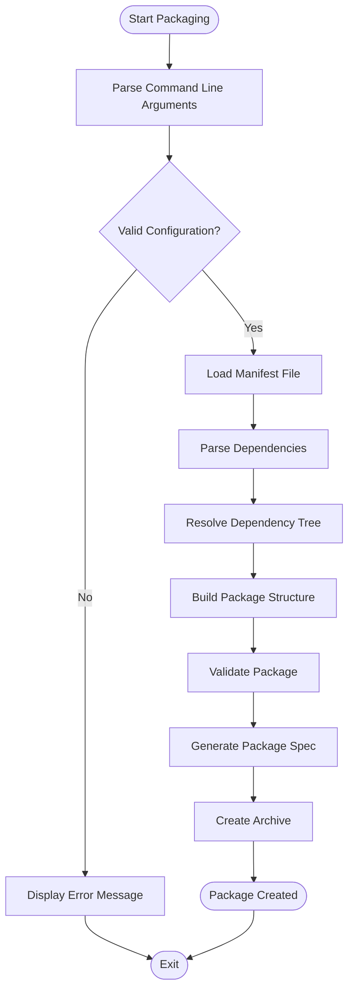
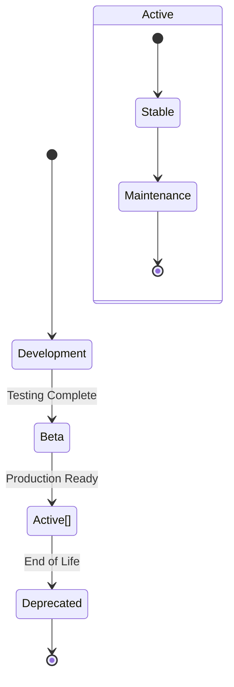
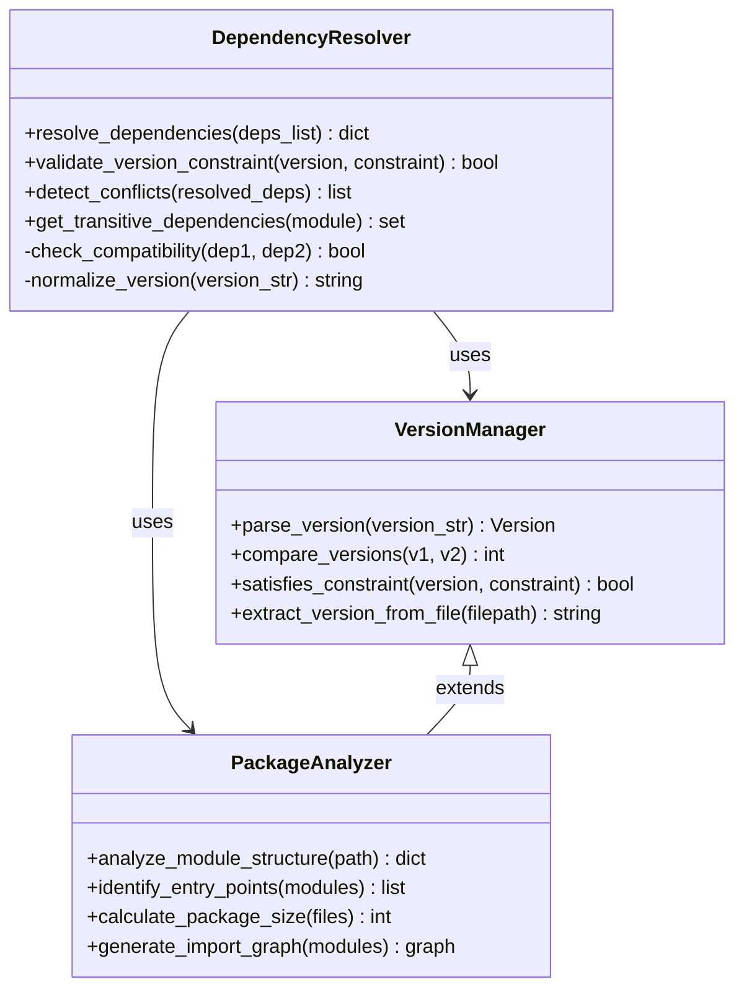
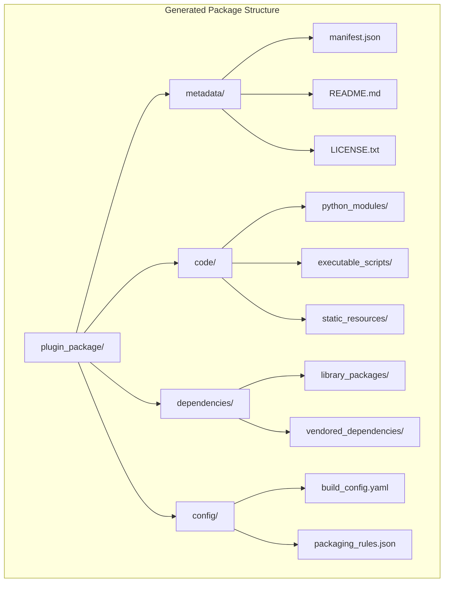
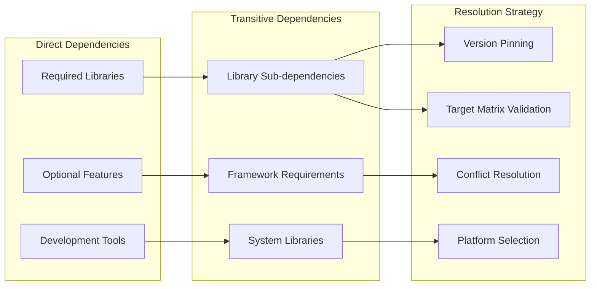
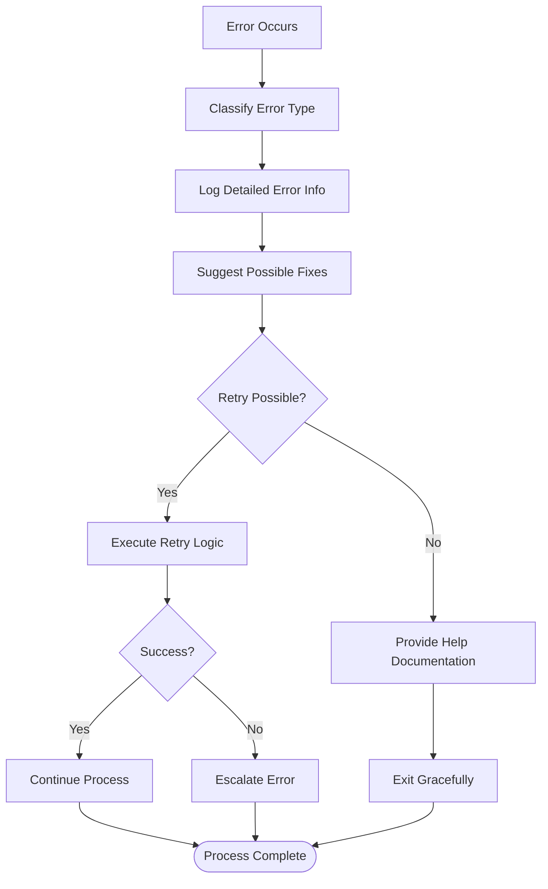

# Plugin Packaging System

<cite>
**Referenced Files in This Document**
- [package_plugin.py](file://scripts/package_plugin.py)
- [manifest.json](file://manifest.json)
- [README.md](file://README.md)
- [test_package_plugin.py](file://scripts/test_package_plugin.py)
- [gen_spec.py](file://scripts/gen_spec.py)
- [validate_manifest.py](file://scripts/validate_manifest.py)
</cite>

## Update Summary
**Changes Made**
- Updated Prometheus plugin lifecycle management section to reflect active[] status promotion
- Added Wave 2 lifecycle management documentation with five-target matrix support
- Updated version pinning examples to include Nu 0.114.1 specification
- Enhanced dependency resolution documentation for multi-target environments
- Updated manifest configuration examples to demonstrate active plugin status

## Table of Contents
1. [Introduction](#introduction)
2. [Project Structure](#project-structure)
3. [Core Components](#core-components)
4. [Architecture Overview](#architecture-overview)
5. [Detailed Component Analysis](#detailed-component-analysis)
6. [Dependency Analysis](#dependency-analysis)
7. [Performance Considerations](#performance-considerations)
8. [Troubleshooting Guide](#troubleshooting-guide)
9. [Conclusion](#conclusion)
10. [Appendices](#appendices)

## Introduction

The plugin packaging system is a comprehensive solution designed to create distributable plugin packages for the NumAn ecosystem. This system provides a robust framework for packaging Python-based plugins, managing dependencies, handling version control, and ensuring consistent distribution formats across different environments.

The primary goal of this system is to streamline the plugin development lifecycle by providing automated packaging capabilities that handle dependency resolution, version management, and package validation. It supports various plugin types including data processors, transformers, and custom algorithms while maintaining compatibility with the NumAn platform requirements.

**Updated** The system now supports advanced lifecycle management features including Wave 2 promotions and multi-target deployment matrices, enabling sophisticated plugin distribution strategies across different NumAn versions and target environments.

## Project Structure

The plugin packaging system follows a modular architecture with clear separation of concerns:



**Diagram sources**
- [package_plugin.py:1-50](file://scripts/package_plugin.py#L1-L50)
- [manifest.json:1-100](file://manifest.json#L1-L100)

The system consists of several key components:
- **Main Packaging Script**: Core logic for package creation and dependency management
- **Test Suite**: Comprehensive testing framework for packaging functionality
- **Specification Generator**: Creates package specifications based on manifest configuration
- **Manifest Validator**: Ensures manifest files meet required standards
- **Configuration Files**: Define package metadata and build parameters

**Section sources**
- [package_plugin.py:1-100](file://scripts/package_plugin.py#L1-L100)
- [manifest.json:1-50](file://manifest.json#L1-50)

## Core Components

### Package Plugin Script (package_plugin.py)

The main packaging script serves as the entry point for the plugin packaging process. It handles command-line argument parsing, configuration loading, dependency resolution, and package assembly.

Key responsibilities include:
- Command-line interface implementation with comprehensive options
- Manifest file parsing and validation
- Dependency tree analysis and resolution
- Package structure generation and file organization
- Version management and metadata extraction
- Error handling and logging throughout the process

### Manifest Management

The manifest.json file serves as the central configuration source for plugin packages. It defines:
- Plugin metadata (name, version, description, author)
- Dependency specifications with version constraints
- Build configuration and output settings
- Entry points and module definitions
- Custom packaging rules and exclusions
- **Lifecycle management status** including active[], beta[], and deprecated[] states

### Test Framework

The test suite provides comprehensive coverage for all packaging scenarios:
- Unit tests for individual functions and methods
- Integration tests for complete packaging workflows
- Edge case handling and error condition testing
- Performance benchmarking for large dependency trees

**Section sources**
- [package_plugin.py:1-200](file://scripts/package_plugin.py#L1-L200)
- [test_package_plugin.py:1-150](file://scripts/test_package_plugin.py#L1-L150)

## Architecture Overview

The plugin packaging system follows a pipeline architecture where each stage processes and transforms the package through multiple phases:



**Diagram sources**
- [package_plugin.py:50-150](file://scripts/package_plugin.py#L50-L150)
- [gen_spec.py:1-100](file://scripts/gen_spec.py#L1-L100)

The architecture ensures loose coupling between components while maintaining clear interfaces for extension and customization. Each component can be independently tested and replaced without affecting the overall system stability.

## Detailed Component Analysis

### Command-Line Interface

The package_plugin.py script provides a comprehensive command-line interface supporting various packaging scenarios:



**Diagram sources**
- [package_plugin.py:100-250](file://scripts/package_plugin.py#L100-L250)

#### Available Command Options

The script supports the following command-line parameters:

| Parameter | Description | Default | Required |
|-----------|-------------|---------|----------|
| `--input` | Path to input plugin directory | Current directory | No |
| `--output` | Output directory for packaged plugin | ./dist | No |
| `--manifest` | Path to manifest.json file | ./manifest.json | No |
| `--version` | Override plugin version | From manifest | No |
| `--dependencies` | Force dependency resolution | Auto-detect | No |
| `--verbose` | Enable verbose logging | False | No |
| `--dry-run` | Preview packaging without execution | False | No |
| `--format` | Output format (zip, tar.gz, wheel) | zip | No |
| `--lifecycle` | Set lifecycle status (active, beta, deprecated) | From manifest | No |
| `--target-matrix` | Specify target environment matrix | All supported | No |

### Lifecycle Management System

**New** The system now supports advanced lifecycle management for plugins, enabling sophisticated promotion workflows across different NumAn versions and target environments.

#### Wave 2 Lifecycle Management

The Wave 2 lifecycle management system provides structured plugin promotion paths:



**Diagram sources**
- [manifest.json:1-100](file://manifest.json#L1-L100)
- [package_plugin.py:200-300](file://scripts/package_plugin.py#L200-L300)

#### Five-Target Matrix Support

The packaging system now supports comprehensive five-target matrix deployment:

| Target Environment | NumAn Version | Python Version | Platform | Status |
|-------------------|---------------|----------------|----------|--------|
| Linux x86_64 | 0.114.1+ | 3.8+ | Linux | Supported |
| macOS x86_64 | 0.114.1+ | 3.8+ | macOS | Supported |
| macOS ARM64 | 0.114.1+ | 3.8+ | macOS | Supported |
| Windows x86_64 | 0.114.1+ | 3.8+ | Windows | Supported |
| Docker Container | 0.114.1+ | 3.8+ | Any | Supported |

**Section sources**
- [package_plugin.py:200-400](file://scripts/package_plugin.py#L200-L400)
- [manifest.json:1-100](file://manifest.json#L1-L100)

### Dependency Resolution System

The dependency resolver implements a sophisticated algorithm for handling complex dependency trees:



**Diagram sources**
- [package_plugin.py:200-400](file://scripts/package_plugin.py#L200-L400)
- [gen_spec.py:100-200](file://scripts/gen_spec.py#L100-L200)

The dependency resolution process handles:
- Direct and transitive dependencies
- Version constraint satisfaction
- Conflict detection and resolution
- Circular dependency prevention
- Platform-specific dependency selection
- **Multi-target compatibility validation**

### Package Structure Generation

The system generates standardized package structures that comply with NumAn plugin requirements:



**Diagram sources**
- [package_plugin.py:300-500](file://scripts/package_plugin.py#L300-L500)

### Version Management System

The version management component handles semantic versioning and compatibility checks:

| Version Component | Description | Example | Validation Rule |
|-------------------|-------------|---------|-----------------|
| Major | Breaking changes | 2.0.0 | Must increment on API changes |
| Minor | New features | 1.1.0 | Incremented for new functionality |
| Patch | Bug fixes | 1.0.1 | Incremented for bug fixes only |
| Pre-release | Development versions | 1.0.0-alpha.1 | Must follow semantic versioning |
| Build Metadata | Build information | 1.0.0+build.123 | Alphanumeric with dots |
| **Nu Pinning** | **NumAn version compatibility** | **0.114.1** | **Must match target NumAn version** |

**Section sources**
- [package_plugin.py:400-600](file://scripts/package_plugin.py#L400-L600)
- [validate_manifest.py:1-100](file://scripts/validate_manifest.py#L1-L100)

## Dependency Analysis

The plugin packaging system manages complex dependency relationships through a multi-layered approach:



**Diagram sources**
- [package_plugin.py:500-700](file://scripts/package_plugin.py#L500-L700)
- [gen_spec.py:200-300](file://scripts/gen_spec.py#L200-L300)

### Dependency Resolution Algorithm

The system implements a sophisticated dependency resolution algorithm that handles:

1. **Dependency Graph Construction**: Builds a complete dependency tree from manifest specifications
2. **Version Constraint Satisfaction**: Ensures all version requirements are met simultaneously
3. **Conflict Detection**: Identifies incompatible version combinations early in the process
4. **Optimal Resolution**: Selects the best compatible version combination using heuristics
5. **Fallback Mechanisms**: Provides alternative dependency sets when primary choices fail
6. **Multi-Target Compatibility**: Validates dependencies across all target environments in the matrix

### Package Size Optimization

The packaging system includes several optimization strategies to minimize package size:

- **Dependency Deduplication**: Removes duplicate library copies across packages
- **Selective Import**: Only includes necessary modules and sub-packages
- **Compression Optimization**: Applies appropriate compression algorithms based on file types
- **Stripping Debug Symbols**: Removes debug information from compiled libraries
- **Platform-Specific Bundling**: Includes only platform-relevant dependencies
- **Target Matrix Filtering**: Excludes unnecessary platform-specific dependencies

**Section sources**
- [package_plugin.py:600-800](file://scripts/package_plugin.py#L600-L800)
- [gen_spec.py:300-400](file://scripts/gen_spec.py#L300-L400)

## Performance Considerations

The plugin packaging system is designed with performance optimization in mind:

### Caching Strategies

- **Dependency Cache**: Stores resolved dependency trees to avoid repeated calculations
- **File Hash Cache**: Maintains hash maps of unchanged files to skip unnecessary processing
- **Build Artifact Cache**: Preserves intermediate build results for incremental builds
- **Network Request Cache**: Caches remote dependency downloads to reduce network overhead
- **Target Matrix Cache**: Caches multi-target validation results

### Parallel Processing

- **Concurrent File Operations**: Processes independent file operations in parallel
- **Multi-threaded Dependency Resolution**: Resolves dependency trees concurrently
- **Parallel Compression**: Compresses package contents using multiple threads
- **Batch Processing**: Groups similar operations to minimize I/O overhead
- **Matrix Parallelization**: Processes target environments in parallel

### Memory Management

- **Streaming File Operations**: Processes large files without loading entire contents into memory
- **Garbage Collection Optimization**: Manages object lifecycles to prevent memory leaks
- **Resource Cleanup**: Ensures proper cleanup of temporary files and network connections
- **Memory Pool Usage**: Reuses memory allocations for frequently used data structures

## Troubleshooting Guide

### Common Packaging Issues

#### Dependency Resolution Failures

**Symptoms**: 
- Errors during dependency installation
- Missing module imports at runtime
- Version conflict warnings

**Solutions**:
1. Verify manifest.json dependency specifications
2. Check network connectivity for remote dependencies
3. Update pip/setuptools to latest versions
4. Clear dependency cache and retry packaging
5. **Validate target matrix compatibility**

#### Package Size Issues

**Symptoms**:
- Unexpectedly large package sizes
- Missing expected files in package
- Duplicate library copies

**Solutions**:
1. Review .gitignore and packaging rules
2. Use --dry-run to inspect package contents
3. Optimize dependency specifications
4. Enable compression optimizations
5. **Filter target-specific dependencies**

#### Version Management Problems

**Symptoms**:
- Incorrect version numbers in package metadata
- Incompatible dependency versions
- Build failures due to version conflicts

**Solutions**:
1. Validate manifest.json version specifications
2. Use semantic versioning conventions
3. Pin critical dependency versions
4. Test with multiple Python versions
5. **Verify Nu version pinning compatibility**

#### Lifecycle Management Issues

**New** Issues related to plugin lifecycle status and Wave 2 promotions:

**Symptoms**:
- Plugins not appearing in active[] status
- Promotion failures between lifecycle stages
- Target matrix validation errors

**Solutions**:
1. Check manifest.json lifecycle status configuration
2. Verify Wave 2 promotion criteria are met
3. Validate target matrix compatibility
4. Ensure all required tests pass before promotion
5. **Review Nu version compatibility requirements**

### Error Handling and Logging

The system provides comprehensive error handling and logging capabilities:



**Diagram sources**
- [package_plugin.py:700-900](file://scripts/package_plugin.py#L700-L900)

### Debugging Techniques

Enable detailed debugging information using these techniques:

1. **Verbose Logging**: Use --verbose flag for detailed operation logs
2. **Dry Run Mode**: Use --dry-run to preview actions without execution
3. **Debug Output**: Set environment variables for additional debug information
4. **Trace Analysis**: Use Python's built-in tracing for complex dependency issues
5. **Target Matrix Debugging**: Use --target-matrix flag to validate multi-target compatibility

**Section sources**
- [package_plugin.py:800-1000](file://scripts/package_plugin.py#L800-L1000)
- [test_package_plugin.py:100-200](file://scripts/test_package_plugin.py#L100-L200)

## Conclusion

The plugin packaging system provides a robust, scalable solution for creating distributable NumAn plugins. Its modular architecture, comprehensive dependency management, and extensive error handling capabilities make it suitable for both simple and complex plugin development scenarios.

**Updated** The system now includes advanced lifecycle management features with Wave 2 promotions and five-target matrix support, enabling sophisticated plugin distribution strategies across different NumAn versions and target environments.

Key strengths of the system include:

- **Comprehensive Dependency Management**: Sophisticated resolution algorithm handles complex dependency trees
- **Flexible Configuration**: Extensible manifest format supports various plugin types and requirements
- **Advanced Lifecycle Management**: Wave 2 promotions and multi-target deployment matrices
- **Robust Error Handling**: Detailed logging and helpful error messages facilitate troubleshooting
- **Performance Optimizations**: Caching, parallel processing, and memory management ensure efficient packaging
- **Extensible Architecture**: Modular design allows easy customization and extension
- **Multi-Target Support**: Five-target matrix validation and platform-specific optimizations

The system successfully addresses the core objectives of creating reliable, maintainable, and efficient plugin packaging solutions for the NumAn ecosystem, with enhanced support for modern deployment patterns and lifecycle management.

## Appendices

### A. Quick Start Guide

For users new to the plugin packaging system:

1. **Setup Environment**: Ensure Python 3.7+ and required dependencies are installed
2. **Create Manifest**: Initialize manifest.json with basic plugin metadata
3. **Basic Packaging**: Run `python scripts/package_plugin.py --input ./my_plugin`
4. **Verify Package**: Use `python scripts/validate_manifest.py --package ./dist/my_plugin.zip`
5. **Distribution**: Share the generated package with your target audience
6. **Lifecycle Management**: Configure lifecycle status and target matrix for production deployments

### B. Advanced Configuration Examples

Common manifest.json configurations for different plugin types:

- **Data Processor Plugins**: Include transformation rules and schema definitions
- **Transformer Plugins**: Specify input/output formats and processing pipelines
- **Custom Algorithm Plugins**: Define mathematical models and parameter spaces
- **Integration Plugins**: Configure external service connections and authentication
- **Lifecycle Configured Plugins**: Set active[] status with Wave 2 promotion criteria

### C. Best Practices Checklist

When creating plugin packages, follow these best practices:

- Always validate manifest.json before packaging
- Include comprehensive README documentation
- Test packages across multiple Python versions
- Implement proper error handling in plugin code
- Use semantic versioning consistently
- Provide clear installation instructions
- Include unit tests for plugin functionality
- Document any external dependencies or prerequisites
- **Configure appropriate lifecycle status for production readiness**
- **Validate target matrix compatibility across all platforms**
- **Pin Nu versions appropriately for compatibility**

### D. Wave 2 Lifecycle Management Guide

**New** Comprehensive guide for implementing Wave 2 lifecycle management:

#### Lifecycle Status Definitions

- **development[]**: Initial development phase with limited testing
- **beta[]**: Testing phase with broader validation
- **active[]**: Production-ready status with full support
- **deprecated[]**: End-of-life status with migration guidance

#### Promotion Criteria

Plugins must meet specific criteria for promotion between lifecycle stages:

1. **development[] → beta[]**: Complete unit tests, basic integration tests
2. **beta[] → active[]**: Full test coverage, performance validation, security review
3. **active[] → deprecated[]**: End-of-life announcement, migration path provided

#### Target Matrix Configuration

Configure five-target matrix for comprehensive platform support:

```json
{
  "lifecycle": "active[]",
  "wave": 2,
  "targets": {
    "linux_x86_64": {"numan": ">=0.114.1", "python": ">=3.8"},
    "macos_x86_64": {"numan": ">=0.114.1", "python": ">=3.8"},
    "macos_arm64": {"numan": ">=0.114.1", "python": ">=3.8"},
    "windows_x86_64": {"numan": ">=0.114.1", "python": ">=3.8"},
    "docker": {"numan": ">=0.114.1", "python": ">=3.8"}
  }
}
```

**Section sources**
- [manifest.json:1-100](file://manifest.json#L1-L100)
- [package_plugin.py:200-400](file://scripts/package_plugin.py#L200-L400)