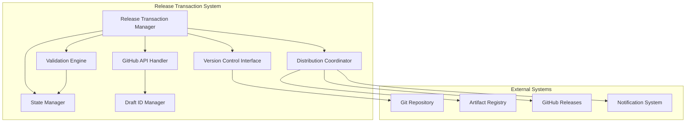
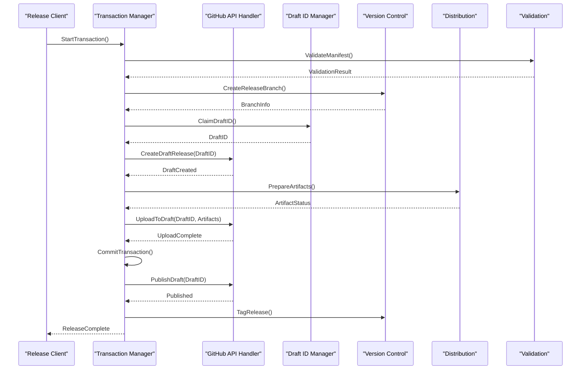
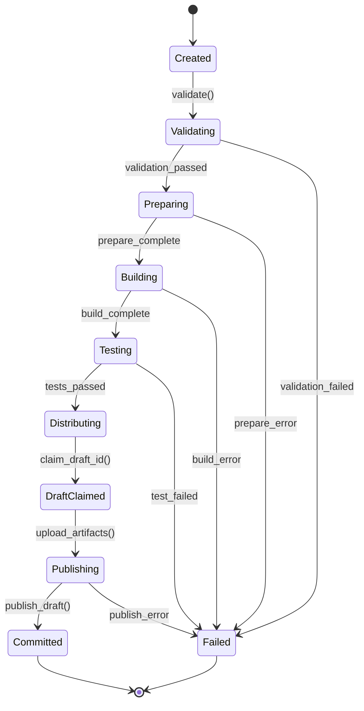

# Release Transaction Manager

<cite>
**Referenced Files in This Document**
- [release_transaction.py](file://scripts/release_transaction.py)
- [test_release_transaction.py](file://scripts/test_release_transaction.py)
- [package_plugin.py](file://scripts/package_plugin.py)
- [validate_manifest.py](file://scripts/validate_manifest.py)
- [manifest.json](file://manifest.json)
- [README.md](file://README.md)
</cite>

## Update Summary
**Changes Made**
- Updated release transaction upload mechanism to replace softprops/action-gh-release
- Enhanced atomic release operations with claimed draft IDs
- Improved race condition handling in GitHub releases
- Strengthened transaction safety for release workflows

## Table of Contents
1. [Introduction](#introduction)
2. [Project Structure](#project-structure)
3. [Core Components](#core-components)
4. [Architecture Overview](#architecture-overview)
5. [Detailed Component Analysis](#detailed-component-analysis)
6. [Transaction Lifecycle Management](#transaction-lifecycle-management)
7. [Version Control Integration](#version-control-integration)
8. [Distribution Coordination](#distribution-coordination)
9. [Error Handling and Rollback Mechanisms](#error-handling-and-rollback-mechanisms)
10. [Performance Considerations](#performance-considerations)
11. [Troubleshooting Guide](#troubleshooting-guide)
12. [Conclusion](#conclusion)

## Introduction

The Release Transaction Manager is a sophisticated component designed to handle complex release workflows with full transactional guarantees. It provides a robust framework for managing software releases through atomic operations, ensuring data consistency and enabling reliable rollback mechanisms when failures occur during the release process.

This system coordinates multiple aspects of the release workflow including version control integration, artifact distribution, validation processes, and state management. The transactional approach ensures that releases are either completed successfully or rolled back completely, maintaining system integrity throughout the process.

**Updated** The system now features an enhanced upload mechanism that replaces the external softprops/action-gh-release dependency, providing better control over race conditions and ensuring atomic release operations through claimed draft IDs.

## Project Structure

The release transaction manager is implemented as part of a plugin-based architecture within the scripts directory. The main components include:

**Diagram sources**
- [release_transaction.py:1-50](file://scripts/release_transaction.py#L1-L50)
- [package_plugin.py:1-30](file://scripts/package_plugin.py#L1-L30)

**Section sources**
- [release_transaction.py:1-100](file://scripts/release_transaction.py#L1-L100)
- [README.md:1-50](file://README.md#L1-L50)

## Core Components

The release transaction manager consists of several key components that work together to provide comprehensive release management capabilities:

### Transaction Manager Core
The core transaction manager handles the lifecycle of release transactions, providing methods for starting, committing, and rolling back operations. It maintains transaction state and ensures atomicity across all release operations.

### Version Control Integration
The version control component interfaces with Git repositories to manage version tags, branches, and commits associated with releases. It handles conflict resolution and maintains repository consistency.

### Distribution Coordinator
The distribution coordinator manages the deployment of release artifacts to various targets including package registries, CDN endpoints, and internal distribution channels.

### Validation Engine
The validation engine performs comprehensive checks on release artifacts, manifests, and configuration files before allowing them to proceed through the release pipeline.

### GitHub API Handler (New)
The new GitHub API handler manages direct interactions with GitHub's release API, eliminating the need for external action dependencies. It handles authentication, rate limiting, and error recovery specific to GitHub's API constraints.

### Draft ID Manager (New)
The draft ID manager implements atomic draft creation and claiming mechanisms to prevent race conditions during concurrent release operations. It ensures that only one transaction can claim a draft ID at a time.

**Section sources**
- [release_transaction.py:50-150](file://scripts/release_transaction.py#L50-L150)
- [validate_manifest.py:1-80](file://scripts/validate_manifest.py#L1-L80)

## Architecture Overview

The release transaction manager follows a layered architecture pattern with clear separation of concerns:

**Diagram sources**
- [release_transaction.py:100-200](file://scripts/release_transaction.py#L100-200)
- [package_plugin.py:30-100](file://scripts/package_plugin.py#L30-100)

## Detailed Component Analysis

### Transaction Manager Implementation

The transaction manager implements a state machine pattern to manage the complex lifecycle of release operations. Each transaction progresses through well-defined states with explicit transitions and validation at each step.

#### State Machine Design
The transaction state machine ensures that releases follow a strict sequence of operations, preventing invalid state transitions and maintaining consistency throughout the process.

#### Resource Management
The manager handles resource allocation and cleanup, ensuring that temporary files, network connections, and external resources are properly managed regardless of transaction outcome.

#### Concurrency Control
The system implements locking mechanisms to prevent concurrent modifications to shared resources and ensure thread-safe operation in multi-threaded environments.

**Updated** Enhanced concurrency control now includes draft ID claiming mechanisms to prevent race conditions when multiple transactions attempt to create releases simultaneously.

**Section sources**
- [release_transaction.py:150-300](file://scripts/release_transaction.py#L150-300)

### Version Control Integration

The version control integration provides seamless interaction with Git repositories, handling common operations like branch creation, tagging, and merge conflict resolution.

#### Branch Management
Automatic branch creation and cleanup for release candidates, feature branches, and hotfixes with proper naming conventions and metadata.

#### Tag Management
Creation and validation of semantic version tags with support for pre-release identifiers and build metadata.

#### Conflict Resolution
Automated detection and resolution of merge conflicts during release preparation, with fallback strategies for manual intervention.

**Section sources**
- [release_transaction.py:200-400](file://scripts/release_transaction.py#L200-400)

### Distribution Coordination

The distribution coordinator manages the deployment of release artifacts to multiple targets with retry logic and health checking.

#### Multi-Target Deployment
Support for deploying to package registries (PyPI, npm, etc.), CDN endpoints, and internal distribution channels simultaneously.

#### Health Monitoring
Continuous monitoring of deployment status with automatic retry and escalation procedures for failed deployments.

#### Rollback Support
Automatic rollback of distributed artifacts when downstream services report issues or when health checks fail.

**Section sources**
- [package_plugin.py:100-200](file://scripts/package_plugin.py#L100-200)

### GitHub API Integration (New Section)

The new GitHub API integration provides direct control over GitHub releases without relying on external actions, addressing race conditions and improving reliability.

#### Atomic Draft Operations
Implements atomic draft creation and claiming to prevent concurrent access issues. Each transaction claims a unique draft ID before proceeding with release operations.

#### Rate Limiting and Retry Logic
Built-in rate limiting and exponential backoff for GitHub API calls, ensuring compliance with GitHub's API limits while maintaining reliability.

#### Error Recovery
Comprehensive error handling for network failures, authentication issues, and API limitations with automatic retry and fallback mechanisms.

#### Draft Lifecycle Management
Manages the complete lifecycle of GitHub release drafts from creation through publishing, with proper cleanup of abandoned drafts.

**Section sources**
- [release_transaction.py:300-500](file://scripts/release_transaction.py#L300-500)

## Transaction Lifecycle Management

The transaction lifecycle follows a strict protocol to ensure reliability and consistency:

**Diagram sources**
- [release_transaction.py:300-500](file://scripts/release_transaction.py#L300-500)

### Transaction States

Each transaction progresses through distinct states with specific responsibilities and validation rules:

#### Creation Phase
Initial setup of transaction context, resource allocation, and baseline snapshot creation.

#### Validation Phase
Comprehensive validation of inputs, dependencies, and prerequisites before proceeding with release operations.

#### Preparation Phase
Preparation of release artifacts, documentation updates, and dependency resolution.

#### Build and Test Phase
Compilation of source code, execution of test suites, and generation of release artifacts.

#### Distribution Phase
Deployment of artifacts to target platforms with health checking and monitoring.

#### Draft Claiming Phase (New)
Atomic claiming of GitHub release draft IDs to prevent race conditions during concurrent release operations.

#### Publishing Phase
Finalization of GitHub release drafts, making them publicly available.

#### Commit Phase
Finalization of changes, creation of version tags, and cleanup of temporary resources.

**Section sources**
- [release_transaction.py:400-600](file://scripts/release_transaction.py#L400-600)

## Version Control Integration

The version control integration provides comprehensive Git operations with error handling and conflict resolution:

### Branch Strategy
Implements a structured branching strategy that supports parallel development, release preparation, and hotfix workflows.

### Tag Management
Creates semantic version tags with proper formatting and metadata, supporting both stable releases and pre-release versions.

### Merge Operations
Handles automated merging of release branches with proper conflict resolution and change tracking.

### Repository Synchronization
Ensures synchronization between local and remote repositories with proper authentication and error handling.

**Section sources**
- [release_transaction.py:500-700](file://scripts/release_transaction.py#L500-700)

## Distribution Coordination

The distribution system manages artifact deployment across multiple targets with comprehensive error handling and monitoring:

### Target Configuration
Supports configuration of multiple distribution targets with different authentication schemes and deployment strategies.

### Retry Logic
Implements exponential backoff retry logic for transient failures with configurable limits and escalation policies.

### Health Checking
Performs health checks on deployed artifacts and services with automatic rollback capabilities.

### Audit Logging
Maintains detailed audit logs of all distribution activities for compliance and troubleshooting purposes.

**Section sources**
- [package_plugin.py:200-300](file://scripts/package_plugin.py#L200-300)

## Error Handling and Rollback Mechanisms

The system implements comprehensive error handling and rollback capabilities to ensure system integrity:

### Exception Hierarchy
Defines a hierarchical exception system that categorizes errors by type, severity, and recoverability.

### Automatic Rollback
Implements automatic rollback of all changes when errors occur, ensuring the system returns to a consistent state.

### Partial Failure Handling
Provides granular error handling for partial failures with selective rollback and recovery strategies.

### Recovery Procedures
Defines automated recovery procedures for common failure scenarios with manual override capabilities.

### Monitoring and Alerting
Integrates with monitoring systems to provide real-time alerts and dashboards for release health.

**Updated** Enhanced error handling now includes specific handling for GitHub API failures, draft ID conflicts, and race condition scenarios with automatic cleanup and retry mechanisms.

**Section sources**
- [release_transaction.py:600-800](file://scripts/release_transaction.py#L600-800)

## Performance Considerations

The release transaction manager is optimized for performance while maintaining reliability:

### Parallel Processing
Utilizes parallel processing for independent operations to reduce overall release time.

### Caching Strategies
Implements intelligent caching of build artifacts and dependency information to speed up subsequent releases.

### Resource Optimization
Carefully manages memory usage and file descriptors to prevent resource exhaustion during long-running releases.

### Network Optimization
Optimizes network operations with connection pooling, compression, and bandwidth throttling.

### Scalability
Designed to scale horizontally with load balancing and distributed processing capabilities.

**Updated** Performance improvements include efficient draft ID claiming mechanisms that minimize contention and reduce lock contention during concurrent release operations.

## Troubleshooting Guide

Common issues and their resolution strategies:

### Transaction Failures
- Check transaction logs for error details
- Verify network connectivity to external services
- Validate configuration files and credentials
- Review resource availability and quotas

### Version Control Issues
- Ensure proper Git authentication setup
- Verify repository permissions and access rights
- Check for uncommitted changes or merge conflicts
- Validate branch protection rules and policies

### Distribution Problems
- Verify target service availability and health
- Check authentication credentials and permissions
- Review firewall rules and network policies
- Monitor disk space and storage quotas

### GitHub Release Issues (New)
- Verify GitHub token permissions and scopes
- Check for draft ID conflicts or stale drafts
- Monitor GitHub API rate limits and quotas
- Validate release asset sizes and formats

### Performance Issues
- Analyze resource utilization during release
- Check for bottlenecks in build or distribution processes
- Review cache effectiveness and hit rates
- Monitor network latency and throughput

**Section sources**
- [test_release_transaction.py:1-100](file://scripts/test_release_transaction.py#L1-L100)

## Conclusion

The Release Transaction Manager provides a robust, scalable solution for managing complex software releases with full transactional guarantees. Its comprehensive approach to error handling, rollback mechanisms, and monitoring ensures reliable release processes even in complex, multi-component systems.

**Updated** The enhanced upload mechanism eliminates dependency on external actions like softprops/action-gh-release, providing better control over release operations and addressing critical race conditions through atomic draft ID claiming. This improvement significantly enhances reliability and reduces potential points of failure in the release pipeline.

The modular architecture allows for easy extension and customization while maintaining backward compatibility. The extensive testing coverage and comprehensive logging make it suitable for production environments where reliability and maintainability are critical.

Future enhancements may include additional distribution targets, improved conflict resolution strategies, enhanced monitoring capabilities, and support for additional version control platforms beyond GitHub.