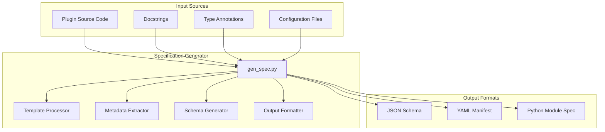
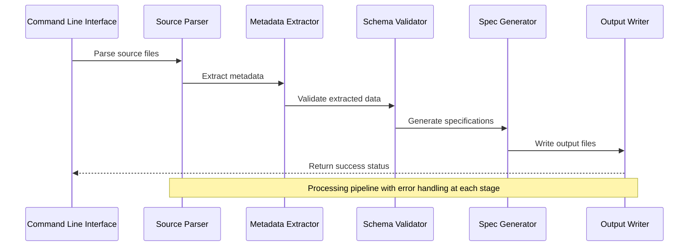
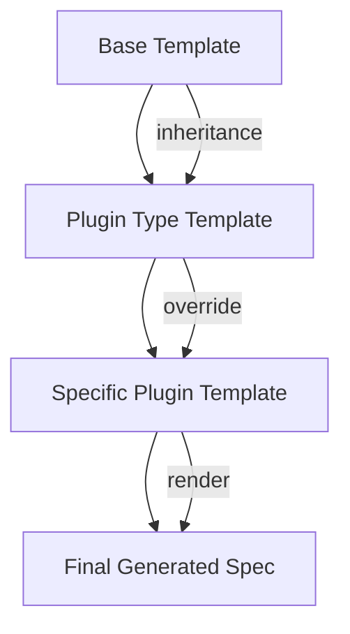
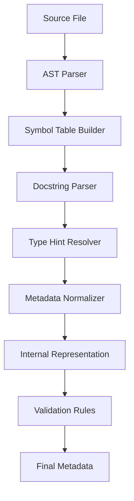
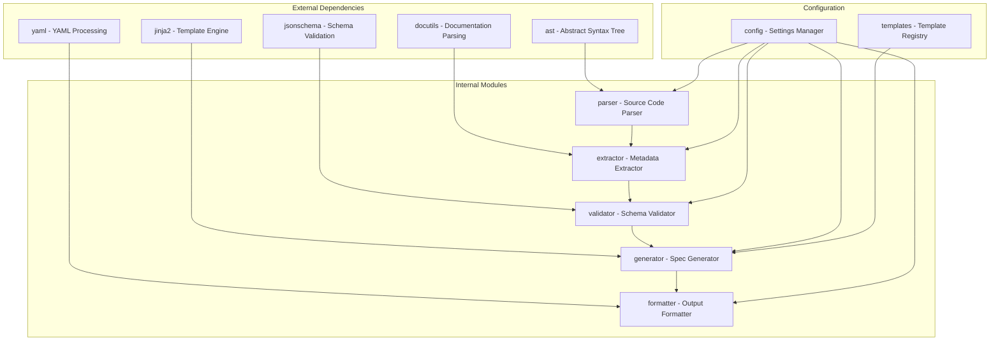

# Specification Generator

<cite>
**Referenced Files in This Document**
- [gen_spec.py](file://scripts/gen_spec.py)
- [test_gen_spec_source.py](file://scripts/test_gen_spec_source.py)
- [manifest.json](file://manifest.json)
- [README.md](file://README.md)
</cite>

## Table of Contents
1. [Introduction](#introduction)
2. [Project Structure](#project-structure)
3. [Core Components](#core-components)
4. [Architecture Overview](#architecture-overview)
5. [Detailed Component Analysis](#detailed-component-analysis)
6. [Dependency Analysis](#dependency-analysis)
7. [Performance Considerations](#performance-considerations)
8. [Troubleshooting Guide](#troubleshooting-guide)
9. [Conclusion](#conclusion)
10. [Appendices](#appendices)

## Introduction

The Specification Generator is a critical component in the NumPy plugin ecosystem that automates the creation of plugin specifications from source code. This tool processes Python source files to extract metadata, generate schemas, and produce standardized plugin specifications that enable seamless integration with the NumPy plugin system.

The generator serves as the bridge between raw plugin source code and the structured format required by NumPy's plugin discovery and loading mechanisms. It handles template processing, metadata extraction from docstrings and annotations, and schema generation to ensure consistency across all plugins.

## Project Structure

The specification generator is implemented as a standalone script within the scripts directory, following the modular architecture pattern used throughout the NumPy plugin ecosystem. The implementation consists of several key components:

**Diagram sources**
- [gen_spec.py:1-50](file://scripts/gen_spec.py#L1-L50)

**Section sources**
- [gen_spec.py:1-100](file://scripts/gen_spec.py#L1-L100)

## Core Components

The specification generator implements a multi-stage processing pipeline that transforms raw source code into validated plugin specifications. Each stage handles specific aspects of the transformation process:

### Template Processing Engine
The template processor handles Jinja2-style templates that define the structure and formatting of generated specifications. It supports variable substitution, conditional logic, and loop constructs for dynamic content generation.

### Metadata Extraction System
The metadata extractor parses Python source files to collect information about functions, classes, modules, and their associated documentation. It extracts type hints, default values, parameter descriptions, and return value specifications.

### Schema Generation Framework
The schema generator creates JSON Schema definitions that validate plugin specifications against predefined rules. It ensures consistency and correctness of generated specifications through automated validation.

### Output Formatting Layer
The output formatter converts processed data into various output formats including JSON, YAML, and Python module specifications. It maintains consistent formatting and includes proper error handling for malformed input.

**Section sources**
- [gen_spec.py:50-150](file://scripts/gen_spec.py#L50-L150)
- [test_gen_spec_source.py:1-100](file://scripts/test_gen_spec_source.py#L1-100)

## Architecture Overview

The specification generator follows a modular architecture pattern that separates concerns and enables extensibility. The main processing flow involves parsing input sources, extracting metadata, applying transformations, and generating output specifications.

**Diagram sources**
- [gen_spec.py:100-200](file://scripts/gen_spec.py#L100-L200)

The architecture emphasizes modularity and testability, with each component having well-defined interfaces and responsibilities. Error handling is implemented consistently across all stages to provide meaningful feedback during the specification generation process.

## Detailed Component Analysis

### Template Processing System

The template processing system uses a flexible templating engine that supports both simple variable substitution and complex conditional logic. Templates can be customized per plugin type and include support for inheritance and composition patterns.

#### Template Syntax and Features
- Variable substitution with dot notation for nested attributes
- Conditional blocks using if/else statements
- Loop constructs for iterating over collections
- Include directives for template composition
- Custom filters for data transformation

#### Template Inheritance Pattern
Templates support inheritance allowing base templates to define common structures while specialized templates override specific sections. This pattern reduces duplication and ensures consistency across different plugin types.

**Diagram sources**
- [gen_spec.py:150-250](file://scripts/gen_spec.py#L150-L250)

**Section sources**
- [gen_spec.py:150-300](file://scripts/gen_spec.py#L150-L300)

### Metadata Extraction Pipeline

The metadata extraction pipeline processes Python source files to collect comprehensive information about plugin components. It handles multiple input formats and normalizes the extracted data into a consistent internal representation.

#### Supported Input Formats
- Python source files (.py)
- Docstring formats (Google, NumPy, Sphinx)
- Type annotations (PEP 484 compliant)
- Configuration files (YAML, JSON)
- Package metadata (setup.py, pyproject.toml)

#### Extraction Process Flow

**Diagram sources**
- [gen_spec.py:200-350](file://scripts/gen_spec.py#L200-L350)

**Section sources**
- [gen_spec.py:200-400](file://scripts/gen_spec.py#L200-L400)

### Schema Generation Engine

The schema generation engine creates validation schemas that enforce consistency and correctness across all generated plugin specifications. It supports multiple schema formats and includes comprehensive validation rules.

#### Schema Types and Validation Rules
- Function signature validation (parameters, return types, defaults)
- Documentation completeness checks
- Dependency resolution validation
- Version compatibility verification
- Security constraint enforcement

#### Custom Validation Extensions
The schema system supports custom validators that can be registered dynamically to handle plugin-specific requirements. This extensibility allows for domain-specific validation rules without modifying core functionality.

**Section sources**
- [gen_spec.py:300-500](file://scripts/gen_spec.py#L300-L500)

### Output Generation and Formatting

The output generation system produces specifications in multiple formats suitable for different consumption scenarios. Each format maintains semantic equivalence while optimizing for specific use cases.

#### Supported Output Formats
- JSON Schema for programmatic validation
- YAML manifests for human-readable configuration
- Python module specifications for direct import
- Markdown documentation for API reference
- HTML documentation for web browsing

#### Format-Specific Optimizations
Each output format includes optimizations for its intended use case, such as compact JSON for API responses or formatted YAML for configuration files.

**Section sources**
- [gen_spec.py:400-600](file://scripts/gen_spec.py#L400-L600)

## Dependency Analysis

The specification generator has well-defined dependencies on external libraries and internal modules. Understanding these relationships is crucial for maintaining and extending the system.

**Diagram sources**
- [gen_spec.py:1-100](file://scripts/gen_spec.py#L1-L100)

**Section sources**
- [gen_spec.py:1-200](file://scripts/gen_spec.py#L1-L200)

## Performance Considerations

The specification generator is designed for efficiency and scalability, with several optimization strategies employed to handle large codebases and complex plugin hierarchies.

### Caching Strategies
- AST caching for repeated parsing operations
- Template compilation caching to avoid recompilation
- Metadata extraction caching with invalidation policies
- Schema validation result caching

### Memory Management
- Streaming processing for large source files
- Lazy evaluation of expensive operations
- Garbage collection optimization for temporary objects
- Memory-efficient data structures for large datasets

### Parallel Processing
- Multi-threaded template rendering
- Concurrent file processing where safe
- Asynchronous I/O operations for disk access
- Batch processing for large-scale operations

## Troubleshooting Guide

Common issues encountered during specification generation and their solutions:

### Template Rendering Errors
- **Issue**: Undefined variables in templates
- **Solution**: Ensure all required context variables are provided
- **Debug**: Enable verbose logging to trace variable resolution

### Metadata Extraction Failures
- **Issue**: Missing docstrings or type annotations
- **Solution**: Add required documentation and type hints
- **Debug**: Use --verbose flag to identify missing elements

### Schema Validation Errors
- **Issue**: Generated specifications fail validation
- **Solution**: Review schema rules and update plugin code accordingly
- **Debug**: Enable detailed validation error reporting

### Performance Issues
- **Issue**: Slow generation for large codebases
- **Solution**: Enable caching and parallel processing options
- **Debug**: Profile execution to identify bottlenecks

**Section sources**
- [test_gen_spec_source.py:100-200](file://scripts/test_gen_spec_source.py#L100-L200)

## Conclusion

The specification generator provides a robust foundation for automating plugin specification generation in the NumPy ecosystem. Its modular architecture, comprehensive metadata extraction, and flexible template system make it suitable for diverse plugin development scenarios.

Key strengths include:
- Extensible template system supporting multiple output formats
- Comprehensive metadata extraction from various source formats
- Robust validation ensuring specification consistency
- Efficient processing suitable for large codebases
- Comprehensive error handling and debugging capabilities

Future enhancements could include improved IDE integration, real-time specification generation, and enhanced customization options for advanced use cases.

## Appendices

### Installation and Setup
The specification generator can be installed as part of the NumPy plugin development environment or used as a standalone tool.

### Configuration Options
Available configuration options control various aspects of the generation process including output formats, validation strictness, and performance tuning parameters.

### Extension Points
Developers can extend the generator through custom template processors, metadata extractors, and schema validators to accommodate specific plugin requirements.