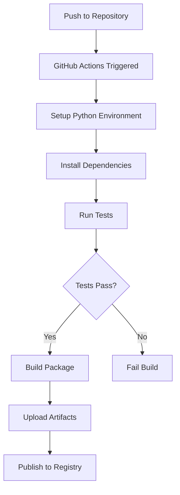
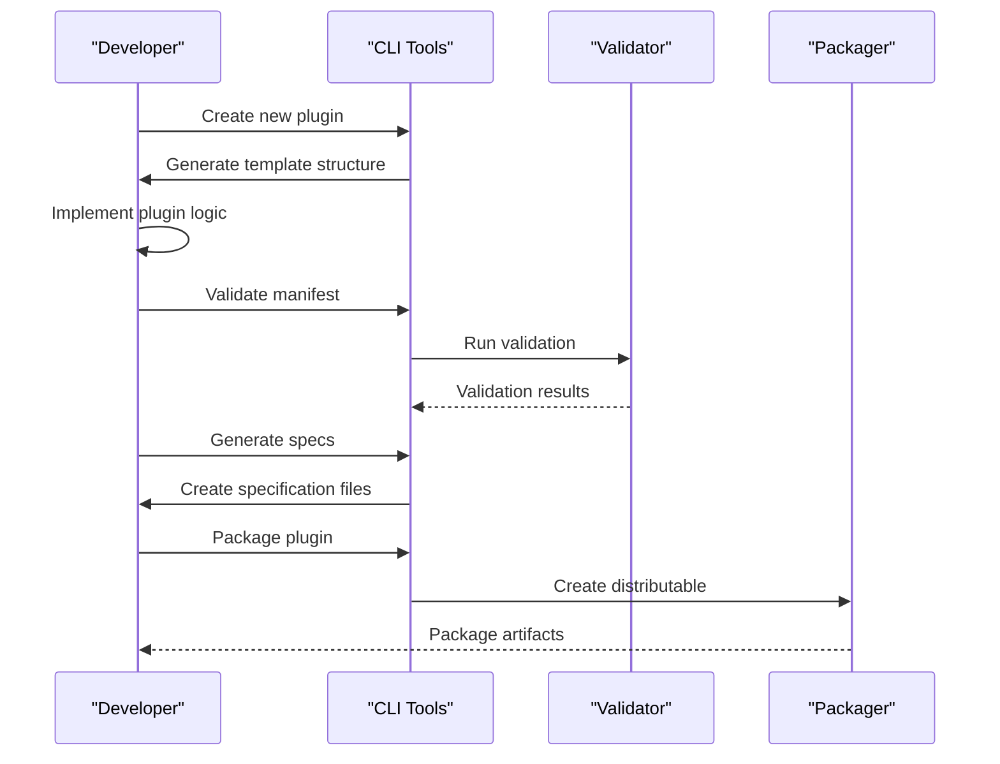

# Getting Started

<cite>
**Referenced Files in This Document**
- [README.md](file://README.md)
- [manifest.json](file://manifest.json)
- [gen_spec.py](file://scripts/gen_spec.py)
- [package_plugin.py](file://scripts/package_plugin.py)
- [validate_manifest.py](file://scripts/validate_manifest.py)
- [build.yml](file://.github/workflows/build.yml)
</cite>

## Table of Contents
1. [Introduction](#introduction)
2. [Prerequisites](#prerequisites)
3. [Installation](#installation)
4. [Environment Setup](#environment-setup)
5. [Basic Configuration](#basic-configuration)
6. [Creating Your First Plugin](#creating-your-first-plugin)
7. [Generating Specifications](#generating-specifications)
8. [Validating Manifests](#validating-manifests)
9. [Packaging Plugins](#packaging-plugins)
10. [Common Workflows](#common-workflows)
11. [Troubleshooting Guide](#troubleshooting-guide)
12. [Conclusion](#conclusion)

## Introduction

The Numan Plugins system provides a comprehensive framework for developing, managing, and distributing plugins. This system enables developers to extend functionality through modular components while maintaining consistency and quality standards across all plugins.

The plugin architecture supports:
- Modular plugin development with standardized interfaces
- Automated specification generation from source code
- Manifest validation and compliance checking
- Streamlined packaging and distribution workflows
- Integration with continuous integration pipelines

This guide will walk you through setting up your development environment, creating your first plugin, and understanding the complete plugin lifecycle from development to distribution.

## Prerequisites

Before getting started with the Numan Plugins system, ensure you have the following prerequisites installed and configured:

### Required Software
- **Python 3.8+**: The core runtime environment for plugin development
- **pip**: Python package manager for dependency management
- **Git**: Version control system for plugin repository management
- **Command-line interface**: Basic familiarity with terminal operations

### Recommended Tools
- **Code editor or IDE**: VS Code, PyCharm, or similar with Python support
- **Virtual environment tool**: venv or conda for isolated development environments
- **Package managers**: For system-level dependencies if required by your plugins

### Knowledge Requirements
- **Python programming**: Understanding of Python syntax, modules, and packages
- **Command-line usage**: Basic shell commands and script execution
- **Software packaging**: Familiarity with Python package structure and distribution
- **Version control**: Git workflow and repository management

**Section sources**
- [build.yml](file://.github/workflows/build.yml)

## Installation

Follow these steps to install the Numan Plugins system on your local machine:

### Step 1: Clone the Repository

```bash
git clone https://github.com/your-org/numan-plugins.git
cd numan-plugins
```

### Step 2: Create Virtual Environment

```bash
python -m venv venv
source venv/bin/activate  # On Windows: venv\Scripts\activate
```

### Step 3: Install Dependencies

```bash
pip install -r requirements.txt
```

### Step 4: Verify Installation

```bash
python --version
pip list | grep numan
```

### Alternative Installation Methods

#### Development Installation
```bash
pip install -e .
```

#### Using Conda
```bash
conda env create -f environment.yml
conda activate numan-plugins
```

**Section sources**
- [build.yml](file://.github/workflows/build.yml)

## Environment Setup

Proper environment configuration is crucial for consistent plugin development across different machines and deployment scenarios.

### Setting Up Development Environment

1. **Configure Python Path**
   ```bash
   export PYTHONPATH=$PYTHONPATH:$(pwd)/src
   ```

2. **Set Environment Variables**
   ```bash
   export NUMAN_PLUGINS_DIR=~/.numan/plugins
   export NUMAN_LOG_LEVEL=INFO
   ```

3. **Initialize Plugin Directory Structure**
   ```bash
   mkdir -p ~/.numan/plugins
   mkdir -p ~/.numan/specs
   mkdir -p ~/.numan/cache
   ```

### Configuring IDE/Editor

For optimal development experience, configure your IDE with:
- Python interpreter pointing to your virtual environment
- Linting rules for PEP 8 compliance
- Auto-formatting with Black or similar tools
- Import organization with isort

### CI/CD Integration

The system includes GitHub Actions workflows for automated testing and building:



**Diagram sources**
- [build.yml](file://.github/workflows/build.yml)

**Section sources**
- [build.yml](file://.github/workflows/build.yml)

## Basic Configuration

The Numan Plugins system uses a manifest-based configuration approach for defining plugin metadata and dependencies.

### Manifest Structure

The `manifest.json` file serves as the central configuration for each plugin:

```json
{
  "name": "plugin-name",
  "version": "1.0.0",
  "description": "Plugin description",
  "author": "Author Name",
  "license": "MIT",
  "dependencies": {
    "required-python": ">=3.8"
  },
  "entry-points": {
    "main": "module:function"
  }
}
```

### Configuration Steps

1. **Create Manifest File**
   - Navigate to your plugin directory
   - Create `manifest.json` with required fields
   - Define plugin metadata and dependencies

2. **Validate Configuration**
   ```bash
   python scripts/validate_manifest.py manifest.json
   ```

3. **Generate Specifications**
   ```bash
   python scripts/gen_spec.py manifest.json
   ```

### Environment-Specific Settings

Create environment-specific configuration files:
- `config.dev.json` for development settings
- `config.prod.json` for production deployments
- `config.test.json` for testing environments

**Section sources**
- [manifest.json](file://manifest.json)
- [validate_manifest.py](file://scripts/validate_manifest.py)

## Creating Your First Plugin

Let's walk through creating a simple plugin step by step.

### Step 1: Initialize Plugin Structure

```bash
mkdir my-first-plugin
cd my-first-plugin
mkdir src
touch src/__init__.py
```

### Step 2: Create Plugin Module

Create your main plugin module in `src/plugin.py`:

```python
class MyFirstPlugin:
    def __init__(self, config):
        self.config = config
        self.name = "My First Plugin"
    
    def execute(self, data):
        """Main plugin execution method"""
        return f"Processed: {data}"
    
    def get_metadata(self):
        """Return plugin metadata"""
        return {
            "name": self.name,
            "version": "1.0.0",
            "description": "A simple demonstration plugin"
        }
```

### Step 3: Create Manifest File

Create `manifest.json` in your plugin root:

```json
{
  "name": "my-first-plugin",
  "version": "1.0.0",
  "description": "A simple demonstration plugin",
  "author": "Your Name",
  "license": "MIT",
  "dependencies": {
    "required-python": ">=3.8"
  },
  "entry-points": {
    "main": "src.plugin:MyFirstPlugin"
  }
}
```

### Step 4: Validate and Test

```bash
# Validate manifest
python ../scripts/validate_manifest.py manifest.json

# Generate specifications
python ../scripts/gen_spec.py manifest.json

# Test plugin loading
python -c "from src.plugin import MyFirstPlugin; p = MyFirstPlugin({}); print(p.get_metadata())"
```

### Plugin Best Practices

- **Modular Design**: Keep plugin logic in separate modules
- **Error Handling**: Implement proper exception handling
- **Configuration Management**: Use external configuration files
- **Logging**: Add appropriate logging statements
- **Documentation**: Include docstrings and README files

**Section sources**
- [manifest.json](file://manifest.json)
- [validate_manifest.py](file://scripts/validate_manifest.py)

## Generating Specifications

Specifications define the expected behavior and interface contracts for plugins. The system automatically generates specifications from source code analysis.

### Automatic Specification Generation

Use the specification generator to create comprehensive plugin specs:

```bash
python scripts/gen_spec.py manifest.json
```

### Generated Specification Components

The specification generator creates:
- **Interface definitions**: Method signatures and parameter types
- **Dependency graphs**: Required libraries and versions
- **Validation rules**: Input/output format constraints
- **Metadata extraction**: Plugin information and capabilities

### Custom Specification Rules

You can extend the specification generator with custom rules:

```python
# In gen_spec.py
def custom_validation(plugin_data):
    """Custom validation logic for specific plugin types"""
    if plugin_data.get("type") == "data_processor":
        validate_data_schema(plugin_data)
```

### Specification Validation

Always validate generated specifications:

```bash
python scripts/validate_manifest.py generated_spec.json
```

**Section sources**
- [gen_spec.py](file://scripts/gen_spec.py)
- [validate_manifest.py](file://scripts/validate_manifest.py)

## Validating Manifests

Manifest validation ensures that plugin configurations are correct and compliant with system requirements.

### Running Validation

```bash
python scripts/validate_manifest.py path/to/manifest.json
```

### Validation Checks

The validator performs several checks:
- **JSON Syntax**: Validates JSON structure and syntax
- **Required Fields**: Ensures all mandatory fields are present
- **Type Checking**: Verifies field data types
- **Dependency Resolution**: Checks for valid dependency specifications
- **Entry Point Validation**: Confirms entry points exist and are callable

### Common Validation Errors

| Error Type | Description | Solution |
|------------|-------------|----------|
| Missing Field | Required manifest field not found | Add the missing field with correct value |
| Invalid Type | Field has incorrect data type | Convert field to expected type |
| Dependency Conflict | Conflicting version requirements | Resolve version conflicts |
| Entry Point Not Found | Specified entry point doesn't exist | Verify module path and function name |

### Custom Validation Rules

Extend validation with custom rules:

```python
# In validate_manifest.py
def custom_manifest_validator(manifest):
    """Add custom validation logic"""
    if manifest.get("security_level") == "high":
        validate_security_requirements(manifest)
```

**Section sources**
- [validate_manifest.py](file://scripts/validate_manifest.py)

## Packaging Plugins

The packaging system creates distributable plugin packages with all necessary metadata and dependencies.

### Basic Packaging

```bash
python scripts/package_plugin.py path/to/plugin
```

### Package Structure

The packaging process creates:
```
plugin-package/
├── manifest.json
├── spec.json
├── src/
│   ├── __init__.py
│   └── plugin.py
├── requirements.txt
└── README.md
```

### Customizing Packages

Modify packaging behavior through configuration:
- **Exclusion patterns**: Skip certain files during packaging
- **Compression options**: Control archive compression levels
- **Signing options**: Enable cryptographic signing for security

### Distribution Formats

The system supports multiple distribution formats:
- **Wheel packages**: Standard Python wheel format
- **Zip archives**: Simple compressed archives
- **Container images**: Docker container packaging

### Publishing to Registry

After successful packaging, publish to your plugin registry:

```bash
python scripts/package_plugin.py --publish path/to/plugin
```

**Section sources**
- [package_plugin.py](file://scripts/package_plugin.py)

## Common Workflows

This section covers typical development workflows using the Numan Plugins system.

### Development Workflow



**Diagram sources**
- [gen_spec.py](file://scripts/gen_spec.py)
- [package_plugin.py](file://scripts/package_plugin.py)
- [validate_manifest.py](file://scripts/validate_manifest.py)

### Testing Workflow

1. **Unit Tests**: Write tests for plugin functionality
2. **Integration Tests**: Test plugin interactions
3. **Manifest Validation**: Ensure configuration correctness
4. **Specification Testing**: Validate generated specs
5. **Packaging Tests**: Verify package integrity

### Deployment Workflow

1. **Build Pipeline**: Automated building and testing
2. **Quality Gates**: Code coverage and linting checks
3. **Security Scanning**: Vulnerability assessment
4. **Package Signing**: Cryptographic verification
5. **Registry Upload**: Distribution to artifact repositories

**Section sources**
- [gen_spec.py](file://scripts/gen_spec.py)
- [package_plugin.py](file://scripts/package_plugin.py)
- [validate_manifest.py](file://scripts/validate_manifest.py)

## Troubleshooting Guide

This section addresses common issues encountered during setup and development.

### Installation Issues

**Problem**: Python version incompatibility
- **Solution**: Ensure Python 3.8+ is installed
- **Check**: `python --version`
- **Fix**: Install compatible Python version

**Problem**: Permission errors during installation
- **Solution**: Use virtual environment or run with elevated privileges
- **Check**: Current user permissions
- **Fix**: Activate virtual environment before installing

### Configuration Problems

**Problem**: Manifest validation fails
- **Symptoms**: Validation errors with missing fields
- **Solution**: Check manifest structure against schema
- **Debug**: Enable verbose logging with `--verbose` flag

**Problem**: Entry points not found
- **Symptoms**: ImportError when loading plugin
- **Solution**: Verify module paths and function names
- **Check**: Python path configuration

### Development Issues

**Problem**: Circular imports in plugins
- **Symptoms**: Import errors during plugin loading
- **Solution**: Restructure imports to avoid cycles
- **Prevention**: Use lazy imports where possible

**Problem**: Dependency conflicts
- **Symptoms**: Package installation failures
- **Solution**: Update dependency versions
- **Tool**: Use `pip resolve` to find compatible versions

### Performance Issues

**Problem**: Slow plugin loading times
- **Causes**: Large dependencies, inefficient initialization
- **Solutions**: 
  - Optimize import statements
  - Use lazy loading for heavy dependencies
  - Cache frequently accessed data

**Problem**: Memory leaks in long-running plugins
- **Detection**: Monitor memory usage over time
- **Solutions**: 
  - Proper resource cleanup
  - Avoid global state accumulation
  - Use context managers for resource management

### Debugging Techniques

Enable detailed logging for troubleshooting:

```bash
export NUMAN_LOG_LEVEL=DEBUG
python scripts/validate_manifest.py --debug manifest.json
```

Use Python debugging tools:
```bash
python -m pdb scripts/package_plugin.py
```

**Section sources**
- [validate_manifest.py](file://scripts/validate_manifest.py)
- [package_plugin.py](file://scripts/package_plugin.py)

## Conclusion

The Numan Plugins system provides a robust framework for developing, managing, and distributing plugins. By following the guidelines in this document, you can:

- Set up a complete development environment
- Create well-structured plugins with proper configuration
- Automate specification generation and validation
- Package and distribute plugins effectively
- Troubleshoot common issues efficiently

The system's emphasis on standardization, automation, and quality assurance ensures that your plugins maintain consistency and reliability throughout their lifecycle. As you become more familiar with the system, explore advanced features like custom validators, extended packaging options, and integration with your existing development workflows.

Remember to always validate your manifests, test your plugins thoroughly, and follow best practices for Python development. The Numan Plugins community and documentation provide additional resources for advanced topics and specialized use cases.

Happy plugin development!