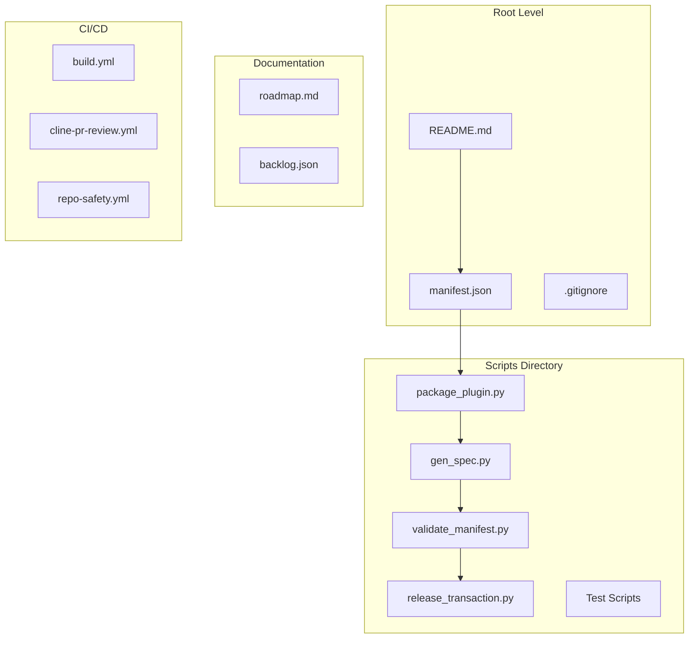
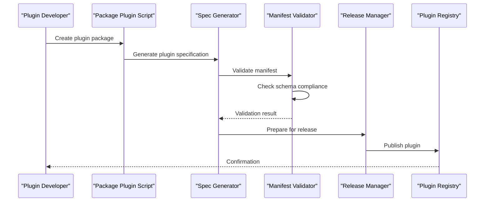
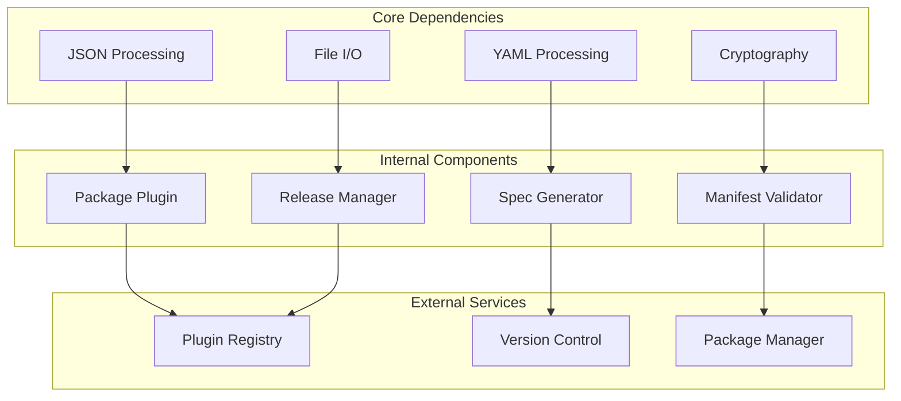

# Project Overview

<cite>
**Referenced Files in This Document**
- [README.md](file://README.md)
- [manifest.json](file://manifest.json)
- [build.yml](file://.github/workflows/build.yml)
- [package_plugin.py](file://scripts/package_plugin.py)
- [gen_spec.py](file://scripts/gen_spec.py)
- [validate_manifest.py](file://scripts/validate_manifest.py)
- [release_transaction.py](file://scripts/release_transaction.py)
- [roadmap.md](file://docs/roadmap.md)
</cite>

## Table of Contents
1. [Introduction](#introduction)
2. [Project Structure](#project-structure)
3. [Core Components](#core-components)
4. [Architecture Overview](#architecture-overview)
5. [Detailed Component Analysis](#detailed-component-analysis)
6. [Dependency Analysis](#dependency-analysis)
7. [Performance Considerations](#performance-considerations)
8. [Troubleshooting Guide](#troubleshooting-guide)
9. [Conclusion](#conclusion)

## Introduction

The Numan Plugins project serves as a comprehensive plugin management system designed specifically for the Numan ecosystem. This project provides developers with the tools and infrastructure necessary to create, package, validate, and distribute plugins that extend the functionality of the Numan platform.

### Purpose and Vision

At its core, the Numan Plugins project aims to:
- Standardize plugin development across the Numan ecosystem
- Provide robust tooling for plugin packaging and distribution
- Ensure plugin quality through automated validation and testing
- Streamline the release process for plugin authors
- Maintain consistency in plugin specifications and manifests

### Target Audience

This documentation serves both beginners entering the Numan plugin development ecosystem and experienced developers who need detailed technical information about the plugin architecture and workflow.

## Project Structure

The Numan Plugins project follows a modular architecture with clear separation of concerns:

**Diagram sources**
- [package_plugin.py](file://scripts/package_plugin.py)
- [gen_spec.py](file://scripts/gen_spec.py)
- [validate_manifest.py](file://scripts/validate_manifest.py)
- [release_transaction.py](file://scripts/release_transaction.py)

**Section sources**
- [README.md](file://README.md)
- [manifest.json](file://manifest.json)

## Core Components

The Numan Plugins system consists of several interconnected components that work together to provide a complete plugin lifecycle management solution.

### Plugin Packaging System

The packaging system handles the creation of distributable plugin packages. It ensures that all necessary files are included and properly structured according to Numan's plugin specifications.

### Specification Generator

The specification generator creates standardized plugin specifications that define the plugin's capabilities, dependencies, and configuration options. This ensures consistency across all plugins in the ecosystem.

### Manifest Validation

The manifest validation system checks plugin manifests against the defined schema, ensuring that all required fields are present and correctly formatted before a plugin can be distributed.

### Release Management

The release management component handles the versioning, tagging, and distribution of plugin releases, providing a streamlined workflow for plugin authors.

**Section sources**
- [package_plugin.py](file://scripts/package_plugin.py)
- [gen_spec.py](file://scripts/gen_spec.py)
- [validate_manifest.py](file://scripts/validate_manifest.py)
- [release_transaction.py](file://scripts/release_transaction.py)

## Architecture Overview

The Numan Plugins architecture follows a pipeline-based approach where each stage processes the plugin data and passes it to the next stage for further processing.

**Diagram sources**
- [package_plugin.py](file://scripts/package_plugin.py)
- [gen_spec.py](file://scripts/gen_spec.py)
- [validate_manifest.py](file://scripts/validate_manifest.py)
- [release_transaction.py](file://scripts/release_transaction.py)

## Detailed Component Analysis

### Plugin Packaging System

The plugin packaging system is responsible for creating standardized plugin packages that can be distributed and installed within the Numan ecosystem.

#### Key Features:
- Automatic dependency resolution
- File structure validation
- Metadata extraction and verification
- Package compression and optimization

#### Workflow:
1. Input validation of plugin source directory
2. Dependency analysis and resolution
3. Asset collection and organization
4. Package creation with proper metadata
5. Integrity verification and signing

**Section sources**
- [package_plugin.py](file://scripts/package_plugin.py)

### Specification Generation

The specification generation system creates standardized plugin specifications that define the plugin's interface, capabilities, and requirements.

#### Specification Components:
- Plugin metadata (name, version, description)
- Capability definitions
- Dependency declarations
- Configuration schemas
- API endpoints and interfaces

#### Generation Process:
1. Source code analysis
2. Interface detection
3. Dependency mapping
4. Schema generation
5. Output formatting

**Section sources**
- [gen_spec.py](file://scripts/gen_spec.py)

### Manifest Validation

The manifest validation system ensures that plugin manifests conform to the required schema and contain all necessary information for proper plugin installation and execution.

#### Validation Rules:
- Schema compliance checking
- Required field validation
- Data type verification
- Cross-reference validation
- Security policy enforcement

#### Error Handling:
- Detailed error reporting
- Suggestion generation for fixes
- Batch validation support
- Custom validator extensions

**Section sources**
- [validate_manifest.py](file://scripts/validate_manifest.py)

### Release Management

The release management system handles the complete lifecycle of plugin releases, from versioning to distribution.

#### Release Features:
- Semantic versioning support
- Automated changelog generation
- Multi-platform build coordination
- Distribution channel management
- Rollback capabilities

#### Release Workflow:
1. Version bump and tag creation
2. Build artifact generation
3. Quality gates execution
4. Distribution publishing
5. Release notes generation

**Section sources**
- [release_transaction.py](file://scripts/release_transaction.py)

## Dependency Analysis

The Numan Plugins system has well-defined dependencies between its components, ensuring loose coupling and high cohesion.

**Diagram sources**
- [package_plugin.py](file://scripts/package_plugin.py)
- [gen_spec.py](file://scripts/gen_spec.py)
- [validate_manifest.py](file://scripts/validate_manifest.py)
- [release_transaction.py](file://scripts/release_transaction.py)

**Section sources**
- [package_plugin.py](file://scripts/package_plugin.py)
- [gen_spec.py](file://scripts/gen_spec.py)
- [validate_manifest.py](file://scripts/validate_manifest.py)
- [release_transaction.py](file://scripts/release_transaction.py)

## Performance Considerations

The Numan Plugins system is designed with performance in mind, implementing several optimization strategies:

### Caching Strategies
- File system caching for repeated operations
- Dependency graph caching
- Specification template caching
- Validation rule caching

### Parallel Processing
- Concurrent file operations where safe
- Parallel validation of multiple plugins
- Asynchronous network requests for registry operations

### Memory Management
- Streaming processing for large files
- Efficient data structures for plugin metadata
- Garbage collection optimization

### Scalability Patterns
- Horizontal scaling for build operations
- Load balancing for registry interactions
- Distributed caching for shared resources

## Troubleshooting Guide

### Common Issues and Solutions

#### Plugin Packaging Failures
- **Issue**: Missing dependencies in plugin package
  - **Solution**: Use the dependency analyzer to identify and include missing packages
- **Issue**: Invalid plugin manifest format
  - **Solution**: Run the manifest validator with detailed error reporting

#### Specification Generation Problems
- **Issue**: Incorrect capability detection
  - **Solution**: Review plugin interface definitions and ensure proper annotations
- **Issue**: Dependency conflicts during spec generation
  - **Solution**: Use dependency resolution tools to identify and resolve conflicts

#### Release Management Issues
- **Issue**: Version conflicts during release
  - **Solution**: Implement proper version locking and conflict resolution
- **Issue**: Distribution failures
  - **Solution**: Check network connectivity and registry availability

### Debugging Tools
- Verbose logging modes for all components
- Diagnostic report generation
- Interactive debugging sessions
- Performance profiling tools

**Section sources**
- [package_plugin.py](file://scripts/package_plugin.py)
- [gen_spec.py](file://scripts/gen_spec.py)
- [validate_manifest.py](file://scripts/validate_manifest.py)
- [release_transaction.py](file://scripts/release_transaction.py)

## Conclusion

The Numan Plugins project provides a comprehensive and robust foundation for plugin development within the Numan ecosystem. Its modular architecture, automated validation, and streamlined release process make it an essential tool for both new and experienced plugin developers.

### Key Benefits
- **Standardization**: Consistent plugin structure and behavior across the ecosystem
- **Quality Assurance**: Automated validation and testing reduce errors and improve reliability
- **Developer Experience**: Streamlined workflows and comprehensive tooling enhance productivity
- **Ecosystem Growth**: Facilitates plugin sharing and reuse across the Numan platform

### Future Directions
The project roadmap includes enhancements to support more complex plugin architectures, improved developer tooling, and expanded integration capabilities with other NNuman ecosystem components.

For plugin developers, this system provides everything needed to create high-quality, maintainable plugins that integrate seamlessly with the NNuman platform. The comprehensive documentation and tooling ensure that developers can focus on building great features rather than worrying about infrastructure details.