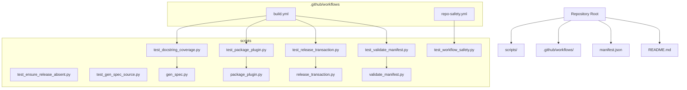
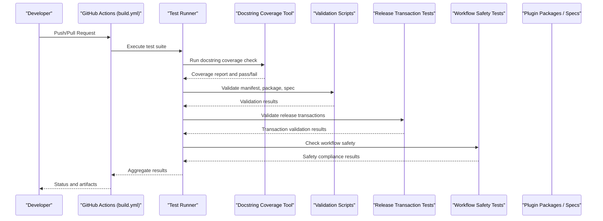
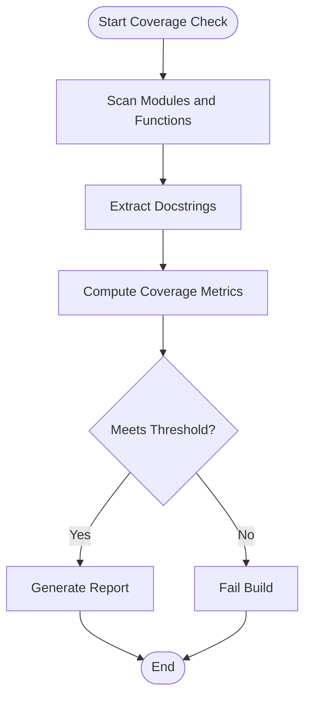
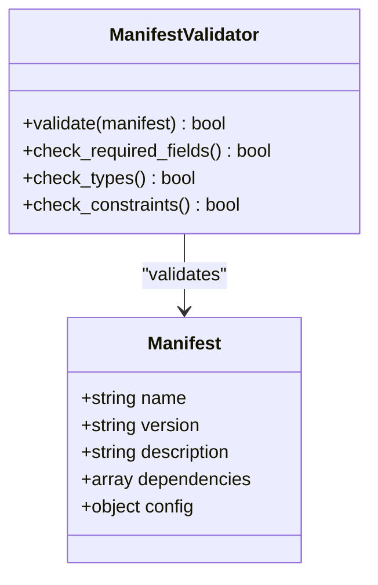
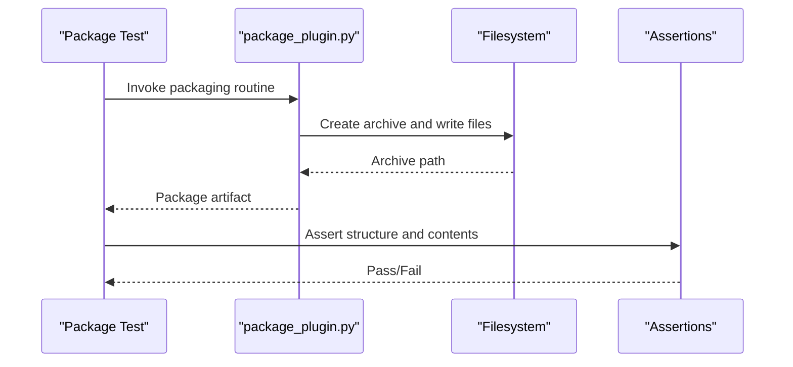
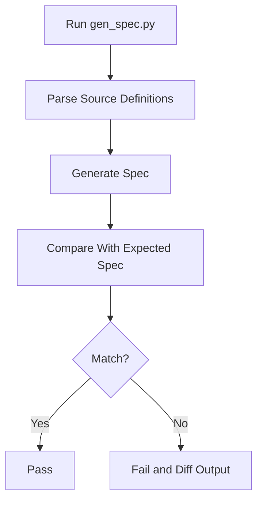
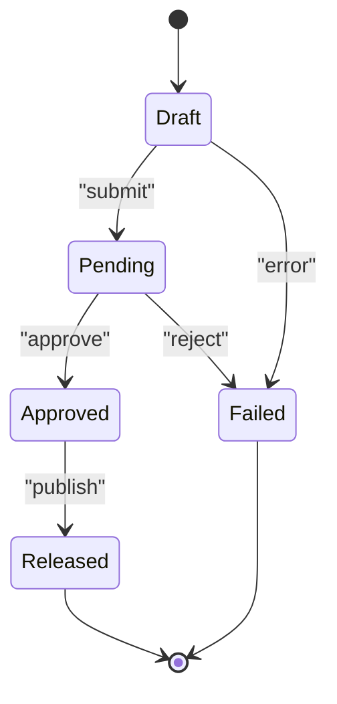
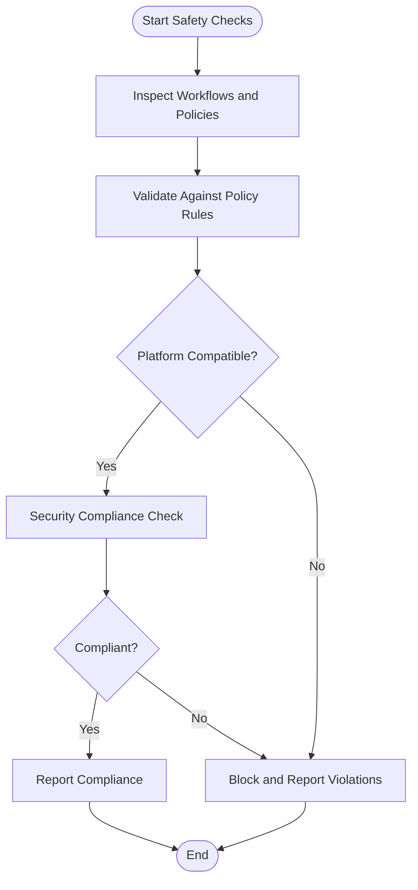
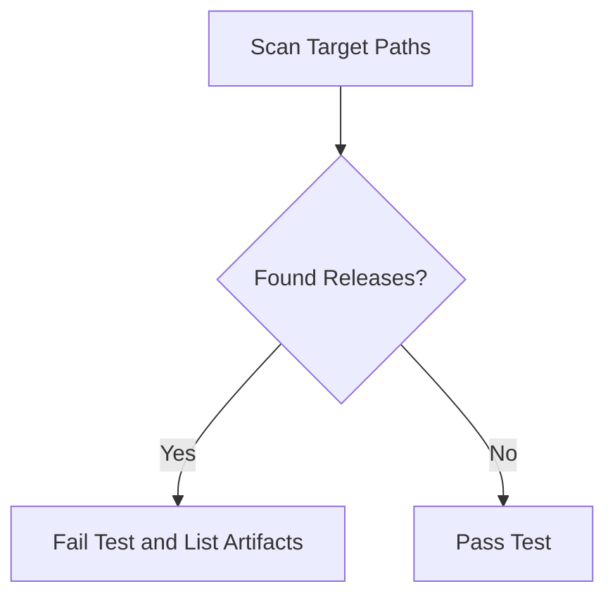
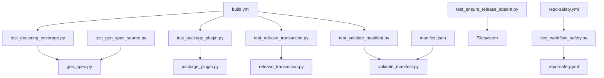

# Testing and Quality Assurance

<cite>
**Referenced Files in This Document**
- [README.md](file://README.md)
- [manifest.json](file://manifest.json)
- [build.yml](file://.github/workflows/build.yml)
- [repo-safety.yml](file://.github/workflows/repo-safety.yml)
- [test_docstring_coverage.py](file://scripts/test_docstring_coverage.py)
- [test_ensure_release_absent.py](file://scripts/test_ensure_release_absent.py)
- [test_gen_spec_source.py](file://scripts/test_gen_spec_source.py)
- [test_package_plugin.py](file://scripts/test_package_plugin.py)
- [test_release_transaction.py](file://scripts/test_release_transaction.py)
- [test_validate_manifest.py](file://scripts/test_validate_manifest.py)
- [test_workflow_safety.py](file://scripts/test_workflow_safety.py)
- [gen_spec.py](file://scripts/gen_spec.py)
- [package_plugin.py](file://scripts/package_plugin.py)
- [release_transaction.py](file://scripts/release_transaction.py)
- [validate_manifest.py](file://scripts/validate_manifest.py)
</cite>

## Update Summary
**Changes Made**
- Enhanced test coverage with new `test_release_transaction.py` for release transaction functionality validation
- Added comprehensive workflow safety testing with `test_workflow_safety.py` for cross-platform security checks
- Updated architecture diagrams to reflect new testing components
- Expanded troubleshooting guide with new failure scenarios

## Table of Contents
1. [Introduction](#introduction)
2. [Project Structure](#project-structure)
3. [Core Components](#core-components)
4. [Architecture Overview](#architecture-overview)
5. [Detailed Component Analysis](#detailed-component-analysis)
6. [Dependency Analysis](#dependency-analysis)
7. [Performance Considerations](#performance-considerations)
8. [Troubleshooting Guide](#troubleshooting-guide)
9. [Conclusion](#conclusion)
10. [Appendices](#appendices)

## Introduction
This document explains how testing and quality assurance are implemented in the Numan Plugins system. It covers the test framework usage, writing patterns for tests, quality metrics such as docstring coverage, and how to maintain high-quality standards across custom plugins and extensions. The system now includes enhanced release transaction validation and comprehensive workflow safety checks across target platforms.

## Project Structure
The repository organizes tests and quality tools under a scripts directory, with CI workflows defined in GitHub Actions. The core configuration is provided by manifest.json, which is validated by dedicated scripts and tests. Recent enhancements include specialized testing for release transactions and workflow safety validation.

**Diagram sources**
- [build.yml](file://.github/workflows/build.yml)
- [repo-safety.yml](file://.github/workflows/repo-safety.yml)
- [test_docstring_coverage.py](file://scripts/test_docstring_coverage.py)
- [test_ensure_release_absent.py](file://scripts/test_ensure_release_absent.py)
- [test_gen_spec_source.py](file://scripts/test_gen_spec_source.py)
- [test_package_plugin.py](file://scripts/test_package_plugin.py)
- [test_release_transaction.py](file://scripts/test_release_transaction.py)
- [test_validate_manifest.py](file://scripts/test_validate_manifest.py)
- [test_workflow_safety.py](file://scripts/test_workflow_safety.py)
- [gen_spec.py](file://scripts/gen_spec.py)
- [package_plugin.py](file://scripts/package_plugin.py)
- [release_transaction.py](file://scripts/release_transaction.py)
- [validate_manifest.py](file://scripts/validate_manifest.py)

**Section sources**
- [README.md](file://README.md)
- [manifest.json](file://manifest.json)
- [build.yml](file://.github/workflows/build.yml)
- [repo-safety.yml](file://.github/workflows/repo-safety.yml)

## Core Components
- Test scripts: Python-based unit and integration tests that validate plugin packaging, spec generation, release transactions, manifest validation, and workflow safety.
- Docstring coverage tool: A script that measures documentation coverage across modules and enforces quality thresholds.
- Validation utilities: Scripts that enforce manifest schema and other structural constraints.
- CI workflows: GitHub Actions pipelines that execute tests and quality checks automatically.

Key responsibilities:
- Ensure plugin packages are correctly built and validated.
- Verify generated specs match source definitions.
- Validate release transactions for correctness and idempotency.
- Enforce manifest integrity and required fields.
- Measure and report docstring coverage to maintain documentation quality.
- **Enhanced**: Perform comprehensive workflow safety checks across target platforms.

**Section sources**
- [test_docstring_coverage.py](file://scripts/test_docstring_coverage.py)
- [test_ensure_release_absent.py](file://scripts/test_ensure_release_absent.py)
- [test_gen_spec_source.py](file://scripts/test_gen_spec_source.py)
- [test_package_plugin.py](file://scripts/test_package_plugin.py)
- [test_release_transaction.py](file://scripts/test_release_transaction.py)
- [test_validate_manifest.py](file://scripts/test_validate_manifest.py)
- [test_workflow_safety.py](file://scripts/test_workflow_safety.py)
- [gen_spec.py](file://scripts/gen_spec.py)
- [package_plugin.py](file://scripts/package_plugin.py)
- [release_transaction.py](file://scripts/release_transaction.py)
- [validate_manifest.py](file://scripts/validate_manifest.py)

## Architecture Overview
The testing architecture integrates unit tests, coverage measurement, and CI automation. Tests invoke utility scripts to perform validations and assertions. CI pipelines run these tests on push and pull request events to ensure consistent quality. The enhanced architecture now includes specialized validation for release transactions and workflow safety checks.

**Diagram sources**
- [build.yml](file://.github/workflows/build.yml)
- [test_docstring_coverage.py](file://scripts/test_docstring_coverage.py)
- [test_validate_manifest.py](file://scripts/test_validate_manifest.py)
- [test_package_plugin.py](file://scripts/test_package_plugin.py)
- [test_gen_spec_source.py](file://scripts/test_gen_spec_source.py)
- [test_release_transaction.py](file://scripts/test_release_transaction.py)
- [test_workflow_safety.py](file://scripts/test_workflow_safety.py)

## Detailed Component Analysis

### Docstring Coverage Testing
The docstring coverage tool scans modules and computes coverage metrics based on presence and completeness of docstrings. It can be integrated into CI to fail builds when coverage falls below thresholds.

**Diagram sources**
- [test_docstring_coverage.py](file://scripts/test_docstring_coverage.py)

Guidelines:
- Ensure all public functions and classes have descriptive docstrings.
- Keep docstrings updated alongside code changes.
- Treat coverage failures as blockers until remediated.

**Section sources**
- [test_docstring_coverage.py](file://scripts/test_docstring_coverage.py)

### Manifest Validation
Manifest validation ensures that plugin metadata conforms to expected schemas and contains required fields. Tests assert structure, types, and constraints.

**Diagram sources**
- [test_validate_manifest.py](file://scripts/test_validate_manifest.py)
- [validate_manifest.py](file://scripts/validate_manifest.py)
- [manifest.json](file://manifest.json)

Best practices:
- Add new fields to both manifest schema and validation logic.
- Include negative tests for invalid manifests.
- Use fixtures for common valid/invalid manifest templates.

**Section sources**
- [test_validate_manifest.py](file://scripts/test_validate_manifest.py)
- [validate_manifest.py](file://scripts/validate_manifest.py)
- [manifest.json](file://manifest.json)

### Plugin Packaging Tests
Packaging tests verify that plugin archives are constructed correctly, include necessary files, and adhere to naming conventions. They simulate build steps and inspect outputs.

**Diagram sources**
- [test_package_plugin.py](file://scripts/test_package_plugin.py)
- [package_plugin.py](file://scripts/package_plugin.py)

Recommendations:
- Mock filesystem operations where appropriate to speed up tests.
- Validate checksums or hashes for reproducibility.
- Test edge cases like missing dependencies or malformed inputs.

**Section sources**
- [test_package_plugin.py](file://scripts/test_package_plugin.py)
- [package_plugin.py](file://scripts/package_plugin.py)

### Spec Generation Tests
Spec generation tests compare generated specifications against source definitions to ensure consistency and accuracy.

**Diagram sources**
- [test_gen_spec_source.py](file://scripts/test_gen_spec_source.py)
- [gen_spec.py](file://scripts/gen_spec.py)

Practices:
- Maintain canonical expected specs in test fixtures.
- Update fixtures when source definitions change.
- Use diff-friendly assertions to pinpoint mismatches.

**Section sources**
- [test_gen_spec_source.py](file://scripts/test_gen_spec_source.py)
- [gen_spec.py](file://scripts/gen_spec.py)

### Release Transaction Tests
Release transaction tests validate the lifecycle of releases, ensuring transactions are created, applied, and verified correctly. They often involve state transitions and idempotency checks. **Updated** with enhanced validation for release transaction functionality.

**Diagram sources**
- [test_release_transaction.py](file://scripts/test_release_transaction.py)
- [release_transaction.py](file://scripts/release_transaction.py)

Guidelines:
- Cover success paths and failure modes.
- Assert state transitions and side effects.
- Ensure rollback behavior is tested where applicable.
- **Enhanced**: Validate transaction idempotency and error recovery mechanisms.

**Section sources**
- [test_release_transaction.py](file://scripts/test_release_transaction.py)
- [release_transaction.py](file://scripts/release_transaction.py)

### Workflow Safety Tests
Workflow safety tests verify that CI configurations and repository policies remain secure and compliant. They may check for secrets handling, branch protections, and allowed actions. **New** comprehensive safety checks across target platforms.

**Diagram sources**
- [test_workflow_safety.py](file://scripts/test_workflow_safety.py)
- [repo-safety.yml](file://.github/workflows/repo-safety.yml)

**Section sources**
- [test_workflow_safety.py](file://scripts/test_workflow_safety.py)
- [repo-safety.yml](file://.github/workflows/repo-safety.yml)

### Ensuring Release Absence
Tests that assert no unintended release artifacts exist help prevent accidental deployments. They scan directories and repositories for unexpected files or tags.

**Diagram sources**
- [test_ensure_release_absent.py](file://scripts/test_ensure_release_absent.py)

**Section sources**
- [test_ensure_release_absent.py](file://scripts/test_ensure_release_absent.py)

## Dependency Analysis
Tests depend on utility scripts and shared configuration. Understanding these relationships helps isolate failures and optimize execution. **Updated** to include new dependency relationships for enhanced testing components.

**Diagram sources**
- [test_docstring_coverage.py](file://scripts/test_docstring_coverage.py)
- [test_package_plugin.py](file://scripts/test_package_plugin.py)
- [test_release_transaction.py](file://scripts/test_release_transaction.py)
- [test_validate_manifest.py](file://scripts/test_validate_manifest.py)
- [test_gen_spec_source.py](file://scripts/test_gen_spec_source.py)
- [test_workflow_safety.py](file://scripts/test_workflow_safety.py)
- [test_ensure_release_absent.py](file://scripts/test_ensure_release_absent.py)
- [gen_spec.py](file://scripts/gen_spec.py)
- [package_plugin.py](file://scripts/package_plugin.py)
- [release_transaction.py](file://scripts/release_transaction.py)
- [validate_manifest.py](file://scripts/validate_manifest.py)
- [manifest.json](file://manifest.json)
- [build.yml](file://.github/workflows/build.yml)
- [repo-safety.yml](file://.github/workflows/repo-safety.yml)

**Section sources**
- [build.yml](file://.github/workflows/build.yml)
- [repo-safety.yml](file://.github/workflows/repo-safety.yml)

## Performance Considerations
- Parallelize independent tests to reduce total runtime.
- Cache intermediate artifacts (e.g., generated specs) to avoid recomputation.
- Use lightweight mocks for I/O-bound operations.
- Limit scope of coverage scanning to relevant modules to minimize overhead.
- Profile slow tests and refactor to reduce setup/teardown costs.
- **Enhanced**: Optimize workflow safety checks by caching platform-specific configurations.

## Troubleshooting Guide
Common issues and resolutions:
- Missing dependencies: Install required packages before running tests.
- Environment misconfiguration: Ensure working directory and paths align with expectations.
- Flaky tests: Stabilize by mocking external services and using deterministic data.
- Coverage threshold failures: Add or improve docstrings; adjust thresholds only if justified.
- CI failures: Inspect logs for specific assertion errors and reproduce locally.
- **New**: Release transaction failures: Check transaction state management and rollback mechanisms.
- **New**: Workflow safety violations: Review platform compatibility and security policy compliance.

Debugging techniques:
- Run individual tests with verbose output to isolate failures.
- Print or log intermediate states in failing scenarios.
- Use breakpoints or interactive debugging sessions for complex flows.
- Compare generated artifacts with expected fixtures to identify discrepancies.
- **Enhanced**: For release transaction issues, examine transaction logs and state transitions.
- **Enhanced**: For workflow safety problems, review platform-specific configurations and security policies.

**Section sources**
- [build.yml](file://.github/workflows/build.yml)
- [repo-safety.yml](file://.github/workflows/repo-safety.yml)

## Conclusion
The Numan Plugins system employs a robust testing and quality assurance strategy centered around Python-based tests, docstring coverage measurement, and CI-driven automation. The recent enhancements include comprehensive release transaction validation and workflow safety checks across target platforms. By following the guidelines and patterns outlined here, contributors can write reliable tests for custom plugins and extensions, maintain high documentation quality, and ensure consistent releases.

## Appendices

### How to Write Tests for Custom Plugins and Extensions
- Mirror existing patterns: structure tests similarly to those in scripts.
- Use fixtures for reusable test data and mock environments.
- Assert both positive and negative cases.
- Include assertions for side effects and state changes.
- Keep tests fast and deterministic; avoid network calls unless mocked.
- **Enhanced**: Include release transaction testing patterns for stateful operations.
- **Enhanced**: Implement workflow safety checks for platform-specific requirements.

### Running Automated Tests
- Execute tests locally using the same commands as CI.
- Review coverage reports and address gaps.
- Commit changes incrementally and push to trigger CI runs.
- **Enhanced**: Run workflow safety tests to ensure cross-platform compatibility.

### Interpreting Test Results
- Focus on failed assertions and error messages.
- Correlate failures with recent changes.
- Re-run targeted tests after fixes to confirm resolution.
- **Enhanced**: Pay special attention to release transaction state validation results.
- **Enhanced**: Review workflow safety compliance reports for security implications.

### Maintaining Test Coverage
- Add tests for new features and bug fixes.
- Regularly review coverage metrics and set minimum thresholds.
- Refactor tests to improve readability and maintainability.
- **Enhanced**: Monitor release transaction test coverage for critical state transitions.
- **Enhanced**: Track workflow safety test effectiveness across different platforms.