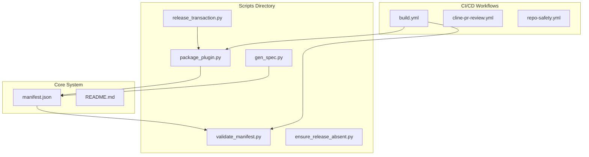

# Troubleshooting and FAQ

<cite>
**Referenced Files in This Document**
- [README.md](file://README.md)
- [manifest.json](file://manifest.json)
- [package_plugin.py](file://scripts/package_plugin.py)
- [validate_manifest.py](file://scripts/validate_manifest.py)
- [gen_spec.py](file://scripts/gen_spec.py)
- [release_transaction.py](file://scripts/release_transaction.py)
- [ensure_release_absent.py](file://scripts/ensure_release_absent.py)
- [build.yml](file://.github/workflows/build.yml)
</cite>

## Table of Contents
1. [Introduction](#introduction)
2. [Project Structure Overview](#project-structure-overview)
3. [Common Setup Issues](#common-setup-issues)
4. [Plugin Development Troubleshooting](#plugin-development-troubleshooting)
5. [Deployment and Packaging Issues](#deployment-and-packaging-issues)
6. [Configuration Problems](#configuration-problems)
7. [Dependency Management](#dependency-management)
8. [Performance Optimization](#performance-optimization)
9. [Error Messages and Solutions](#error-messages-and-solutions)
10. [Debugging Techniques](#debugging-techniques)
11. [FAQ - Frequently Asked Questions](#faq---frequently-asked-questions)
12. [Known Limitations and Workarounds](#known-limitations-and-workarounds)
13. [Best Practices](#best-practices)
14. [Diagnostic Tools Usage](#diagnostic-tools-usage)

## Introduction

This troubleshooting guide provides comprehensive solutions for common issues encountered when working with the Numan Plugins system. It covers setup problems, plugin development challenges, deployment issues, configuration errors, dependency management, performance optimization, debugging techniques, and frequently asked questions. The guide is designed to help both new and experienced developers quickly resolve issues and optimize their plugin development workflow.

## Project Structure Overview

The Numan Plugins system follows a modular architecture with clear separation between core functionality, validation scripts, packaging utilities, and CI/CD workflows. Understanding this structure is crucial for effective troubleshooting.

**Diagram sources**
- [manifest.json:1-50](file://manifest.json#L1-L50)
- [package_plugin.py:1-100](file://scripts/package_plugin.py#L1-L100)
- [validate_manifest.py:1-100](file://scripts/validate_manifest.py#L1-L100)

**Section sources**
- [README.md:1-100](file://README.md#L1-L100)
- [manifest.json:1-200](file://manifest.json#L1-L200)

## Common Setup Issues

### Python Environment Configuration

**Issue**: Python version incompatibility or missing dependencies during plugin setup.

**Symptoms**:
- ImportError or ModuleNotFoundError
- Syntax errors due to Python version mismatch
- Missing package installation failures

**Solutions**:
1. Verify Python version compatibility (typically Python 3.8+)
2. Install required dependencies using pip install -r requirements.txt
3. Use virtual environments to isolate plugin dependencies
4. Check for conflicting package versions

### Manifest File Validation Errors

**Issue**: Invalid manifest.json format or missing required fields.

**Symptoms**:
- JSON parsing errors
- Missing field validation failures
- Schema validation errors

**Solutions**:
1. Validate manifest.json against the expected schema
2. Ensure all required fields are present and correctly formatted
3. Use the validate_manifest.py script for automated validation
4. Check for proper JSON syntax and encoding

**Section sources**
- [validate_manifest.py:1-150](file://scripts/validate_manifest.py#L1-L150)
- [manifest.json:1-100](file://manifest.json#L1-L100)

## Plugin Development Troubleshooting

### Plugin Structure and Organization

**Issue**: Incorrect plugin directory structure or missing required files.

**Common Problems**:
- Missing __init__.py files
- Incorrect module imports
- Relative import path issues

**Solutions**:
1. Follow the standard plugin directory structure
2. Ensure proper __init__.py files in all packages
3. Use absolute imports where possible
4. Test imports in isolation before full integration

### Plugin Loading and Initialization

**Issue**: Plugins fail to load or initialize properly.

**Symptoms**:
- Plugin not appearing in available plugins list
- Initialization errors during startup
- Missing dependencies at runtime

**Solutions**:
1. Verify plugin metadata in manifest.json
2. Check for circular dependencies
3. Ensure all required modules are importable
4. Use logging to trace initialization flow

### Plugin API Compatibility

**Issue**: Incompatibility with Numan Plugins API versions.

**Symptoms**:
- AttributeError or MethodNotImplementedError
- Deprecated API usage warnings
- Unexpected behavior changes

**Solutions**:
1. Check API version compatibility
2. Update deprecated method calls
3. Implement proper error handling for missing methods
4. Test against multiple API versions if needed

**Section sources**
- [package_plugin.py:1-200](file://scripts/package_plugin.py#L1-L200)
- [gen_spec.py:1-150](file://scripts/gen_spec.py#L1-L150)

## Deployment and Packaging Issues

### Plugin Packaging Failures

**Issue**: Plugin fails to package correctly for distribution.

**Common Symptoms**:
- Missing files in packaged plugin
- Incorrect file permissions
- Dependency resolution failures

**Solutions**:
1. Use the package_plugin.py script for consistent packaging
2. Verify all required files are included
3. Check file permissions and ownership
4. Test packaging in clean environment

### Release Process Problems

**Issue**: Issues during the release transaction process.

**Symptoms**:
- Version conflicts
- Git repository state issues
- Release validation failures

**Solutions**:
1. Ensure clean git state before release
2. Verify version numbering consistency
3. Use ensure_release_absent.py to prevent duplicate releases
4. Follow the documented release procedure

### CI/CD Pipeline Failures

**Issue**: GitHub Actions workflows failing during build or validation.

**Common Problems**:
- Missing environment variables
- Dependency installation failures
- Test execution errors

**Solutions**:
1. Check workflow configuration in build.yml
2. Verify all required secrets and environment variables
3. Review build logs for specific error messages
4. Test locally before pushing to main branch

**Section sources**
- [package_plugin.py:1-300](file://scripts/package_plugin.py#L1-L300)
- [release_transaction.py:1-200](file://scripts/release_transaction.py#L1-L200)
- [build.yml:1-100](file://.github/workflows/build.yml#L1-L100)

## Configuration Problems

### Manifest Configuration Errors

**Issue**: Incorrect or incomplete manifest.json configuration.

**Common Issues**:
- Missing required fields
- Invalid data types
- Circular references in dependencies

**Solutions**:
1. Validate manifest.json using validate_manifest.py
2. Ensure all required fields are present with correct types
3. Check for valid dependency specifications
4. Use JSON schema validation tools

### Environment-Specific Configuration

**Issue**: Configuration works in development but fails in production.

**Symptoms**:
- Path resolution differences
- Environment variable mismatches
- Platform-specific issues

**Solutions**:
1. Use environment-specific configuration files
2. Implement proper configuration validation
3. Test across different environments
4. Use configuration templates

**Section sources**
- [validate_manifest.py:1-200](file://scripts/validate_manifest.py#L1-L200)
- [manifest.json:1-150](file://manifest.json#L1-L150)

## Dependency Management

### Version Conflicts

**Issue**: Conflicting dependency versions causing runtime errors.

**Symptoms**:
- Import errors due to version mismatches
- Incompatible API versions
- Transitive dependency conflicts

**Solutions**:
1. Pin specific dependency versions in requirements
2. Use dependency resolution tools
3. Test with exact dependency versions
4. Consider using virtual environments

### Missing Dependencies

**Issue**: Required packages not installed or unavailable.

**Common Causes**:
- Network connectivity issues
- Package registry access problems
- Incorrect package names

**Solutions**:
1. Verify package availability in target environment
2. Check network connectivity to package repositories
3. Use offline package installation if needed
4. Implement fallback mechanisms for optional dependencies

### Performance Impact of Dependencies

**Issue**: Excessive dependencies affecting plugin performance.

**Symptoms**:
- Slow plugin loading times
- High memory usage
- Long initialization periods

**Solutions**:
1. Audit and remove unused dependencies
2. Use lazy loading for heavy dependencies
3. Implement dependency caching
4. Monitor memory and CPU usage

**Section sources**
- [package_plugin.py:100-300](file://scripts/package_plugin.py#L100-L300)
- [gen_spec.py:50-150](file://scripts/gen_spec.py#L50-L150)

## Performance Optimization

### Plugin Loading Performance

**Optimization Strategies**:
1. Implement lazy loading for non-critical components
2. Cache frequently used resources
3. Optimize import statements
4. Use efficient data structures

### Memory Management

**Best Practices**:
1. Avoid global state when possible
2. Implement proper resource cleanup
3. Use generators for large datasets
4. Monitor memory usage patterns

### Execution Efficiency

**Recommendations**:
1. Profile code to identify bottlenecks
2. Use appropriate algorithms for data processing
3. Implement parallel processing where applicable
4. Optimize database queries and API calls

## Error Messages and Solutions

### Common Error Patterns

**Import Errors**:
- **Cause**: Missing modules or incorrect paths
- **Solution**: Verify module structure and add necessary imports

**Validation Errors**:
- **Cause**: Invalid configuration or data format
- **Solution**: Use validation scripts and check data schemas

**Runtime Errors**:
- **Cause**: Logic errors or unexpected states
- **Solution**: Add comprehensive error handling and logging

**Package Errors**:
- **Cause**: Missing files or incorrect permissions
- **Solution**: Verify package contents and file permissions

### Debug Logging

**Implementation**:
1. Enable detailed logging in development
2. Use structured logging formats
3. Implement log rotation for production
4. Centralize log collection

**Section sources**
- [validate_manifest.py:100-200](file://scripts/validate_manifest.py#L100-L200)
- [package_plugin.py:200-400](file://scripts/package_plugin.py#L200-L400)

## Debugging Techniques

### Log Analysis

**Effective Strategies**:
1. Use hierarchical logging levels (DEBUG, INFO, WARNING, ERROR)
2. Include context information in log messages
3. Implement request/response logging for APIs
4. Use correlation IDs for distributed tracing

### Interactive Debugging

**Tools and Methods**:
1. Use Python debugger (pdb) for interactive sessions
2. Implement breakpoint debugging in IDEs
3. Use remote debugging for production issues
4. Leverage logging frameworks like logging or structlog

### Performance Profiling

**Profiling Techniques**:
1. Use cProfile for CPU profiling
2. Implement memory profiling with memory_profiler
3. Use timeit for micro-benchmarks
4. Monitor system resources with built-in tools

### Testing Strategies

**Testing Approaches**:
1. Unit tests for individual components
2. Integration tests for plugin interactions
3. Load testing for performance validation
4. Chaos testing for resilience verification

**Section sources**
- [test_package_plugin.py:1-100](file://scripts/test_package_plugin.py#L1-L100)
- [test_validate_manifest.py:1-100](file://scripts/test_validate_manifest.py#L1-L100)

## FAQ - Frequently Asked Questions

### Q: How do I troubleshoot plugin loading failures?

**A**: Start by checking the plugin manifest for validity, then verify all dependencies are installed. Use debug logging to trace the loading process and check for import errors.

### Q: What should I do if my plugin works locally but fails in production?

**A**: Ensure environment parity between local and production. Check for platform-specific dependencies, environment variables, and file path differences.

### Q: How can I optimize my plugin's performance?

**A**: Profile your code to identify bottlenecks, implement lazy loading, cache expensive operations, and use efficient data structures. Monitor memory usage and optimize accordingly.

### Q: What are the most common manifest.json errors?

**A**: Missing required fields, invalid data types, incorrect dependency specifications, and malformed JSON syntax. Always validate using the provided validation script.

### Q: How do I handle dependency conflicts?

**A**: Pin specific versions, use virtual environments, and audit dependencies regularly. Consider using dependency resolution tools and testing with exact versions.

### Q: What debugging tools are recommended?

**A**: Use Python's built-in logging, pdb for interactive debugging, cProfile for performance analysis, and IDE debugging features for complex issues.

### Q: How do I test my plugin effectively?

**A**: Implement unit tests for individual components, integration tests for plugin interactions, and load tests for performance validation. Use mocking for external dependencies.

### Q: What are best practices for error handling?

**A**: Implement comprehensive error handling, provide meaningful error messages, log errors appropriately, and implement graceful degradation when possible.

**Section sources**
- [README.md:1-200](file://README.md#L1-L200)
- [manifest.json:1-100](file://manifest.json#L1-L100)

## Known Limitations and Workarounds

### Platform-Specific Limitations

**Windows-Specific Issues**:
- Path separator differences
- File permission restrictions
- Line ending variations

**Workarounds**:
- Use os.path functions for path handling
- Implement proper file permission checks
- Normalize line endings in text processing

### Memory Constraints

**Limitations**:
- Large dataset processing may cause memory issues
- Plugin loading overhead in constrained environments

**Workarounds**:
- Implement streaming processing for large files
- Use memory-efficient data structures
- Implement proper resource cleanup

### Concurrency Limitations

**Issues**:
- Thread safety concerns in multi-threaded environments
- Resource contention under high load

**Workarounds**:
- Use thread-safe data structures
- Implement proper locking mechanisms
- Consider async processing for I/O-bound operations

## Best Practices

### Code Organization

**Recommendations**:
1. Follow PEP 8 style guidelines
2. Use meaningful variable and function names
3. Implement proper module structure
4. Separate concerns into logical components

### Error Handling

**Best Practices**:
1. Catch specific exceptions rather than generic ones
2. Provide meaningful error messages
3. Log errors with sufficient context
4. Implement graceful degradation

### Testing Strategy

**Approach**:
1. Write comprehensive unit tests
2. Implement integration tests
3. Use mock objects for external dependencies
4. Maintain high test coverage

### Documentation

**Guidelines**:
1. Document public APIs thoroughly
2. Include usage examples
3. Maintain up-to-date README files
4. Document known limitations and workarounds

### Security Considerations

**Practices**:
1. Validate all input data
2. Sanitize user inputs
3. Implement proper authentication and authorization
4. Follow security best practices for data handling

## Diagnostic Tools Usage

### Built-in Validation Tools

**Manifest Validation**:
- Use validate_manifest.py for automatic validation
- Check for required fields and correct data types
- Validate dependency specifications

**Package Validation**:
- Use package_plugin.py for consistent packaging
- Verify package contents and structure
- Check for missing files or permissions

### Monitoring and Logging

**Logging Implementation**:
1. Configure appropriate log levels
2. Use structured logging formats
3. Implement log rotation
4. Centralize log collection

**Monitoring Tools**:
1. Use application performance monitoring (APM) tools
2. Implement health check endpoints
3. Monitor system resources
4. Set up alerts for critical issues

### Performance Analysis

**Profiling Tools**:
1. Use cProfile for CPU profiling
2. Implement memory profiling
3. Use network profiling for API calls
4. Monitor database query performance

**Section sources**
- [validate_manifest.py:1-200](file://scripts/validate_manifest.py#L1-L200)
- [package_plugin.py:1-300](file://scripts/package_plugin.py#L1-L300)
- [build.yml:1-150](file://.github/workflows/build.yml#L1-L150)

## Conclusion

This troubleshooting guide provides comprehensive solutions for common issues in the Numan Plugins system. By following the outlined strategies, implementing best practices, and utilizing the provided diagnostic tools, developers can effectively resolve issues, optimize performance, and maintain reliable plugin deployments. Regular testing, proper logging, and adherence to established patterns will significantly reduce troubleshooting time and improve overall system reliability.

Remember to always validate configurations, test thoroughly in development environments, and monitor production systems closely. The combination of proactive measures and reactive troubleshooting strategies will ensure smooth operation of your Numan Plugins implementations.